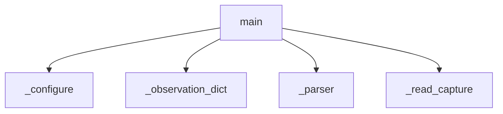

<!-- generated documentation — edit the source, not this file -->
# `integration/homeassistant/src/openaliro_ha/cli.py`

Small, non-interactive HA=1 staging CLI for safe offline operations.

**depends on** [`integration/homeassistant/src/openaliro_ha/agent.py`](agent.md), [`integration/homeassistant/src/openaliro_ha/config.py`](config.md), [`integration/homeassistant/src/openaliro_ha/models.py`](models.md), [`integration/homeassistant/src/openaliro_ha/parser.py`](parser.md), [`integration/homeassistant/src/openaliro_ha/serial_session.py`](serial_session.md), [`integration/homeassistant/src/openaliro_ha/serial_transport.py`](serial_transport.md)  ·  **used by** [`integration/homeassistant/src/openaliro_ha/__main__.py`](__main__.md)  ·  **discussed in** [`docs/home-assistant-internals.md`](../../home-assistant-internals.md)

## API

### `_observation_dict(observation: Observation) -> dict[str, object]`
`integration/homeassistant/src/openaliro_ha/cli.py:26`

Convert an Observation union (DistanceReading or AccessEvent) to a dict with a kind field and all dataclass fields. Raises TypeError if the observation is not a recognized type.

**called by** `main`

### `_read_capture(path: Path) -> list[Observation]`
`integration/homeassistant/src/openaliro_ha/cli.py:35`

Read a UTF-8 sanitized capture file, parse it line by line into Observation objects, and raise ValueError if the file cannot be read, exceeds MAX_REPLAY_BYTES, or contains invalid UTF-8.

**called by** `main`

### `_parser() -> argparse.ArgumentParser`
`integration/homeassistant/src/openaliro_ha/cli.py:50`

Build an argument parser for the openaliro-ha CLI tool with subcommands for version, replay, doctor, configure, and run; the configure subcommand accepts optional device discovery and MQTT configuration flags.

**called by** `main`

### `_prompt(input_fn: object, message: str, *, default: str | None=None) -> str`
`integration/homeassistant/src/openaliro_ha/cli.py:87`

Return the user's input after stripping whitespace, or the default value if the input is empty and a default was provided.

**called by** `_configure`, `_new_mqtt_config`, `_select_port`

### `_candidate_label(index: int, port: SerialPort) -> str`
`integration/homeassistant/src/openaliro_ha/cli.py:94`

Describe a candidate without echoing its device path or USB serial.

**called by** `_select_port`

### `_probe_candidate(port: SerialPort) -> Optional[str]`
`integration/homeassistant/src/openaliro_ha/cli.py:105`

Return None when a candidate answers, else why it did not.

The reason is stripped of device paths so the picker keeps hiding them.

**called by** `_select_port`

### `_select_port(input_fn: object, output_fn: object) -> SerialPort`
`integration/homeassistant/src/openaliro_ha/cli.py:121`

Probe all discoverable serial interfaces with USB identity and select one for the OpenAliro console. List outcomes (ready or probe failure reason), auto-select if exactly one is ready, otherwise prompt for index. Raises ConfigError if no candidates exist or selection is invalid.

**called by** `_configure`  ·  **calls** `_candidate_label`, `_probe_candidate`, `_prompt`

### `_new_mqtt_config(input_fn: object) -> MqttConfig`
`integration/homeassistant/src/openaliro_ha/cli.py:152`

Interactively prompt for MQTT configuration: host, TLS port, CA certificate path, username. If username is given, prompt for password environment variable. If not, require explicit "ALLOW ANONYMOUS MQTT" confirmation. Return a populated MqttConfig struct.

**called by** `_configure`  ·  **calls** `_prompt`

### `_flag(arguments: argparse.Namespace, name: str) -> Optional[object]`
`integration/homeassistant/src/openaliro_ha/cli.py:187`

Read an optional configure flag, tolerating callers that omit it.

**called by** `_configure`, `_flag_mqtt_config`

### `_flag_mqtt_config(arguments: argparse.Namespace) -> MqttConfig`
`integration/homeassistant/src/openaliro_ha/cli.py:193`

Build an MQTT config from flags so a setup script needs no prompts.

**called by** `_configure`  ·  **calls** `_flag`

### `_configure(arguments: argparse.Namespace, *, input_fn: object=input, output_fn: object=print) -> int`
`integration/homeassistant/src/openaliro_ha/cli.py:218`

Create or add one device, from flags when given and prompts otherwise.

**called by** `main`  ·  **calls** `_flag`, `_flag_mqtt_config`, `_new_mqtt_config`, `_prompt`, `_select_port`

### `main(argv: Sequence[str] | None=None) -> int`
`integration/homeassistant/src/openaliro_ha/cli.py:256`

Run an HA=1-gated offline command without exposing raw capture text.

**calls** `_configure`, `_observation_dict`, `_parser`, `_read_capture`
