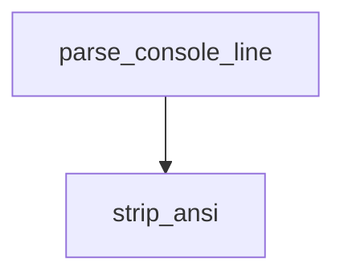

<!-- generated documentation — edit the source, not this file -->
# `integration/homeassistant/src/openaliro_ha/parser.py`

Narrow parser for the currently verified nRF5340 console output.

**depends on** [`integration/homeassistant/src/openaliro_ha/models.py`](models.md)  ·  **used by** [`integration/homeassistant/src/openaliro_ha/__init__.py`](__init__.md), [`integration/homeassistant/src/openaliro_ha/cli.py`](cli.md), [`integration/homeassistant/src/openaliro_ha/compatibility.py`](compatibility.md), [`integration/homeassistant/src/openaliro_ha/serial_session.py`](serial_session.md)

## API

### `strip_ansi(line: str) -> str`
`integration/homeassistant/src/openaliro_ha/parser.py:15`

Remove ANSI control sequences without otherwise normalizing console text.

**called by** `parse_console_line`

### `parse_console_line(line: str) -> Optional[Observation]`
`integration/homeassistant/src/openaliro_ha/parser.py:21`

Convert one verified streaming range or access line into an observation.

The curated ``rng`` line is preferred, but it exists only under
``CONFIG_WOZ_PRETTY_SHELL`` with ``aliro frames`` on, so the always-present
``DIST`` diagnostic is used as a fallback. Its ``phone_d`` field is the
peer's own estimate and is deliberately not represented. Unknown text is
ignored, so no credential identifiers reach an observation.

**calls** `strip_ansi`
