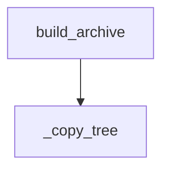

<!-- generated documentation — edit the source, not this file -->
# `integration/homeassistant/tools/package_component.py`

Build a local OpenAliro custom-component archive without publishing it.

## API

### `build_archive(output: Path) -> Path`
`integration/homeassistant/tools/package_component.py:26`

Create an archive rooted at ``custom_components/openaliro``.

**called by** `main`  ·  **calls** `_copy_tree`

Undocumented (2)

- `_copy_tree`
- `main`

