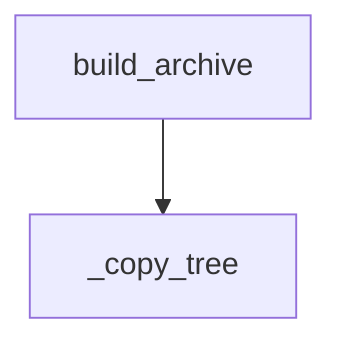

<!-- generated documentation — edit the source, not this file -->
# `integration/homeassistant/tools/package_component.py`

Build a local OpenAliro custom-component archive without publishing it.

## API

### `_copy_tree(source: Path, destination: Path) -> None`
`integration/homeassistant/tools/package_component.py:18`

Recursively copy source directory to destination, excluding __pycache__, *.pyc, *.pyo.

**called by** `build_archive`

### `build_archive(output: Path) -> Path`
`integration/homeassistant/tools/package_component.py:27`

Create an archive rooted at ``custom_components/openaliro``.

**called by** `main`  ·  **calls** `_copy_tree`

### `main() -> int`
`integration/homeassistant/tools/package_component.py:45`

Parse command-line arguments and build the Home Assistant component archive.

**calls** `build_archive`
