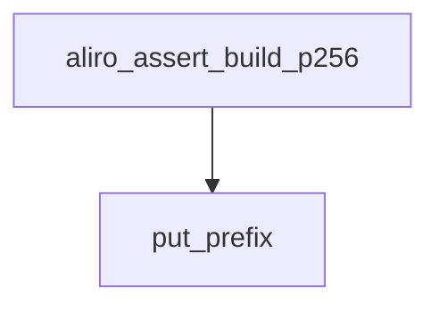

<!-- generated documentation — edit the source, not this file -->
# `modules/woz_aliro/src/aliro_assert.c`

Presence-assertion wire codec + verifier (see aliro_assert.h). Serialises a
dongle's "credential present within N cm for this nonce" statement and verifies
an ECDSA-P256 frame against a challenge nonce, enrolled credential and distance
threshold. Portable C11; no UWB/BLE/platform dependencies.

**depends on** [`modules/woz_aliro/include/aliro_assert.h`](../modules.woz_aliro.include/aliro_assert.h.md), [`modules/woz_aliro/src/aliro_hash.h`](aliro_hash.h.md)

## API

### `static void put_be16(uint8_t *p, uint16_t v)`
`modules/woz_aliro/src/aliro_assert.c:35`

Writes v as 2 big-endian bytes to p.

**called by** `put_prefix`

### `static uint16_t get_be16(const uint8_t *p)`
`modules/woz_aliro/src/aliro_assert.c:42`

Reads 2 big-endian bytes from p.

**called by** `get_be16_signed`, `parse_and_check`

### `static int16_t get_be16_signed(const uint8_t *p)`
`modules/woz_aliro/src/aliro_assert.c:50`

Reads 2 big-endian bytes from p as a signed value. Goes through uint16_t and
an explicit two's-complement fold rather than casting, so the result does not
depend on the implementation-defined narrowing of an out-of-range cast.

**called by** `parse_and_check`  ·  **calls** `get_be16`

### `static void put_be64(uint8_t *p, uint64_t v)`
`modules/woz_aliro/src/aliro_assert.c:58`

Writes v as 8 big-endian bytes to p.

**called by** `put_prefix`

### `static uint64_t get_be64(const uint8_t *p)`
`modules/woz_aliro/src/aliro_assert.c:67`

Reads 8 big-endian bytes from p.

**called by** `parse_and_check`

### `static int ct_equal(const uint8_t *a, const uint8_t *b, size_t n)`
`modules/woz_aliro/src/aliro_assert.c:80`

Constant-time equality of two n-byte buffers: 1 if equal, 0 otherwise. Timing
is independent of where the first differing byte is, so a MAC check does not
leak how much of a forged tag was correct.

**called by** `parse_and_check`

### `static void put_prefix(uint8_t *wire, uint8_t alg, const struct aliro_assert *a)`
`modules/woz_aliro/src/aliro_assert.c:118`

Writes the signed prefix (everything before the signature).

**called by** `aliro_assert_build_p256`  ·  **calls** `put_be16`, `put_be64`

### `static int check_framing(const uint8_t *wire, size_t wire_len, uint8_t want_alg)`
`modules/woz_aliro/src/aliro_assert.c:139`

Framing checks: length for the algorithm named in the frame, magic, version,
and that the algorithm is the one this verifier implements.

**called by** `aliro_assert_verify_p256`  ·  **calls** `aliro_assert_wire_len`

### `static int parse_and_check(const uint8_t *wire, const uint8_t *expected_nonce, const uint8_t *expected_cred_id, uint16_t threshold_cm, uint64_t min_uptime_ms, struct aliro_assert *out)`
`modules/woz_aliro/src/aliro_assert.c:167`

Everything after authentication: parse the fields, hand them to the caller
for logging even on a semantic reject, then apply the policy checks in a
fixed order.

**called by** `aliro_assert_verify_p256`  ·  **calls** `ct_equal`, `get_be16`, `get_be16_signed`, `get_be64`

Undocumented (5)

- `aliro_assert_wire_len` — tested: aliro assert
- `aliro_assert_peek_alg` — tested: aliro assert
- `aliro_assert_cred_id` — tested: aliro assert
- `aliro_assert_build_p256` — tested: aliro assert
- `aliro_assert_verify_p256` — tested: aliro assert

