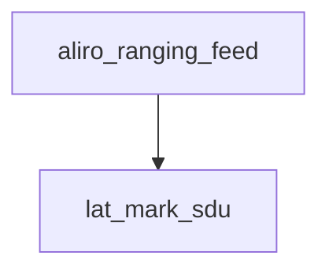

<!-- generated documentation — edit the source, not this file -->
# `modules/woz_aliro/src/aliro_ranging.c`

UWB ranging bring-up and lifecycle for the Aliro reader: initializes the reader's UWB
adapter and Cherry CCC context once, then arms, feeds, and tears down per-connection ranging
sessions driven by the M1-M4 setup exchanged over the peer's L2CAP channel.
Maintains process-wide singletons for the Cherry context and adapter (set up once via
aliro_ranging_init) and for the single active ranging session (the DW3000 supports only one
session at a time), tracking its owning secure channel for send/receive framing.

**depends on** [`modules/woz_aliro/include/aliro_ble.h`](../modules.woz_aliro.include/aliro_ble.h.md), [`modules/woz_aliro/include/aliro_crypto.h`](../modules.woz_aliro.include/aliro_crypto.h.md), [`modules/woz_aliro/include/aliro_lab.h`](../modules.woz_aliro.include/aliro_lab.h.md), [`modules/woz_aliro/include/aliro_lat.h`](../modules.woz_aliro.include/aliro_lat.h.md), [`modules/woz_aliro/src/aliro_ranging.h`](aliro_ranging.h.md), [`modules/woz_port/include/woz_log.h`](../modules.woz_port.include/woz_log.h.md), [`modules/woz_uwb/src/aliro/include/aliro_uwb_adapter/aliro_uwb_adapter.h`](../modules.woz_uwb.src.aliro.include.aliro_uwb_adapter/aliro_uwb_adapter.h.md), [`modules/woz_uwb/src/aliro/include/aliro_uwb_adapter/aliro_uwb_session.h`](../modules.woz_uwb.src.aliro.include.aliro_uwb_adapter/aliro_uwb_session.h.md), [`modules/woz_uwb/src/aliro/include/cherry/cherry.h`](../modules.woz_uwb.src.aliro.include.cherry/cherry.h.md), [`modules/woz_uwb/src/aliro/include/cherry/cherry_ccc.h`](../modules.woz_uwb.src.aliro.include.cherry/cherry_ccc.h.md), [`modules/woz_uwb/src/facade/woz_uwb_facade.h`](../modules.woz_uwb.src.facade/woz_uwb_facade.h.md)  ·  **discussed in** [`ports/esp32/components/aliro_reader/README.md`](../../../ports/esp32/components/aliro_reader/README.md)

## API

### `static void lat_mark_sdu(uint8_t proto, uint8_t id)`
`modules/woz_aliro/src/aliro_ranging.c:90`

Stamp the latency phase this SDU actually is, by identity rather than by
arrival order. Order-based labelling was wrong on real hardware: the phone
sends a proto-3 (supplementary-service) SDU ahead of
Initiate-Ranging-Session, which shifted every device->reader label by one
frame and stamped "M2 received" on the IRS, i.e. before M1 had been sent.
Diagnostics only; the protocol never depended on this.

**called by** `aliro_ranging_feed`, `uwb_tx_cb`

### `static void uwb_tx_cb(struct aliro_uwb_message *message, struct aliro_uwb_session *session, void *user_data, bool timeout)`
`modules/woz_aliro/src/aliro_ranging.c:119`

Send an adapter-built message verbatim over the peer's L2CAP channel. The
bytes already carry the 4-byte Aliro header; hand them straight to the BLE
send. We own the message and MUST free it (even if we don't send).

**calls** `lat_mark_sdu`

### `static void uwb_ev_cb(struct aliro_uwb_session_event *event, void *user_data)`
`modules/woz_aliro/src/aliro_ranging.c:153`

Session notifications. On DEINIT the engine frees the session right after this
returns, so never touch event->session here; identify via user_data. Every
event must be freed.

### `int aliro_ranging_init(void)`
`modules/woz_aliro/src/aliro_ranging.c:187`

One-time bring-up of the reader UWB adapter (cherry ctx + capabilities +
reader config). Idempotent. Returns 0 on success, negative on failure (the
reader still runs; ranging just won't start).

### `int aliro_ranging_start(uint16_t conn_handle, uint32_t session_id, const uint8_t *ursk, struct aliro_secchan *sc_ble)`
`modules/woz_aliro/src/aliro_ranging.c:260`

Arm the M1-M4 ranging setup for a connection: create the session with ranging
session id @session_id, bound to the 32-byte @ursk and the BleSK ranging channel
@sc_ble, whose reader-direction counter is used to seal the engine's outbound SDUs
(continuing from the AP-Completed message). @session_id MUST match the value the
device derived from the AUTH0 transaction id (big-endian txid[12..15]); it is
advertised in M1 and the device indexes its URSK by it. M1 is NOT sent here — the
engine emits it when the device sends its Initiate-Ranging-Session. Returns 0 on
success, negative on failure or if a ranging session is already active (the DW3000
is single-session).

### `int aliro_ranging_feed(uint16_t conn_handle, const uint8_t *data, size_t len)`
`modules/woz_aliro/src/aliro_ranging.c:313`

Feed one inbound post-auth PLAINTEXT SDU (already BleSK-opened by the reader;
proto/id/len header + payload) to the active ranging session. M4 makes the
engine start the responder with the negotiated parameters. Returns 0 if
consumed, negative if there is no active session or the engine rejected it.

**calls** `lat_mark_sdu`

### `void aliro_ranging_stop(uint16_t conn_handle)`
`modules/woz_aliro/src/aliro_ranging.c:348`

Tear down the ranging session for a connection (on disconnect). No-op if none
is active for @conn_handle.
