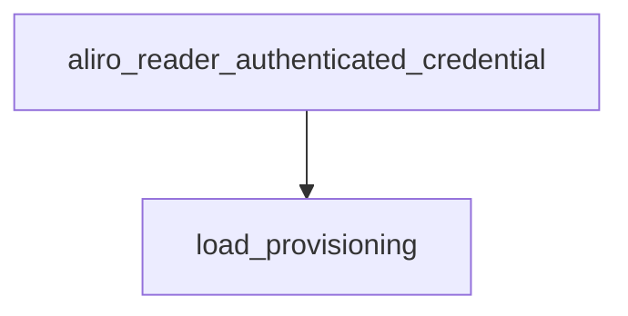

<!-- generated documentation — edit the source, not this file -->
# `modules/woz_aliro/src/aliro_reader.c`

Aliro reader engine: drives the Access Protocol (AUTH0/AUTH1/EXCHANGE) handshake over BLE,
manages reader identity and credential trust provisioning in NVS, and arms UWB ranging once
a session is authenticated. Maintains a fixed-size table of per-connection sessions tracking
transaction phase and secure-channel state, and exposes start/attach entry points for both
standalone and Matter-attached BLE transports, plus provisioning and diagnostic APIs used by
Matter commissioning and the bench console.

**depends on** [`modules/woz_aliro/include/aliro_ble.h`](../modules.woz_aliro.include/aliro_ble.h.md), [`modules/woz_aliro/include/aliro_crypto.h`](../modules.woz_aliro.include/aliro_crypto.h.md), [`modules/woz_aliro/include/aliro_lab.h`](../modules.woz_aliro.include/aliro_lab.h.md), [`modules/woz_aliro/include/aliro_lat.h`](../modules.woz_aliro.include/aliro_lat.h.md), [`modules/woz_aliro/include/aliro_prim.h`](../modules.woz_aliro.include/aliro_prim.h.md), [`modules/woz_aliro/include/aliro_prov.h`](../modules.woz_aliro.include/aliro_prov.h.md), [`modules/woz_aliro/include/aliro_reader.h`](../modules.woz_aliro.include/aliro_reader.h.md), [`modules/woz_aliro/include/aliro_rssi_gate.h`](../modules.woz_aliro.include/aliro_rssi_gate.h.md), [`modules/woz_aliro/include/aliro_stepup.h`](../modules.woz_aliro.include/aliro_stepup.h.md), [`modules/woz_aliro/src/aliro_apdu.h`](aliro_apdu.h.md), [`modules/woz_aliro/src/aliro_ranging.h`](aliro_ranging.h.md), [`modules/woz_port/include/woz_log.h`](../modules.woz_port.include/woz_log.h.md), [`modules/woz_port/include/woz_port.h`](../modules.woz_port.include/woz_port.h.md)  ·  **discussed in** [`docs/dwm3001cdk-surgery.md`](../../dwm3001cdk-surgery.md), [`docs/esp32-gotchas.md`](../../esp32-gotchas.md), [`ports/esp32/components/aliro_reader/README.md`](../../../ports/esp32/components/aliro_reader/README.md)

## API

### `static void notify_access(bool granted)`
`modules/woz_aliro/src/aliro_reader.c:78`

Tell the registered observer, if any, how this transaction's credential check came out.

**called by** `on_auth1_response`, `try_fast_auth`

### `static void compute_reader_group_x(void)`
`modules/woz_aliro/src/aliro_reader.c:109`

Recover the reader group key X from the provisioned signingKey. Call after any
mutation of s_id. Leaves s_have_group_x=false (and logs) on failure.

**called by** `aliro_reader_import_blob`, `aliro_reader_provision_clear`, `aliro_reader_provision_identity`, `load_provisioning`

### `static const char *phase_str(enum txn_phase p)`
`modules/woz_aliro/src/aliro_reader.c:217`

Returns a human-readable name for a transaction phase enum value, or "?" for an unrecognized
value.

**called by** `on_disconnected`, `transaction_feed`

### `static struct aliro_session`
`modules/woz_aliro/src/aliro_reader.c:252`

One credential-auth transaction, keyed by BLE connection handle. Holds the
reader's ephemeral keypair and the transcript inputs (txid, device pubkey, Z)
that derive the two secure channels and the URSK, so everything a transaction
needs between AUTH0 and ranging setup lives here. Cleared on disconnect;
ALIRO_MAX_SESSIONS of them are statically allocated.

### `static struct aliro_session *session_find(uint16_t conn_handle)`
`modules/woz_aliro/src/aliro_reader.c:302`

Finds the active session matching the given BLE connection handle.
Returns a pointer to the matching session, or NULL if no active session has that conn_handle.

**called by** `aliro_reader_rssi_sample`, `on_data`, `on_disconnected`

### `static struct aliro_session *session_alloc(uint16_t conn_handle)`
`modules/woz_aliro/src/aliro_reader.c:315`

Allocates and returns the first inactive slot in the fixed-size session table for a new
connection, initializing it to phase PH_IDLE. Returns NULL if all ALIRO_MAX_SESSIONS slots are
already active.

**called by** `on_connected`

### `static void load_provisioning(void)`
`modules/woz_aliro/src/aliro_reader.c:333`

Loads the reader's provisioning state (identity, trust anchors) from NVS into the module-level
s_id/s_trust, lazily creating the provisioning mutex on first call. Idempotent: does nothing on
subsequent calls once s_loaded is set. Logs whether a dev-default or real identity was loaded and
its source (NVS vs. dev default), then recomputes the reader group X coordinate.

**called by** `aliro_reader_authenticated_credential`, `aliro_reader_export_blob`, `aliro_reader_identity_public`, `aliro_reader_import_blob`, `aliro_reader_presence_authenticated_after`, `aliro_reader_presence_checkpoint`, `aliro_reader_presence_expected_credential`, `aliro_reader_presence_restart`  ·  **calls** `compute_reader_group_x`

### `static int send_ap_command(uint16_t conn, uint8_t ins, const uint8_t *tlv, size_t len)`
`modules/woz_aliro/src/aliro_reader.c:360`

Frame + send an Access-Protocol command: wrap the command TLV in an ISO7816
APDU (ins selects AUTH0/AUTH1/EXCHANGE), then a BLE Access frame
(type=ACCESS, opcode=AP_OP_COMMAND). The command byte lives in the APDU INS,
NOT the BLE opcode — the phone rejects a raw TLV under opcode=INS.

**called by** `on_auth0_response`, `send_exchange`, `start_auth`

### `static int send_ap_raw(uint16_t conn, const uint8_t *apdu, size_t len)`
`modules/woz_aliro/src/aliro_reader.c:390`

Frame + send a fully-formed ISO7816 APDU (ENVELOPE / GET RESPONSE already carry
their own CLA/INS, so they must NOT go through aliro_apdu_wrap). Same BLE Access
frame as send_ap_command: [type=ACCESS][op=COMMAND][len_be16][apdu].

**called by** `on_stepup_response`, `stepup_send_request`

### `static void spare_eph_refill(void)`
`modules/woz_aliro/src/aliro_reader.c:424`

Generate and cache a fresh ephemeral P-256 keypair and random transaction ID in the global spare
(for immediate reuse on the next connection). Sets spare_eph.valid to 0 if either generation
fails.

**called by** `on_disconnected`, `reader_engine_init`

### `static void start_auth(struct aliro_session *s)`
`modules/woz_aliro/src/aliro_reader.c:431`

Kick the reader-driven access protocol: ephemeral keys + txid -> AUTH0.

**called by** `transaction_feed`  ·  **calls** `send_ap_command`

### `static int init_ble_channel(struct aliro_session *s, const uint8_t block[ALIRO_KEY_BLOCK_LEN])`
`modules/woz_aliro/src/aliro_reader.c:484`

Derive + init the BleSK ranging channel (§11.8.1) off a 160-byte key block;
BleSK sits at offset 96 in both the standard and the fast block. Salt =
reader_supported_versions || user_device_selected_version — we advertise and
select v1.0 only, so salt = 01 00 01 00. Its own counters (fresh from 1) live
in s->sc_ble and carry across AP-Completed + M1..M4. Returns 0 on success.

**called by** `on_auth1_response`, `try_fast_auth`

### `static void send_exchange(struct aliro_session *s)`
`modules/woz_aliro/src/aliro_reader.c:509`

Seal + send the EXCHANGE URSK-ready trigger; both auth paths land here once
the secure channels + URSK are up. The AP then waits for the EXCHANGE
response: §11.1.1 requires Reader-Status-AP-Completed (BleSK-sealed) after
EXCHANGE succeeds, otherwise the device stalls and drops (URSK_Unavailable);
on_exchange_response drives that + ranging.

**called by** `on_auth1_response`, `try_fast_auth`  ·  **calls** `send_ap_command`

### `static int try_fast_auth(struct aliro_session *s, const struct aliro_auth0_response *r)`
`modules/woz_aliro/src/aliro_reader.c:539`

Expedited-fast trial (§8.3.1.10-.12): the cryptogram proves the phone holds a
Kpersistent agreed in an earlier standard phase with one of our trusted
credentials. Trial-derive the fast block under each stored Kpersistent and
try the AES-GCM open; a match authenticates the session with no ECDH, no
signatures and no AUTH1 round-trip, and identifies the credential for the
unlock attribution. Returns 0 when the session was consumed (EXCHANGE sent,
or a hard failure); -1 when nothing matched and the caller should continue
with the standard phase.

**called by** `on_auth0_response`  ·  **calls** `init_ble_channel`, `notify_access`, `send_exchange`

### `static void on_auth0_response(struct aliro_session *s, const uint8_t *pl, size_t len)`
`modules/woz_aliro/src/aliro_reader.c:611`

Handles an inbound AUTH0Response: strips the APDU status word, parses the device's ephemeral
public key, performs ECDH with the reader's ephemeral private key, derives the KDF intermediate
z, signs the reader-usage transcript, and sends AUTH1. On any failure (short/malformed APDU,
parse failure, ECDH failure, signing failure) sets s->phase to PH_FAILED and returns without
sending. On success sets s->phase to PH_SENT_AUTH1 after sending the AUTH1 command. Logs (does
not fail on) an unexpected status word other than 0x9000.

**called by** `transaction_feed`  ·  **calls** `send_ap_command`, `try_fast_auth`

### `static void on_auth1_response(struct aliro_session *s, const uint8_t *pl, size_t len)`
`modules/woz_aliro/src/aliro_reader.c:692`

Handles an inbound AUTH1Response: derives the AP and BLE-ranging secure channel keys and URSK
from the ECDH intermediate, decrypts and parses the response, verifies the device's signature,
checks trust, and sends EXCHANGE. Requires the reader group X coordinate to already be available
(s_have_group_x); fails otherwise. Derives the session salt and 160-byte key block, splits it
into the AP channel keys and URSK, and separately derives the BLE ranging-channel keys from the
block's BleSK segment using a versions-based salt; both secure channels are initialized with
counters starting at 1. Decrypts the AUTH1Response body via AES-GCM and fails on tag mismatch
(indicating a key/counter/framing error), oversized ciphertext, or parse failure. Verifies the
device's signature over the device-usage transcript using the presented device public key if
available, else the device's ephemeral public key; a bad signature fails the session. Records the
presented credential key under s_prov_lock and checks it against the trust store: an untrusted
key fails the session unless the reader identity is the dev default (which accepts and warns). On
success, seals and sends the EXCHANGE command, sets s->phase to PH_SENT_EXCHANGE, and logs the
derived URSK; on any failure path sets s->phase to PH_FAILED and returns without sending
EXCHANGE.

**called by** `transaction_feed`  ·  **calls** `init_ble_channel`, `notify_access`, `send_exchange`

### `static void complete_ap_and_range(struct aliro_session *s)`
`modules/woz_aliro/src/aliro_reader.c:911`

Send Reader-Status-AP-Completed (BleSK-sealed) and arm the ranging engine; the
transaction ends in PH_ESTABLISHED. Shared by the normal EXCHANGE path and the
step-up path (which runs it only after the DeviceResponse is collected).

**called by** `aliro_reader_rssi_sample`, `gated_complete_ap`

### `static void gated_complete_ap(struct aliro_session *s)`
`modules/woz_aliro/src/aliro_reader.c:975`

Run complete_ap_and_range only once the RSSI power gate allows the UWB radio:
the device does not initiate ranging until it receives AP-Completed (the
comment above k_ap_completed_plain), so holding that one message here keeps
the DW3000 dark while the phone is still tens of metres out. The gate opening
(aliro_reader_rssi_sample) completes the AP; a phone that gives up meanwhile
simply reconnects on approach and re-runs the fast auth. Direct call when the
gate is compiled out.

**called by** `on_exchange_response`, `on_stepup_response`, `stepup_send_request`  ·  **calls** `complete_ap_and_range`

### `static void stepup_send_request(struct aliro_session *s)`
`modules/woz_aliro/src/aliro_reader.c:1001`

Build the Access-Document DeviceRequest, seal it into a SessionData message on
the StepUpSK channel, and send it in an ENVELOPE APDU (§8.4). On any build/seal
failure fall back to completing the AP so the unlock is never blocked.

**called by** `on_exchange_response`  ·  **calls** `gated_complete_ap`, `send_ap_raw`

### `static void stepup_submit_job(struct aliro_session *s)`
`modules/woz_aliro/src/aliro_reader.c:1028`

Hand the collected SessionData response + StepUpSK keys to the background worker
so the parse/verify runs off the BLE-host task (never in the ranging arm window).
No issuer trust store is provisioned in this reference build, so the verifier
selects by x5chain if present and otherwise records "issuer key not found"; the
verdict is logged only. A trusted wall clock is not wired (time_valid = 0), so a
TimeVerificationRequired document is recorded as time-unverified.

**called by** `on_stepup_response`

### `static void on_stepup_response(struct aliro_session *s, const uint8_t *pl, size_t len)`
`modules/woz_aliro/src/aliro_reader.c:1052`

Collect the DeviceResponse across ENVELOPE / GET RESPONSE (ISO7816 61XX
chaining) before completing the AP. The worker verifies it afterwards.

**called by** `transaction_feed`  ·  **calls** `gated_complete_ap`, `send_ap_raw`, `stepup_submit_job`

### `static void on_exchange_response(struct aliro_session *s, const uint8_t *pl, size_t len)`
`modules/woz_aliro/src/aliro_reader.c:1103`

Handle the EXCHANGE response, then complete the AP and arm ranging. The body is
an AP (proto-0) response on the ExpeditedSK channel: <ct || 16B tag> SW1SW2.

**called by** `transaction_feed`  ·  **calls** `gated_complete_ap`, `stepup_send_request`

### `void aliro_reader_set_lock_state_listener(void (*cb)(bool unlocked))`
`modules/woz_aliro/src/aliro_reader.c:1152`

Register a callback to be invoked when the lock state changes (unlocked or locked).

### `static void reader_status_send(struct aliro_session *s, bool unsecured)`
`modules/woz_aliro/src/aliro_reader.c:1166`

Reader Status Changed (Aliro transaction step 23): the reader->phone grant/relock
confirmation that fires the iPhone Wallet unlock animation. proto-2 (Notification)
message-id 0x02, one State Attribute (id 0x00, len 2) = [OperationSource,
ReaderStateByte]. OperationSource 0x04 = this user device in the BLE+UWB Aliro flow;
ReaderStateByte Unsecured 0x01 = granted (animate), Secured 0x00 = relocked. The
65-byte access-credential public key is NOT serialized (the reference uses it only
to select which connection to notify). Plaintext the BleSK channel then seals:
[02][02][00 04][00 02 04 <state>]. Runs on the BLE-host task (posted via
aliro_ble_post_reader_status) so it serializes with the other sc_ble seals.

**called by** `aliro_reader_rssi_sample`, `reader_status_send_on_host`

### `static void reader_status_send_on_host(bool unsecured)`
`modules/woz_aliro/src/aliro_reader.c:1206`

Send Reader-Status-Changed (Aliro step 23) on an established session: locked (Secured grant to
unlock) or unlocked (Unsecured). Deduplicates consecutive identical messages. Logs Secured
delivery failure and flags for replay on the next session if the peer disconnected before we
could send.

**calls** `reader_status_send`

### `void aliro_reader_notify_unlock(bool unsecured)`
`modules/woz_aliro/src/aliro_reader.c:1245`

Sends a Reader-Status BLE notification reporting the lock's unsecured/secured state to the
connected device. unsecured is true if the reader/lock is currently unsecured (unlocked), false
if secured.

### `void aliro_reader_status_tick(int64_t now_ms)`
`modules/woz_aliro/src/aliro_reader.c:1253`

Releases a held stale-Wallet Secured once its window expires with no grant to supersede it.
now_ms is the caller's monotonic clock (the same one woz_uptime_ms reads); taking it as an
argument keeps the deadline testable without a fake clock. No-op unless a replay is armed.

**calls** `aliro_reader_session_active`

### `bool aliro_reader_session_active(void)`
`modules/woz_aliro/src/aliro_reader.c:1275`

Reports whether any peer currently holds an established Aliro session.
Returns true if at least one session slot is active and in the established phase.

**called by** `aliro_reader_status_tick`

### `void aliro_reader_set_access_listener(void (*cb)(bool granted))`
`modules/woz_aliro/src/aliro_reader.c:1288`

Registers (or with NULL clears) the observer of the per-transaction access verdict.
See aliro_reader.h for what the listener may do; call it before the reader starts.

### `bool aliro_reader_authenticated_credential(uint8_t out[ALIRO_CRED_PUB_LEN])`
`modules/woz_aliro/src/aliro_reader.c:1297`

Copies the credential public key that most recently passed the trust check into out.
Returns true if a credential has authenticated since boot (out written), false otherwise
(out untouched). Safe to call from any task.

**calls** `load_provisioning`

### `bool aliro_reader_presence_expected_credential(uint8_t out[ALIRO_CRED_PUB_LEN])`
`modules/woz_aliro/src/aliro_reader.c:1317`

Return true and copy the reader's single expected credential public key to out if exactly one
trust anchor is configured; used to validate single-device scenarios.

**calls** `load_provisioning`

### `bool aliro_reader_presence_authenticated_after(uint32_t checkpoint, uint8_t out[ALIRO_CRED_PUB_LEN])`
`modules/woz_aliro/src/aliro_reader.c:1335`

Return true and copy the provisioned reader's public key to out if a fresh authentication has
occurred since the checkpoint generation number; caller must hold the provisioning lock scope.

**calls** `load_provisioning`

### `static bool any_session_active_on_host(void)`
`modules/woz_aliro/src/aliro_reader.c:1352`

Return true if any session is marked active on this connection.

**called by** `on_disconnected`

### `static void presence_checkpoint_ready_on_host(void)`
`modules/woz_aliro/src/aliro_reader.c:1366`

Mark the current presence request as ready and capture the current auth generation. Clear the
disconnect-wait flag.

**called by** `on_disconnected`, `presence_reset_on_host`

### `static void presence_reset_on_host(void)`
`modules/woz_aliro/src/aliro_reader.c:1380`

Arm a waiter for disconnect, then ask the BLE transport to close all active sessions. If no
sessions are open, immediately publish a checkpoint; otherwise let the final disconnect event
trigger it.

**calls** `presence_checkpoint_ready_on_host`

### `uint32_t aliro_reader_presence_restart(void)`
`modules/woz_aliro/src/aliro_reader.c:1407`

Increment the presence request counter (skip zero), clear the ready request, and notify the host
that presence detection has restarted. Return the new request ID.

**calls** `load_provisioning`

### `bool aliro_reader_presence_checkpoint(uint32_t request, uint32_t *auth_generation)`
`modules/woz_aliro/src/aliro_reader.c:1427`

Return true if the request ID matches the stored ready-to-present checkpoint and optionally copy
the corresponding authentication generation; used to confirm a presence session has completed.

**calls** `load_provisioning`

### `static size_t capture_a5_tlv(const uint8_t *pl, size_t pl_len, uint8_t *out, size_t cap)`
`modules/woz_aliro/src/aliro_reader.c:1445`

Scan an op-0x05 Initiate-Access-Protocol payload for the phone's 0xA5
proprietary-information TLV (short-form BER length; the A5 value is small) and
copy the whole TLV (tag+len+value) into out. Returns the stored length, or 0
if no well-formed 0xA5 TLV fits.

**called by** `transaction_feed`

### `static void transaction_feed(struct aliro_session *s, const uint8_t *data, uint16_t len)`
`modules/woz_aliro/src/aliro_reader.c:1463`

Consume one inbound Aliro transaction SDU.

**called by** `on_data`  ·  **calls** `capture_a5_tlv`, `on_auth0_response`, `on_auth1_response`, `on_exchange_response`, `on_stepup_response`, `phase_str`, `start_auth`

### `void aliro_reader_rssi_sample(uint16_t conn_handle, int8_t rssi_dbm)`
`modules/woz_aliro/src/aliro_reader.c:1580`

Feeds one connection-RSSI sample into the session's ranging power gate and acts on the
resulting transition: gate opening completes a held AP (starts ranging); gate closing on an
established session tears ranging down and drops the link (the phone re-runs the fast auth
on its next approach). Runs on the BLE-host task, same as every other session touch point.

**calls** `complete_ap_and_range`, `reader_status_send`, `session_find`

### `static int flush_pending_store(void)`
`modules/woz_aliro/src/aliro_reader.c:1639`

Write the trust store if something left it dirty: a Kpersistent minted in RAM, or a removal that
was applied but could not be persisted. Returns 0 when there was nothing pending or the write
landed, and the store's negative errno when a pending write failed again.
The dirty flag is cleared BEFORE the write and re-set on failure, not cleared after a success:
this runs on the BLE-host task and on whatever task a Matter command arrives on, and a
Kpersistent minted between the snapshot and the clear would otherwise be dropped by the success
that did not include it.

**called by** `aliro_reader_provision_remove_trust`, `aliro_reader_provision_remove_type`, `aliro_reader_provision_remove_user`, `on_disconnected`

### `static void on_connected(uint16_t conn_handle)`
`modules/woz_aliro/src/aliro_reader.c:1674`

BLE connection-established callback: allocates a session slot for the new connection.
Logs an error and returns without effect if no free session slot is available.

**calls** `session_alloc`

### `static void on_disconnected(uint16_t conn_handle)`
`modules/woz_aliro/src/aliro_reader.c:1689`

BLE disconnection callback: marks the connection's session inactive (if one exists) and
stops any UWB ranging associated with the connection.
Logs the session's message count and final transaction phase before deactivating it.

**calls** `any_session_active_on_host`, `flush_pending_store`, `phase_str`, `presence_checkpoint_ready_on_host`, `session_find`, `spare_eph_refill`

### `static void on_data(uint16_t conn_handle, const uint8_t *data, uint16_t len)`
`modules/woz_aliro/src/aliro_reader.c:1724`

BLE data-received callback: looks up the session for conn_handle and feeds each Aliro envelope
in the received buffer into its transaction state machine.
Logs a warning and drops the data if no active session exists for conn_handle.

**calls** `session_find`, `transaction_feed`

### `static struct aliro_ble_config make_ble_cfg(void)`
`modules/woz_aliro/src/aliro_reader.c:1758`

The reader's BLE transport config: advertised versions/features + the
transaction transport callbacks. Shared by the standalone + attached starts.

**called by** `aliro_reader_ble_prepare`, `aliro_reader_start`

### `static int reader_engine_init(void)`
`modules/woz_aliro/src/aliro_reader.c:1784`

crypto + provisioning load + UWB ranging setup, shared by both start paths.

**called by** `aliro_reader_start`, `aliro_reader_start_attached`  ·  **calls** `load_provisioning`, `spare_eph_refill`

### `static bool apply_provisioned_adv_params(void)`
`modules/woz_aliro/src/aliro_reader.c:1805`

Applies the provisioned resolvable advertising parameters when a real GRK is
present. The phone resolves "its" reader by re-deriving the dynamic tag from the
GroupResolvingKey, so without this the advertisement carries only the bare 0xFFF2
UUID and a provisioned Wallet key never approaches. groupId = reader_id[0..7],
subId = reader_id[16..17] (the identity is groupIdentifier(16) ||
groupSubIdentifier(16)). Returns false on the all-zero dev-default GRK.

**called by** `aliro_reader_refresh_adv`, `aliro_reader_start`, `aliro_reader_start_attached`

### `int aliro_reader_start(void)`
`modules/woz_aliro/src/aliro_reader.c:1823`

Starts the Aliro reader: initializes the engine (crypto, provisioning, UWB ranging), applies the
provisioned advertising parameters when the loaded identity carries a GRK, and brings up the BLE
transport. Returns 0 on success; returns -1 if engine initialization fails, or the underlying
aliro_ble_start result otherwise.

**calls** `apply_provisioned_adv_params`, `make_ble_cfg`, `reader_engine_init`

### `const void *aliro_reader_ble_prepare(void)`
`modules/woz_aliro/src/aliro_reader.c:1847`

Prepares the BLE transport and returns the Aliro GATT service definition for external
registration, without starting the transport. Returns NULL if aliro_ble_prepare fails; on success
returns the pointer from aliro_ble_service_def(), owned by the BLE layer.

**calls** `make_ble_cfg`

### `int aliro_reader_start_attached(void)`
`modules/woz_aliro/src/aliro_reader.c:1864`

Starts the Aliro reader in "attached" transport mode: initializes the engine, applies provisioned
resolvable advertising parameters if a real GRK is present, then starts the attached BLE
transport. Unlike aliro_reader_start, this applies GRK-based advertising params (group/subgroup
ID from reader_id, GRK) before starting, when the reader has already been provisioned; falls back
to unresolvable advertising if no GRK is set yet. Returns 0 on success; returns -1 if engine
initialization fails, or the underlying aliro_ble_start_attached result otherwise.

**calls** `apply_provisioned_adv_params`, `reader_engine_init`

### `void aliro_reader_refresh_adv(void)`
`modules/woz_aliro/src/aliro_reader.c:1888`

Refreshes the BLE advertisement to include the resolvable service data once a real
GroupResolvingKey (GRK) is available. Handles the case where Matter provisioning
(SetAliroReaderConfig) lands after advertising has already started with only the bare 0xFFF2 UUID
(dev default, all-zero GRK), which the phone cannot resolve. No-ops if the GRK in s_id is still
all-zero. On a nonzero GRK, derives the two-byte subgroup ID from reader_id[16..17] and calls
aliro_ble_set_adv_params + aliro_ble_readvertise to make the reader approach-resolvable.

**called by** `aliro_reader_import_blob`, `aliro_reader_provision_identity`  ·  **calls** `apply_provisioned_adv_params`

### `void aliro_reader_prov_print(void)`
`modules/woz_aliro/src/aliro_reader.c:1918`

Print the reader's provisioning state (identity, trust anchors, last presented credential)
to the console for diagnostics.
Loads provisioning first, then snapshots the shared state under s_prov_lock before printing
so UART I/O does not hold the lock during the BLE task's trust check.

**calls** `load_provisioning`

### `static void revoke_sweep_on_host(void)`
`modules/woz_aliro/src/aliro_reader.c:1973`

Terminate every live Aliro link. Runs on the BLE-host task, which owns the session table.

### `static void revoke_aftermath(const uint8_t *removed_pub)`
`modules/woz_aliro/src/aliro_reader.c:1990`

Forget a revoked credential everywhere outside the trust store: the attribution latch that names
who unlocked, the bench re-add latch that would put it straight back, and any link still ranging
on it. Pass NULL when more than one key went, which clears both latches unconditionally.
Call without s_prov_lock held.

**called by** `aliro_reader_provision_clear`, `aliro_reader_provision_remove_trust`, `aliro_reader_provision_remove_type`, `aliro_reader_provision_remove_user`, `aliro_reader_trust_clear`

### `static int persist_removal(const struct aliro_reader_identity *id, const struct aliro_trust_store *ts)`
`modules/woz_aliro/src/aliro_reader.c:2024`

Persist a store a removal has ALREADY applied in RAM.
The opposite order to the add path, deliberately. An add that cannot be persisted must not be
trusted, so it writes first and commits second. A removal that cannot be persisted must still
stop opening the door, so it commits first and reports the failure afterwards; the store is left
dirty for flush_pending_store() to retry.
That retry needs a caller. A disconnect is one, but a revocation with no link up has no
disconnect coming, so the removal entry points retry a pending write themselves -- an admin
repeating the command is then what drives it, and until one of the two runs the removal is live
in RAM and a reboot would bring the anchor back.
Returns 0 when the removal is live and persisted, or the store's negative errno when it is live
but unpersisted -- never 0 for an unpersisted removal, because a Matter admin is told what this
returns.

**called by** `aliro_reader_provision_remove_trust`, `aliro_reader_provision_remove_type`, `aliro_reader_provision_remove_user`, `aliro_reader_trust_clear`

### `int aliro_reader_trust_last(void)`
`modules/woz_aliro/src/aliro_reader.c:2046`

Add the most recently presented credential's public key to the trust store and persist it.
Returns 1 if no credential has been presented yet or it is already trusted (nothing
persisted), -1 if the key is not an uncompressed point, the store's negative errno if the
NVS write fails (in-memory trust store left unchanged on failure), 0 if newly added and
committed. A full store evicts rather than refusing.

**calls** `load_provisioning`

### `int aliro_reader_trust_clear(void)`
`modules/woz_aliro/src/aliro_reader.c:2096`

Empty the trust store and persist the empty store, keeping the reader identity.
Returns 1 if the store was already empty (nothing persisted), 0 if cleared and persisted,
or the store's negative errno if the NVS write failed -- in which case the store is still
empty in RAM, because a revocation that cannot be written must not keep opening the door
in the meantime.
Every re-pair mints a fresh credential and nothing evicts the old ones, so the store
reaches ALIRO_TRUST_MAX and refuses the key currently being presented. A Matter factory
reset does not touch this namespace, so without this the only way out is erasing NVS.

**calls** `load_provisioning`, `persist_removal`, `revoke_aftermath`

### `void aliro_reader_stepup_arm(void)`
`modules/woz_aliro/src/aliro_reader.c:2126`

Arm a one-shot Access-Document request (see aliro_reader.h). No-op with a note
when the reader was built without CONFIG_WOZ_ALIRO_STEPUP.

**calls** `load_provisioning`

### `void aliro_reader_stepup_status(void)`
`modules/woz_aliro/src/aliro_reader.c:2140`

Print the armed state and the most recent verification verdict (see aliro_reader.h).

**calls** `load_provisioning`

### `int aliro_reader_provision_identity(const uint8_t reader_id[ALIRO_READER_ID_LEN], const uint8_t sign_priv[ALIRO_READER_PRIV_LEN], const uint8_t grk[ALIRO_GRK_LEN])`
`modules/woz_aliro/src/aliro_reader.c:2180`

Store a Matter-provisioned reader identity (reader ID, signing private key, GRK), keeping
any trust anchors already present, and persist it to NVS.
Returns the store's negative errno if the NVS write fails, in which case in-memory identity
(s_id) is unchanged; returns 0 on success, after which the reader group key salt is recomputed
via compute_reader_group_x since the signing key changed.

**calls** `aliro_reader_refresh_adv`, `compute_reader_group_x`, `load_provisioning`

### `int aliro_reader_identity_public(uint8_t reader_id[ALIRO_READER_ID_LEN], uint8_t verif_pub[ALIRO_P256_POINT], uint8_t grk[ALIRO_GRK_LEN])`
`modules/woz_aliro/src/aliro_reader.c:2235`

Read back the public half of the stored identity. See aliro_reader.h for why this exists and
why verif_pub is derived rather than stored. No lock: s_id is written at boot and by the
provisioning paths, which are the same single caller this shares a thread with, and s_trust --
the thing s_prov_lock guards -- is not touched here.

**calls** `load_provisioning`

### `int aliro_reader_provision_add_trust(const uint8_t cred_pub[ALIRO_CRED_PUB_LEN], uint8_t cred_type, uint16_t cred_index, uint16_t user_index)`
`modules/woz_aliro/src/aliro_reader.c:2264`

Add a Matter-provisioned credential public key to the reader's trust store, bind the Matter
credential/user indices it was installed under, and persist it.
Returns 0 if newly added and stored, 1 if the credential was already trusted (persisted only
when its indices changed), -1 if cred_pub is not an uncompressed point, or the store's
negative errno if the NVS write fails. A FULL store is not a failure: the oldest anchor
that never completed a standard phase is evicted to make room, which is logged.
On failure the in-memory trust store (s_trust) is left unchanged.
The indices are what ClearCredential and ClearUser later name the anchor by; pass
ALIRO_CRED_INDEX_NONE for either one the caller does not have.

**calls** `load_provisioning`

### `int aliro_reader_provision_remove_trust(uint8_t cred_type, uint16_t cred_index)`
`modules/woz_aliro/src/aliro_reader.c:2331`

Revoke the trust anchor a Matter admin installed as (cred_type, cred_index). Both halves
are matched, because a Matter credential index is scoped to its type.
Returns 1 when no anchor carries that pair (a removal that already happened, or a
pre-v4 anchor that never had one -- both are answered as success, since the credential
the admin named is not trusted either way), 0 when the anchor is gone and the store is
persisted, or the store's negative errno when it is gone from RAM but the write failed --
including a write an EARLIER removal left pending, which this retries.

**calls** `flush_pending_store`, `load_provisioning`, `persist_removal`, `revoke_aftermath`

### `int aliro_reader_provision_remove_type(uint8_t cred_type)`
`modules/woz_aliro/src/aliro_reader.c:2378`

Revoke every trust anchor of one Matter credential type, or every anchor there is when
cred_type is 0. Backs ClearCredential's two wildcards: an index of 0xFFFE (all of that
type) and an absent Credential field (all types, including anchors a bench command added
-- those are not Matter credentials, but leaving them would leave the door open).
Returns the number of anchors removed (0 is success: there were none), or the store's
negative errno when they are gone from RAM but the write failed -- including a write an
EARLIER removal left pending, which this retries.

**calls** `flush_pending_store`, `load_provisioning`, `persist_removal`, `revoke_aftermath`

### `int aliro_reader_provision_remove_user(uint16_t user_index)`
`modules/woz_aliro/src/aliro_reader.c:2417`

Revoke every trust anchor a Matter admin bound to user index user_index, or all of them
when user_index is ALIRO_USER_INDEX_ALL.
Returns the number of anchors removed (0 when the user held none, which is still success),
or the store's negative errno when they are gone from RAM but the write failed -- including
a write an EARLIER removal left pending, which this retries.

**calls** `flush_pending_store`, `load_provisioning`, `persist_removal`, `revoke_aftermath`

### `int aliro_reader_provision_clear(void)`
`modules/woz_aliro/src/aliro_reader.c:2457`

Revert the reader's provisioning to the default dev identity and empty trust store, and
persist that state to NVS.
Returns the store's negative errno if the NVS write fails, in which case in-memory state is
unchanged; returns 0 on success, after which the reader group key salt is recomputed via
compute_reader_group_x.

**calls** `compute_reader_group_x`, `load_provisioning`, `revoke_aftermath`

### `int aliro_reader_export_blob(uint8_t *out, size_t cap, size_t *out_len)`
`modules/woz_aliro/src/aliro_reader.c:2498`

Serialise the reader's current identity + trust store into a self-describing blob
(aliro_prov_serialize format) so it can be loaded onto a second board. Snapshots
the shared state under s_prov_lock, then serialises off the copy. Returns 0 and
sets *out_len on success; -1 if the buffer is too small.

**calls** `load_provisioning`

### `int aliro_reader_import_blob(const uint8_t *buf, size_t len)`
`modules/woz_aliro/src/aliro_reader.c:2518`

Adopt an identity + trust store from a blob written by aliro_reader_export_blob
(or aliro_prov_serialize): parse, persist to NVS, then commit in memory so the
running reader uses it immediately. Persist happens before the in-memory commit,
so a failed NVS write leaves the live identity unchanged. Returns 0 on success,
-1 if the blob is malformed, -2 if the NVS write fails.

**calls** `aliro_reader_refresh_adv`, `compute_reader_group_x`, `load_provisioning`
