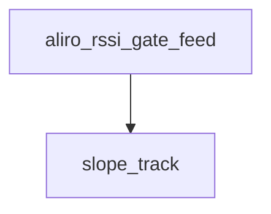

<!-- generated documentation — edit the source, not this file -->
# `modules/woz_aliro/src/aliro_rssi_gate.c`

BLE-RSSI ranging power gate implementation: EWMA smoothing in Q4 fixed point,
open/close hysteresis with a sustained-below close hold, and an optional
rise-rate fast open so a fast approach is not penalized by the smoothing lag.
Pure logic — no radio, clock, or logging dependencies — so the host suite can
drive it with synthetic approach traces.

**depends on** [`modules/woz_aliro/include/aliro_rssi_gate.h`](../modules.woz_aliro.include/aliro_rssi_gate.h.md)  ·  **discussed in** [`docs/power-profile.md`](../../power-profile.md)

## API

### `void aliro_rssi_gate_reset(struct aliro_rssi_gate *g)`
`modules/woz_aliro/src/aliro_rssi_gate.c:20`

Reset the RSSI gate to its initial state (all fields zeroed). Gate is not primed and will not
filter samples until the first feed.

### `bool aliro_rssi_gate_is_open(const struct aliro_rssi_gate *g)`
`modules/woz_aliro/src/aliro_rssi_gate.c:29`

Return true if the RSSI gate is currently open (signal is strong enough to unlock), false
otherwise.

### `void aliro_rssi_gate_hold_begin(struct aliro_rssi_gate *g, uint32_t now_ms)`
`modules/woz_aliro/src/aliro_rssi_gate.c:39`

Begin a hold period for the RSSI gate, marking the start time. Used by the reader to signal that
it is deferring an approach-unlock decision (e.g., awaiting a credential) and will check hold-cap
timeout on future samples.

### `bool aliro_rssi_gate_was_capped(const struct aliro_rssi_gate *g)`
`modules/woz_aliro/src/aliro_rssi_gate.c:51`

Return true if the gate ever hit the hold-cap timeout (max_hold_ms exceeded without qualifying on
RSSI level alone), false otherwise. Caller uses this to detect when the reader gave up waiting
and opened early.

### `int16_t aliro_rssi_gate_level_dbm(const struct aliro_rssi_gate *g)`
`modules/woz_aliro/src/aliro_rssi_gate.c:60`

Return the smoothed RSSI level in decibel-milliwatts (dBm). The value is the EWMA average of all
samples seen so far.

### `static void slope_track(struct aliro_rssi_gate *g, const struct aliro_rssi_gate_cfg *cfg, uint32_t now_ms)`
`modules/woz_aliro/src/aliro_rssi_gate.c:68`

Advance the rise-rate reference: `mid` follows the newest smoothed value, and
once it is window/2 old it becomes `old`, so `old` always lags the present by
between window/2 and ~window (given a steady sample interval).

**called by** `aliro_rssi_gate_feed`

### `bool aliro_rssi_gate_feed(struct aliro_rssi_gate *g, const struct aliro_rssi_gate_cfg *cfg, int8_t rssi_dbm, uint32_t now_ms)`
`modules/woz_aliro/src/aliro_rssi_gate.c:95`

Feed an RSSI sample and timestamp to the gate. Returns true if the gate should remain open (or
just opened). Handles EWMA smoothing, rise-rate fast-open when the signal climbs steeply within a
short window, hold-cap timeout to prevent indefinite deferral, and close-hysteresis to avoid
flapping on fades. Caller must supply configuration and current time; unavailable signals
(ALIRO_RSSI_UNAVAILABLE) are skipped and do not alter the state.

**calls** `slope_track`
