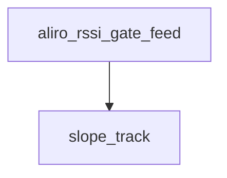

<!-- generated documentation — edit the source, not this file -->
# `modules/woz_aliro/src/aliro_rssi_gate.c`

BLE-RSSI ranging power gate implementation: EWMA smoothing in Q4 fixed point,
open/close hysteresis with a sustained-below close hold, and an optional
rise-rate fast open so a fast approach is not penalized by the smoothing lag.
Pure logic — no radio, clock, or logging dependencies — so the host suite can
drive it with synthetic approach traces.

**depends on** [`modules/woz_aliro/include/aliro_rssi_gate.h`](../modules.woz_aliro.include/aliro_rssi_gate.h.md)  ·  **discussed in** [`docs/power-profile.md`](../../power-profile.md)

## API

### `static void slope_track(struct aliro_rssi_gate *g, const struct aliro_rssi_gate_cfg *cfg, uint32_t now_ms)`
`modules/woz_aliro/src/aliro_rssi_gate.c:46`

Advance the rise-rate reference: `mid` follows the newest smoothed value, and
once it is window/2 old it becomes `old`, so `old` always lags the present by
between window/2 and ~window (given a steady sample interval).

**called by** `aliro_rssi_gate_feed`

Undocumented (6)

- `aliro_rssi_gate_reset` — tested: rssi gate
- `aliro_rssi_gate_is_open` — tested: rssi gate
- `aliro_rssi_gate_hold_begin` — tested: rssi gate
- `aliro_rssi_gate_was_capped` — tested: rssi gate
- `aliro_rssi_gate_level_dbm` — tested: rssi gate
- `aliro_rssi_gate_feed` — tested: rssi gate

