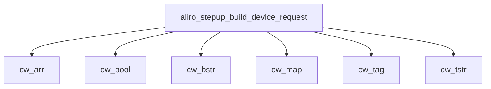

<!-- generated documentation — edit the source, not this file -->
# `modules/woz_aliro/src/aliro_stepup.c`

Aliro step-up phase codec + verifier: derives the StepUpSK SessionData keys, builds the mdoc
DeviceRequest and its ENVELOPE/GET RESPONSE APDUs, seals/opens SessionData over the aliro_secchan
AES-256-GCM channel, and runs the six-step Access Document verification of spec 7.4. The ES256
primitive is injected (verify ctx) so this unit carries no elliptic-curve dependency.

**depends on** [`modules/woz_aliro/include/aliro_crypto.h`](../modules.woz_aliro.include/aliro_crypto.h.md), [`modules/woz_aliro/include/aliro_stepup.h`](../modules.woz_aliro.include/aliro_stepup.h.md), [`modules/woz_aliro/src/aliro_hash.h`](aliro_hash.h.md)  ·  **discussed in** [`security/README.md`](../../../security/README.md)

## API

### `int aliro_stepup_derive_keys(const uint8_t block[ALIRO_KEY_BLOCK_LEN], uint8_t sk_reader[ALIRO_SESSION_KEY_LEN], uint8_t sk_device[ALIRO_SESSION_KEY_LEN])`
`modules/woz_aliro/src/aliro_stepup.c:27`

Derive Step-Up reader and device session keys (SKReader and SKDevice) from the Step-Up segment of
a key block using HKDF with null salt; return 0 on success or -1 if HKDF fails.

### `void aliro_stepup_channel_init(struct aliro_secchan *sc, const uint8_t sk_reader[ALIRO_SESSION_KEY_LEN], const uint8_t sk_device[ALIRO_SESSION_KEY_LEN])`
`modules/woz_aliro/src/aliro_stepup.c:46`

Initialize a session-key security channel for Step-Up step-up protocol using reader and device
session keys derived from key material.

### `struct cw`
`modules/woz_aliro/src/aliro_stepup.c:59`

CBOR writer: tracks output buffer pointer, end, and error state for incremental encoding of
BER-TLV and CBOR primitives.

### `static void cw_raw(struct cw *w, const void *b, size_t n)`
`modules/woz_aliro/src/aliro_stepup.c:69`

Append n bytes from buffer b to the CBOR writer; set error flag and return early if no space
remains or writer is already in error state.

**called by** `cw_bool`, `cw_bstr`, `cw_tstr`, `cw_type`

### `static void cw_type(struct cw *w, uint8_t major, uint64_t arg)`
`modules/woz_aliro/src/aliro_stepup.c:83`

Encode a CBOR major type and argument into the writer as 1, 2, 3, or 5 bytes depending on
argument magnitude.

**called by** `cw_arr`, `cw_bstr`, `cw_map`, `cw_tag`, `cw_tstr`  ·  **calls** `cw_raw`

### `static void cw_map(struct cw *w, uint64_t n)`
`modules/woz_aliro/src/aliro_stepup.c:114`

Encode a CBOR map header with n key-value pairs.

**called by** `aliro_stepup_build_device_request`, `aliro_stepup_seal_sessiondata`  ·  **calls** `cw_type`

### `static void cw_arr(struct cw *w, uint64_t n)`
`modules/woz_aliro/src/aliro_stepup.c:121`

Encode a CBOR array header with n elements.

**called by** `aliro_stepup_build_device_request`, `build_sig_structure`  ·  **calls** `cw_type`

### `static void cw_tstr(struct cw *w, const char *s)`
`modules/woz_aliro/src/aliro_stepup.c:128`

Encode a CBOR text string header and payload.

**called by** `aliro_stepup_build_device_request`, `aliro_stepup_seal_sessiondata`, `build_sig_structure`  ·  **calls** `cw_raw`, `cw_type`

### `static void cw_bstr(struct cw *w, const uint8_t *b, size_t n)`
`modules/woz_aliro/src/aliro_stepup.c:138`

Encode a CBOR byte string header and payload.

**called by** `aliro_stepup_build_device_request`, `aliro_stepup_seal_sessiondata`, `build_sig_structure`  ·  **calls** `cw_raw`, `cw_type`

### `static void cw_tag(struct cw *w, uint64_t t)`
`modules/woz_aliro/src/aliro_stepup.c:146`

Encode a CBOR semantic tag number.

**called by** `aliro_stepup_build_device_request`  ·  **calls** `cw_type`

### `static void cw_bool(struct cw *w, int v)`
`modules/woz_aliro/src/aliro_stepup.c:153`

Append a CBOR boolean (0xf5 for true, 0xf4 for false) to the writer.

**called by** `aliro_stepup_build_device_request`  ·  **calls** `cw_raw`

### `int aliro_stepup_build_device_request(const char *const *elems, size_t n_elems, uint8_t *out, size_t cap, size_t *out_len)`
`modules/woz_aliro/src/aliro_stepup.c:169`

Build a CBOR-encoded Step-Up deviceRequest with itemsRequest containing requested element names
(or default AccessCode, AccessLevel if none given) and docType "aliro-a"; return 0 on success or
-1 on buffer overflow.

**calls** `cw_arr`, `cw_bool`, `cw_bstr`, `cw_map`, `cw_tag`, `cw_tstr`

### `int aliro_stepup_seal_sessiondata(struct aliro_secchan *sc, const uint8_t *plain, size_t plain_len, uint8_t *out, size_t cap, size_t *out_len)`
`modules/woz_aliro/src/aliro_stepup.c:222`

Seal a plaintext Step-Up response into a CBOR map with key "data" containing BER-TLV CBOR byte
string; return 0 on success or -1 on encryption or buffer errors.

**calls** `cw_bstr`, `cw_map`, `cw_tstr`

### `int aliro_stepup_open_sessiondata(struct aliro_secchan *sc, const uint8_t *sd, size_t sd_len, uint8_t *out, size_t cap, size_t *out_len)`
`modules/woz_aliro/src/aliro_stepup.c:250`

Decrypt a CBOR-wrapped sessionData blob (tag 0xa1, key "data", BER-TLV CBOR bstr) using the
security channel; return 0 and write plaintext length to *out_len on success, or -1 if format is
invalid, authentication fails, or output capacity is exceeded.

**called by** `aliro_stepup_run`

### `int aliro_stepup_build_envelope(const uint8_t *data, size_t data_len, int chaining, uint8_t *out, size_t cap, size_t *out_len)`
`modules/woz_aliro/src/aliro_stepup.c:299`

Encode an APDU ENVELOPE command (ISO 7816-4 chaining flag, INS 0xC3, and 5-byte fixed header)
wrapping plaintext data; return 0 on success or -1 if data_len is 0, exceeds 255, or output
buffer is too small.

### `int aliro_stepup_build_get_response(uint8_t le, uint8_t *out, size_t cap, size_t *out_len)`
`modules/woz_aliro/src/aliro_stepup.c:320`

Encode an APDU GET RESPONSE command (INS 0xC0) with expected response length le; return 0 on
success or -1 if output buffer is too small.

### `static size_t build_sig_structure(const struct aliro_stepup_doc *doc, uint8_t *out, size_t cap)`
`modules/woz_aliro/src/aliro_stepup.c:338`

Build the COSE Sig_structure ["Signature1", protected, ext_aad(empty), payload]
that the IssuerAuth ES256 signature covers. Returns the length or 0 on error.

**called by** `aliro_stepup_verify`  ·  **calls** `cw_arr`, `cw_bstr`, `cw_tstr`

### `static int x5chain_ee_pubkey(const uint8_t *x5, size_t n, uint8_t pub[65])`
`modules/woz_aliro/src/aliro_stepup.c:356`

Extract a P-256 end-entity public key from an x5chain: scan for the SPKI
uncompressed-point marker `03 42 00 04` (BIT STRING, 66 bytes, 0 unused, 0x04)
and take the following 64 bytes as X||Y. Bounded; no full DER parse.

**called by** `select_issuer`

### `static int select_issuer(const struct aliro_stepup_doc *doc, const struct aliro_stepup_verify_ctx *ctx, uint8_t pub[65], int *chain_validated)`
`modules/woz_aliro/src/aliro_stepup.c:377`

Select an issuer public key for Step-Up signature verification from x5chain, kid-matched
provisioned issuer, or single fallback issuer; set *chain_validated to 0 if x5chain is used (not
validated), 1 otherwise; return 0 on success or -1 if selection criteria cannot be met.

**called by** `aliro_stepup_verify`  ·  **calls** `x5chain_ee_pubkey`

### `static const struct aliro_stepup_digest *find_digest(const struct aliro_stepup_doc *doc, uint64_t id)`
`modules/woz_aliro/src/aliro_stepup.c:408`

Search a Step-Up document's digest list for an entry with the given numeric id; return pointer to
the digest on success or NULL if not found.

**called by** `aliro_stepup_verify`

### `static int ct_bytes_equal(const uint8_t *a, const uint8_t *b, size_t n)`
`modules/woz_aliro/src/aliro_stepup.c:428`

Compare two byte strings in time independent of their contents; return 1 if all @p n bytes are
equal and 0 otherwise.
memcmp returns as soon as it finds a difference, so how long it runs says how many leading bytes
matched. On a digest check inside an access-control verifier that is an oracle: it turns forging
a 32-byte value from one 2^256 guess into 32 guesses of 256. The OR-accumulate below always
reads all @p n bytes and branches once, on data the attacker cannot vary.

**called by** `aliro_stepup_verify`

### `int aliro_stepup_verify(const struct aliro_stepup_doc *doc, const struct aliro_stepup_verify_ctx *ctx, struct aliro_stepup_verdict *v)`
`modules/woz_aliro/src/aliro_stepup.c:443`

Verify a parsed Step-Up document against issuer keys, signature, digests, doctype, time window,
and validity iteration; populate verdict struct with per-step validation results and overall
validity flag; return 0 if valid, -1 otherwise.

**called by** `aliro_stepup_run`  ·  **calls** `build_sig_structure`, `ct_bytes_equal`, `find_digest`, `select_issuer`

### `int aliro_stepup_run(struct aliro_secchan *sc, const uint8_t *sd_resp, size_t sd_len, const struct aliro_stepup_verify_ctx *ctx, uint8_t *scratch, size_t scratch_cap, struct aliro_stepup_doc *doc, struct aliro_stepup_verdict *verdict)`
`modules/woz_aliro/src/aliro_stepup.c:520`

Decrypt sessionData from a Step-Up response APDU, parse the plaintext as a document, and verify
it; return 0 on success or -1 on decryption failure, parse error, or verification failure.

**calls** `aliro_stepup_open_sessiondata`, `aliro_stepup_verify`
