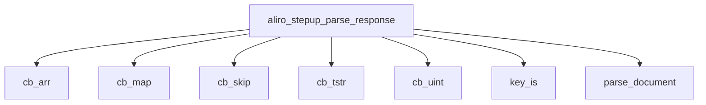

<!-- generated documentation — edit the source, not this file -->
# `modules/woz_aliro/src/aliro_stepup_parse.c`

DeviceResponse structural decoder for the Aliro step-up phase: a minimal, bounds-checked,
depth-limited CBOR reader (definite-length core-deterministic only) plus the Table 8-22/7-1/7-2
field walk. No crypto and no allocation; every parsed field is a slice of the caller's buffer.
This is the wire-facing attack surface and is fuzzed on its own (tests/host/fuzz/fuzz_stepup.c).

**depends on** [`modules/woz_aliro/include/aliro_stepup.h`](../modules.woz_aliro.include/aliro_stepup.h.md)

## API

### `struct cbor`
`modules/woz_aliro/src/aliro_stepup_parse.c:25`

CBOR stream parser: p (current position), end (buffer limit).

### `static int cb_head(struct cbor *c, uint8_t *mt, uint64_t *arg)`
`modules/woz_aliro/src/aliro_stepup_parse.c:33`

Read one CBOR head: major type + argument. Consumes the argument bytes (and,
for major type 7, the simple/float payload). Rejects indefinite lengths and
anything truncated. Returns 0 on success.

**called by** `cb_bool`, `cb_expect`, `cb_int_key`, `cb_skip_d`

### `static int cb_skip_d(struct cbor *c, int depth)`
`modules/woz_aliro/src/aliro_stepup_parse.c:69`

Recursively skip one CBOR value: ints/floats/strings/arrays/maps/tags. Depth-checks CB_MAX_DEPTH.
Returns 0 on success, -1 on overflow or malformed.

**called by** `cb_skip`  ·  **calls** `cb_head`

### `static int cb_skip(struct cbor *c)`
`modules/woz_aliro/src/aliro_stepup_parse.c:114`

Skip one complete CBOR value (int, string, array, map, tag, float, or null). Returns 0 on
success, -1 on malformed input or depth overflow.

**called by** `aliro_stepup_parse_response`, `parse_document`, `parse_issuer_auth`, `parse_issuer_signed`, `parse_mso`, `parse_name_spaces`, `parse_one_item`, `parse_validity`  ·  **calls** `cb_skip_d`

### `static int cb_expect(struct cbor *c, uint8_t want_mt, uint64_t *arg)`
`modules/woz_aliro/src/aliro_stepup_parse.c:123`

Parse CBOR major type + argument with type check: consume one head, verify mt matches want_mt,
return 0 and set *arg, else -1.

**called by** `cb_arr`, `cb_bytes`, `cb_map`, `cb_tag`, `cb_uint`  ·  **calls** `cb_head`

### `static int cb_map(struct cbor *c, uint64_t *n)`
`modules/woz_aliro/src/aliro_stepup_parse.c:136`

Parse CBOR major type 5 (map) and return the number of key-value pairs.

**called by** `aliro_stepup_parse_response`, `parse_document`, `parse_issuer_auth`, `parse_issuer_signed`, `parse_mso`, `parse_name_spaces`, `parse_one_item`, `parse_validity`  ·  **calls** `cb_expect`

### `static int cb_arr(struct cbor *c, uint64_t *n)`
`modules/woz_aliro/src/aliro_stepup_parse.c:144`

Parse CBOR major type 4 (array) and return the element count.

**called by** `aliro_stepup_parse_response`, `parse_issuer_auth`, `parse_name_spaces`  ·  **calls** `cb_expect`

### `static int cb_uint(struct cbor *c, uint64_t *v)`
`modules/woz_aliro/src/aliro_stepup_parse.c:152`

Parse CBOR major type 0 (unsigned integer) and return the value.

**called by** `aliro_stepup_parse_response`, `parse_one_item`, `parse_validity`, `parse_value_digests`  ·  **calls** `cb_expect`

### `static int cb_bytes(struct cbor *c, uint8_t want_mt, const uint8_t **s, size_t *n)`
`modules/woz_aliro/src/aliro_stepup_parse.c:161`

Parse a CBOR byte string or text string (major type 2 or 3) and return a pointer to its data and
length. Returns 0 on success, -1 on type mismatch or overflow.

**called by** `cb_bstr`, `cb_tstr`  ·  **calls** `cb_expect`

### `static int cb_bstr(struct cbor *c, const uint8_t **s, size_t *n)`
`modules/woz_aliro/src/aliro_stepup_parse.c:177`

Parse a CBOR byte string (major type 2) and return a pointer to its data and length.

**called by** `parse_issuer_auth`, `parse_one_item`, `parse_value_digests`  ·  **calls** `cb_bytes`

### `static int cb_tstr(struct cbor *c, const uint8_t **s, size_t *n)`
`modules/woz_aliro/src/aliro_stepup_parse.c:185`

Parse a CBOR text string (major type 3) and return a pointer to its data and length.

**called by** `aliro_stepup_parse_response`, `parse_document`, `parse_issuer_signed`, `parse_mso`, `parse_name_spaces`, `parse_one_item`, `parse_validity`, `parse_value_digests`  ·  **calls** `cb_bytes`

### `static int cb_int_key(struct cbor *c, int64_t *v)`
`modules/woz_aliro/src/aliro_stepup_parse.c:191`

Read a signed integer map key (uint or nint).

**called by** `parse_issuer_auth`  ·  **calls** `cb_head`

### `static int cb_bool(struct cbor *c, int *b)`
`modules/woz_aliro/src/aliro_stepup_parse.c:214`

Parse one CBOR boolean (major type 7, arg 20 or 21). Returns 0 and sets *b to 0 (false) or 1
(true), -1 on mismatch.

**called by** `parse_mso`  ·  **calls** `cb_head`

### `static int cb_tag(struct cbor *c, uint64_t *tag)`
`modules/woz_aliro/src/aliro_stepup_parse.c:229`

Parse CBOR major type 6 (semantic tag) and return the tag number.

**called by** `parse_issuer_auth`, `parse_one_item`, `parse_validity`  ·  **calls** `cb_expect`

### `static void str_copy(char *dst, size_t cap, const uint8_t *s, size_t n)`
`modules/woz_aliro/src/aliro_stepup_parse.c:235`

Copy a text string into a fixed char buffer (NUL-terminated, truncated).

**called by** `parse_document`, `parse_mso`, `parse_name_spaces`, `parse_one_item`

### `static int key_is(const uint8_t *s, size_t n, char c)`
`modules/woz_aliro/src/aliro_stepup_parse.c:244`

Match a 1-byte text key "1".."9" without allocating.

**called by** `aliro_stepup_parse_response`, `parse_document`, `parse_issuer_signed`, `parse_mso`, `parse_one_item`, `parse_validity`

### `static int digit2(const uint8_t *s, int *out)`
`modules/woz_aliro/src/aliro_stepup_parse.c:254`

Parse two decimal digits (s[0], s[1]). Returns 0 and *out = 0-99, else -1.

**called by** `tdate_epoch`

### `static int64_t days_from_civil(int64_t y, unsigned m, unsigned d)`
`modules/woz_aliro/src/aliro_stepup_parse.c:264`

days since 1970-01-01 for a proleptic-Gregorian civil date (Hinnant).

**called by** `tdate_epoch`

### `static int tdate_epoch(const uint8_t *s, size_t n, int64_t *epoch)`
`modules/woz_aliro/src/aliro_stepup_parse.c:276`

Parse "YYYY-MM-DDTHH:MM:SSZ" (20 chars). Returns 0 and *epoch, else -1.

**called by** `parse_validity`  ·  **calls** `days_from_civil`, `digit2`

### `static int parse_validity(struct cbor *c, struct aliro_stepup_doc *doc)`
`modules/woz_aliro/src/aliro_stepup_parse.c:307`

Parse the mdoc validity object: extracts validityIteration (key "5") and
signed/validFrom/validUntil times (keys "1"/"2"/"3", each tagged with epoch 0). Returns 0 on
success, -1 on parse error. Sets have_* flags and epoch values in the output struct for each
field found.

**called by** `parse_mso`  ·  **calls** `cb_map`, `cb_skip`, `cb_tag`, `cb_tstr`, `cb_uint`, `key_is`, `tdate_epoch`

### `static int parse_value_digests(struct cbor *c, struct aliro_stepup_doc *doc)`
`modules/woz_aliro/src/aliro_stepup_parse.c:362`

Parse the mdoc valueDigests map: reads namespace → digest-ID → hash pairs. Collects up to
ALIRO_STEPUP_MAX_DIGESTS SHA-256 hashes (32 bytes). Returns 0 on success, -1 on parse error.

**called by** `parse_mso`  ·  **calls** `cb_bstr`, `cb_map`, `cb_tstr`, `cb_uint`

### `static int parse_mso(const uint8_t *mso, size_t mso_len, struct aliro_stepup_doc *doc)`
`modules/woz_aliro/src/aliro_stepup_parse.c:400`

Parse the mobile security object (MSO): extracts digest algorithm (key "2"), valueDigests (key
"3"), docType (key "5"), validity (key "6"), and timeVerificationRequired (key "7"). Returns 0 on
success, -1 on parse error. Calls parse_validity and parse_value_digests.

**called by** `parse_issuer_auth`  ·  **calls** `cb_bool`, `cb_map`, `cb_skip`, `cb_tstr`, `key_is`, `parse_validity`, `parse_value_digests`, `str_copy`

### `static int parse_issuer_auth(struct cbor *c, struct aliro_stepup_doc *doc)`
`modules/woz_aliro/src/aliro_stepup_parse.c:457`

Parse the issuer authentication COSE Sign1 structure: reads protected header, unprotected map
(extracts kid at key 4 and x5chain at key 33), payload, and signature (64 bytes). Unwraps the
payload from CBOR tag 24 and calls parse_mso. Returns 0 on success, -1 on format error.

**called by** `parse_issuer_signed`  ·  **calls** `cb_arr`, `cb_bstr`, `cb_int_key`, `cb_map`, `cb_skip`, `cb_tag`, `parse_mso`

### `static int parse_one_item(struct cbor *c, struct aliro_stepup_item *it)`
`modules/woz_aliro/src/aliro_stepup_parse.c:530`

Parse one mdoc item from an issuer-signed namespace: unwraps CBOR tag 24 and reads elementID (key
"3") and digestID (key "1"). Returns 0 on success, -1 on parse error. Stores the full tagged
bytes and extracted fields in the output struct.

**called by** `parse_name_spaces`  ·  **calls** `cb_bstr`, `cb_map`, `cb_skip`, `cb_tag`, `cb_tstr`, `cb_uint`, `key_is`, `str_copy`

### `static int parse_name_spaces(struct cbor *c, struct aliro_stepup_doc *doc)`
`modules/woz_aliro/src/aliro_stepup_parse.c:581`

Parse the issuer-signed nameSpaces map: reads namespace → array of items. Stores the first
namespace name found, then collects up to ALIRO_STEPUP_MAX_ITEMS from all namespaces. Returns 0
on success, -1 on parse error.

**called by** `parse_issuer_signed`  ·  **calls** `cb_arr`, `cb_map`, `cb_skip`, `cb_tstr`, `parse_one_item`, `str_copy`

### `static int parse_issuer_signed(struct cbor *c, struct aliro_stepup_doc *doc)`
`modules/woz_aliro/src/aliro_stepup_parse.c:617`

Parse the issuer-signed wrapper: reads nameSpaces (key "1") and issuerAuth (key "2"). Returns 0
on success, -1 on parse error.

**called by** `parse_document`  ·  **calls** `cb_map`, `cb_skip`, `cb_tstr`, `key_is`, `parse_issuer_auth`, `parse_name_spaces`

### `static int parse_document(struct cbor *c, struct aliro_stepup_doc *doc)`
`modules/woz_aliro/src/aliro_stepup_parse.c:650`

Parse one mdoc document: reads issuerSigned (key "1") and docType (key "5"). Returns 0 on
success, -1 on parse error. Calls parse_issuer_signed.

**called by** `aliro_stepup_parse_response`  ·  **calls** `cb_map`, `cb_skip`, `cb_tstr`, `key_is`, `parse_issuer_signed`, `str_copy`

### `int aliro_stepup_parse_response(const uint8_t *buf, size_t len, struct aliro_stepup_doc *doc)`
`modules/woz_aliro/src/aliro_stepup_parse.c:688`

Parse a mobile driver license response: top-level CBOR map with status (key "3") and documents
array (key "2"). Extracts the first document only and sets have_document flag. Returns 0 on
success, -1 on null pointer or parse error. Zeros the output struct on entry.

**calls** `cb_arr`, `cb_map`, `cb_skip`, `cb_tstr`, `cb_uint`, `key_is`, `parse_document`
