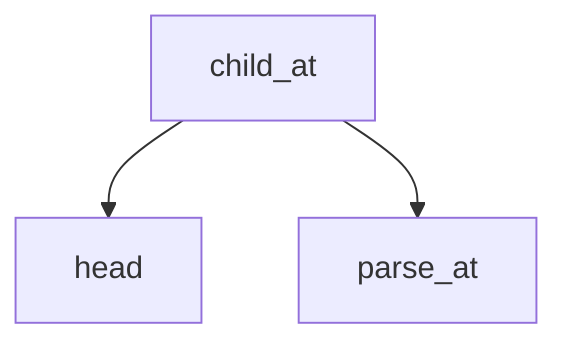

<!-- generated documentation — edit the source, not this file -->
# `modules/woz_aliro_stack/src/protocol/access_document.c`

**depends on** [`modules/woz_aliro_stack/src/protocol/access_document.h`](access_document.h.md)

## API

### `int woz_aliro_parse_access_document(const uint8_t *data, size_t length, const uint8_t *requested, size_t requested_length, struct woz_aliro_access_document *r)`
`modules/woz_aliro_stack/src/protocol/access_document.c:276`

Strictly parse the compact-key Aliro Access Document subset used by a reader.

**calls** `child_at`, `integer`, `map_find_int`, `map_find_text`, `root`, `tagged_embedded`, `timestamp`

Undocumented (11)

- `item`
- `head`
- `child_count`
- `parse_at`
- `root`
- `child_at`
- `map_find_text`
- `integer`
- `map_find_int`
- `tagged_embedded`
- `timestamp`

