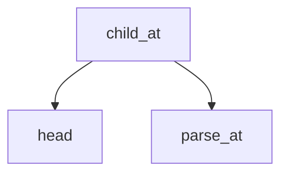

<!-- generated documentation — edit the source, not this file -->
# `modules/woz_aliro_stack/src/protocol/access_document.c`

@file access_document.c
Compact-key CBOR parser for Aliro Access Documents (compact subset of ISO 18013-5 mDoc). Parses
strictly with iterative depth traversal (no stack recursion), validates CBOR encoding (no floats,
no simple values with payloads, minimal representation), and enforces a 25-level nesting bound.
Core: parse_at walks encoded items; root validates full-buffer consumption; child_at / map_find_*
retrieve nested elements; integer / timestamp extract scalar fields.

**depends on** [`modules/woz_aliro_stack/src/protocol/access_document.h`](access_document.h.md)

## API

### `struct item`
`modules/woz_aliro_stack/src/protocol/access_document.c:17`

Parsed CBOR item: major type, argument value, raw encoded bytes (with length), and payload
(contents for strings/arrays after the head).

### `static int head(const uint8_t *data, size_t length, size_t *offset, uint8_t *major, uint64_t *value)`
`modules/woz_aliro_stack/src/protocol/access_document.c:31`

Parse one CBOR head (major type and argument): consume the initial byte (type in bits 7-5, info
in bits 4-0), then additional bytes for arguments 24+ (1/2/4/8 bytes). Return 0 on success, -1 on
overflow/underrun/non-canonical encoding. Advances offset.

**called by** `child_at`, `map_find_int`, `map_find_text`, `parse_at`, `tagged_embedded`, `timestamp`

### `static int child_count(uint8_t major, uint64_t value, uint64_t *count)`
`modules/woz_aliro_stack/src/protocol/access_document.c:64`

Count the number of child elements in a CBOR container by major type: arrays (type 4) → count,
maps (type 5) → count*2 (each key-value pair), tags (type 6) → 1 (the tagged value). Returns -1
for invalid major types.

**called by** `parse_at`

### `static int parse_at(const uint8_t *data, size_t length, size_t *offset, struct item *out)`
`modules/woz_aliro_stack/src/protocol/access_document.c:90`

Parse one CBOR-encoded item and all its children iteratively (depth-first traversal),
constraining nesting to at most 25 levels to bound the embedded workqueue stack. On success,
populate out with the major type, argument value, encoded-byte range, and (for strings) the
payload pointer and length. Return 0 on success, -1 on format error, overflow, or underrun.

**called by** `child_at`, `map_find_int`, `map_find_text`, `root`, `tagged_embedded`, `timestamp`  ·  **calls** `child_count`, `head`

### `static int root(const uint8_t *data, size_t length, struct item *out)`
`modules/woz_aliro_stack/src/protocol/access_document.c:182`

Parse the root CBOR item and validate that it consumes the entire input. Return 0 on success, -1
if parsing fails or trailing bytes remain.

**called by** `woz_aliro_parse_access_document`  ·  **calls** `parse_at`

### `static int child_at(const struct item *container, size_t wanted, struct item *out)`
`modules/woz_aliro_stack/src/protocol/access_document.c:193`

Extract the child at position wanted (0-indexed) from a CBOR array or map, re-reading the
container head and walking wanted+1 items to reach it. Return 0 on success, -1 if the container
is not an array/map, the index is out of bounds, or parsing fails.

**called by** `woz_aliro_parse_access_document`  ·  **calls** `head`, `parse_at`

### `static int map_find_text(const struct item *map, const char *key, struct item *value)`
`modules/woz_aliro_stack/src/protocol/access_document.c:218`

Search a CBOR map (major type 5) for an entry with text string key (major type 3). Iterate
key-value pairs and return 0 when a match is found (value written to result), or -1 if the key is
not present or parsing fails.

**called by** `woz_aliro_parse_access_document`  ·  **calls** `head`, `parse_at`

### `static int integer(const struct item *item, int64_t *value)`
`modules/woz_aliro_stack/src/protocol/access_document.c:249`

Extract a signed integer from a parsed CBOR item: major type 0 (uint) → positive value, type 1
(nint) → -(value + 1). Returns 0 on success, -1 if the item is not an integer or overflows
int64_t.

**called by** `map_find_int`, `woz_aliro_parse_access_document`

### `static int map_find_int(const struct item *map, int64_t key, struct item *value)`
`modules/woz_aliro_stack/src/protocol/access_document.c:267`

Search a CBOR map (major type 5) for an entry with integer key. Iterate key-value pairs and
return 0 when a match is found (value written to result), or -1 if the key is not present or
parsing fails.

**called by** `woz_aliro_parse_access_document`  ·  **calls** `head`, `integer`, `parse_at`

### `static int tagged_embedded(const struct item *tag, struct item *embedded)`
`modules/woz_aliro_stack/src/protocol/access_document.c:298`

Extract the byte payload from a CBOR tag with tag number 24 (embedded tag for binary data).
Validate that the tag contains exactly one child of type 2 (byte string) and that it fills the
entire tag encoding. Return 0 on success, -1 on format error.

**called by** `woz_aliro_parse_access_document`  ·  **calls** `head`, `parse_at`

### `static int timestamp(const struct item *item, uint8_t output[20])`
`modules/woz_aliro_stack/src/protocol/access_document.c:319`

Extract a 20-byte timestamp from a CBOR item: accept a text string (major type 3) directly, or
extract and unwrap a tag-0 wrapper around a text string. Validate length and copy the payload.
Return 0 on success, -1 if format or length is invalid.

**called by** `woz_aliro_parse_access_document`  ·  **calls** `head`, `parse_at`

### `int woz_aliro_parse_access_document(const uint8_t *data, size_t length, const uint8_t *requested, size_t requested_length, struct woz_aliro_access_document *r)`
`modules/woz_aliro_stack/src/protocol/access_document.c:338`

Strictly parse the compact-key Aliro Access Document subset used by a reader.

**calls** `child_at`, `integer`, `map_find_int`, `map_find_text`, `root`, `tagged_embedded`, `timestamp`
