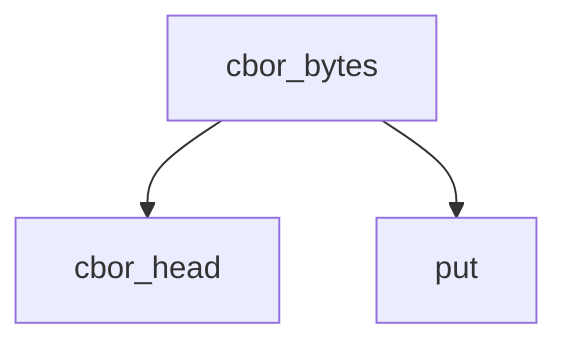

<!-- generated documentation — edit the source, not this file -->
# `modules/woz_aliro_stack/src/protocol/nfc_step_up.c`

@file nfc_step_up.c
NFC step-up messaging: compact-key CBOR encoder/decoder for Aliro DeviceRequest and SessionData
(ISO 18013-5). Core: put appends to writer buffer; cbor_head / cbor_bytes / text build encoded
items; cbor_read_head parses with validation (non-minimal representation rejected);
build_device_request constructs DeviceRequest (compact keys); wrap_session_data /
unwrap_session_data encode/decode SessionData; wrap_do53 / unwrap_do53 TLV-wrap messages;
build_envelope_command / build_get_response_command and collect_response chain ISO APDU commands.

**depends on** [`modules/woz_aliro_stack/src/protocol/nfc_step_up.h`](nfc_step_up.h.md), [`modules/woz_aliro_stack/src/protocol/tlv.h`](tlv.h.md)

## API

### `struct writer`
`modules/woz_aliro_stack/src/protocol/nfc_step_up.c:20`

Buffered writer for composing CBOR/TLV payloads: tracks current write position and capacity. Used
by message builders to accumulate encoded data.

### `static int put(struct writer *w, const void *data, size_t length)`
`modules/woz_aliro_stack/src/protocol/nfc_step_up.c:31`

Append bytes to a writer buffer. Returns WOZ_ALIRO_STEP_UP_OK on success,
WOZ_ALIRO_STEP_UP_BUFFER_TOO_SMALL if appending would exceed capacity. Length-zero writes are
allowed and do not alter the buffer.

**called by** `cbor_bytes`, `cbor_head`, `woz_aliro_build_device_request`

### `static int cbor_head(struct writer *w, uint8_t major, size_t value)`
`modules/woz_aliro_stack/src/protocol/nfc_step_up.c:48`

Encode a CBOR head (major type + argument value) into the writer buffer. Values <24 fit in 1
byte; 24–255 in 2 bytes; 256–65535 in 3 bytes; 65536–2^32−1 in 5 bytes; larger in 9 bytes. Return
WOZ_ALIRO_STEP_UP_OK on success, WOZ_ALIRO_STEP_UP_BUFFER_TOO_SMALL if appending would overflow.

**called by** `cbor_bytes`, `woz_aliro_build_device_request`, `woz_aliro_wrap_session_data`  ·  **calls** `put`

### `static int cbor_bytes(struct writer *w, uint8_t major, const uint8_t *data, size_t length)`
`modules/woz_aliro_stack/src/protocol/nfc_step_up.c:84`

Encode a CBOR byte string (major type 2 or 3) or text string: emit the head (type + length) then
the payload bytes. Return WOZ_ALIRO_STEP_UP_OK on success, WOZ_ALIRO_STEP_UP_BUFFER_TOO_SMALL if
appending would overflow.

**called by** `text`, `woz_aliro_build_device_request`, `woz_aliro_wrap_session_data`  ·  **calls** `cbor_head`, `put`

### `static int text(struct writer *w, const char *value)`
`modules/woz_aliro_stack/src/protocol/nfc_step_up.c:94`

Encode a UTF-8 text string as CBOR major type 3: emit the head and the string bytes. Return
WOZ_ALIRO_STEP_UP_OK on success, WOZ_ALIRO_STEP_UP_BUFFER_TOO_SMALL if appending would overflow.

**called by** `woz_aliro_build_device_request`, `woz_aliro_wrap_session_data`  ·  **calls** `cbor_bytes`

### `int woz_aliro_build_device_request(const uint8_t *element_identifier, size_t element_identifier_length, bool intent_to_store, uint8_t *output, size_t output_capacity, size_t *output_length)`
`modules/woz_aliro_stack/src/protocol/nfc_step_up.c:99`

Build the compact-key Aliro DeviceRequest.

**calls** `cbor_bytes`, `cbor_head`, `put`, `text`

### `int woz_aliro_wrap_session_data(const uint8_t *ciphertext, size_t ciphertext_length, uint8_t *output, size_t output_capacity, size_t *output_length)`
`modules/woz_aliro_stack/src/protocol/nfc_step_up.c:142`

Encode/decode ISO 18013-5 SessionData: { "data": bstr }.

**calls** `cbor_bytes`, `cbor_head`, `text`

### `static int cbor_read_head(const uint8_t *data, size_t length, size_t *offset, uint8_t major, size_t *value)`
`modules/woz_aliro_stack/src/protocol/nfc_step_up.c:170`

Parse a CBOR major type and initial value from an encoded stream. Major type is encoded in the
top 3 bits of the first byte; additional info determines whether the value follows. Validates
encoding: rejects non-minimal representations (e.g., a 1-byte value encoded with 2 bytes) and
returns WOZ_ALIRO_STEP_UP_INVALID_DATA if the major type or additional-info field does not match
expectations.

**called by** `woz_aliro_unwrap_session_data`

### `int woz_aliro_unwrap_session_data(const uint8_t *session_data, size_t session_data_length, const uint8_t **ciphertext, size_t *ciphertext_length)`
`modules/woz_aliro_stack/src/protocol/nfc_step_up.c:206`

Unwrap an ISO 18013-5 SessionData envelope (CBOR map with "data" key) to extract the encrypted
ciphertext. Validate that SessionData is a map with exactly one entry and return a pointer into
the input buffer for the ciphertext bytes and their length. Return 0 on success,
WOZ_ALIRO_STEP_UP_INVALID_DATA on format error or invalid argument.

**calls** `cbor_read_head`

### `int woz_aliro_wrap_do53(const uint8_t *message, size_t message_length, uint8_t *output, size_t output_capacity, size_t *output_length)`
`modules/woz_aliro_stack/src/protocol/nfc_step_up.c:228`

Encode/decode the NFC Device Engagement DO53 wrapper.

### `int woz_aliro_unwrap_do53(const uint8_t *encoded, size_t encoded_length, const uint8_t **message, size_t *message_length)`
`modules/woz_aliro_stack/src/protocol/nfc_step_up.c:248`

Unwrap an Aliro DO'53 TLV-encoded message: extract the value of a tag-0x53 object from an encoded
buffer. Returns a pointer into the input buffer for the message payload and its length; the
pointer is valid only as long as the input buffer is valid.

### `int woz_aliro_build_envelope_command(const uint8_t *encoded_do53, size_t encoded_length, size_t *offset, size_t max_command_data, size_t max_response_data, bool extended_supported, uint8_t *output, size_t output_capacity, size_t *output_length, bool *last_fragment)`
`modules/woz_aliro_stack/src/protocol/nfc_step_up.c:265`

Build one ENVELOPE command. offset is advanced by the emitted fragment.

### `int woz_aliro_build_get_response_command(size_t expected_length, uint8_t *output, size_t output_capacity, size_t *output_length)`
`modules/woz_aliro_stack/src/protocol/nfc_step_up.c:324`

Build an ISO 7816 GET RESPONSE command APDU for retrieving data from a previous response chain.
For lengths <= 256 bytes, outputs a 5-byte APDU; for lengths > 256, outputs a 7-byte
extended-length APDU. Output capacity must be >= 5 or >= 7 bytes respectively. Expected length
must be 1–65536.

### `int woz_aliro_collect_response(const uint8_t *response, size_t response_length, uint8_t *collected, size_t collected_capacity, size_t *collected_length, size_t *next_length)`
`modules/woz_aliro_stack/src/protocol/nfc_step_up.c:352`

Append response data and interpret 9000 / 61xx. sw2==0 means 256 bytes.
