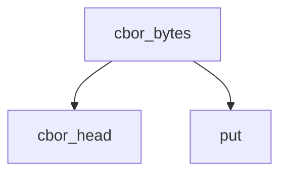

<!-- generated documentation — edit the source, not this file -->
# `modules/woz_aliro_stack/src/protocol/nfc_step_up.c`

**depends on** [`modules/woz_aliro_stack/src/protocol/nfc_step_up.h`](nfc_step_up.h.md), [`modules/woz_aliro_stack/src/protocol/tlv.h`](tlv.h.md)

## API

### `int woz_aliro_build_device_request(const uint8_t *element_identifier, size_t element_identifier_length, bool intent_to_store, uint8_t *output, size_t output_capacity, size_t *output_length)`
`modules/woz_aliro_stack/src/protocol/nfc_step_up.c:67`

Build the compact-key Aliro DeviceRequest.

**calls** `cbor_bytes`, `cbor_head`, `put`, `text`

### `int woz_aliro_wrap_session_data(const uint8_t *ciphertext, size_t ciphertext_length, uint8_t *output, size_t output_capacity, size_t *output_length)`
`modules/woz_aliro_stack/src/protocol/nfc_step_up.c:110`

Encode/decode ISO 18013-5 SessionData: { "data": bstr }.

**calls** `cbor_bytes`, `cbor_head`, `text`

### `int woz_aliro_wrap_do53(const uint8_t *message, size_t message_length, uint8_t *output, size_t output_capacity, size_t *output_length)`
`modules/woz_aliro_stack/src/protocol/nfc_step_up.c:183`

Encode/decode the NFC Device Engagement DO53 wrapper.

### `int woz_aliro_build_envelope_command(const uint8_t *encoded_do53, size_t encoded_length, size_t *offset, size_t max_command_data, size_t max_response_data, bool extended_supported, uint8_t *output, size_t output_capacity, size_t *output_length, bool *last_fragment)`
`modules/woz_aliro_stack/src/protocol/nfc_step_up.c:215`

Build one ENVELOPE command. offset is advanced by the emitted fragment.

### `int woz_aliro_collect_response(const uint8_t *response, size_t response_length, uint8_t *collected, size_t collected_capacity, size_t *collected_length, size_t *next_length)`
`modules/woz_aliro_stack/src/protocol/nfc_step_up.c:296`

Append response data and interpret 9000 / 61xx. sw2==0 means 256 bytes.

Undocumented (9)

- `writer`
- `put`
- `cbor_head`
- `cbor_bytes`
- `text`
- `cbor_read_head`
- `woz_aliro_unwrap_session_data` — tested: aliro nfc
- `woz_aliro_unwrap_do53` — tested: aliro nfc
- `woz_aliro_build_get_response_command` — tested: aliro nfc

