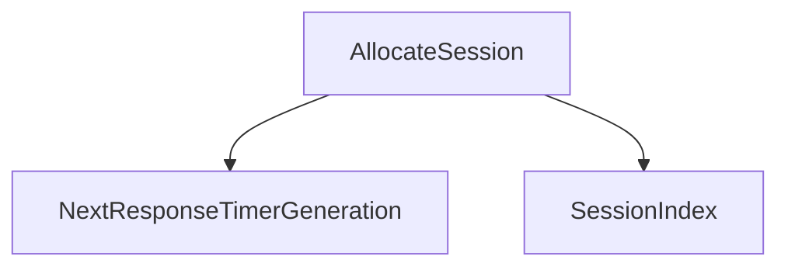

<!-- generated documentation — edit the source, not this file -->
# `modules/woz_aliro_stack/src/session.cpp`

@file session.cpp
Aliro reader BLE session state machine and cryptographic session context. Manages NFC APDU
limits, response timeouts, connection setup, fast-path and standard key derivation, message
encryption and decryption, and reader-status notifications. Processes events from the BLE
transport and application layer.

**depends on** [`modules/woz_aliro_stack/src/protocol/access_document.h`](../modules.woz_aliro_stack.src.protocol/access_document.h.md), [`modules/woz_aliro_stack/src/protocol/ble_message.h`](../modules.woz_aliro_stack.src.protocol/ble_message.h.md), [`modules/woz_aliro_stack/src/protocol/ble_timeout.h`](../modules.woz_aliro_stack.src.protocol/ble_timeout.h.md), [`modules/woz_aliro_stack/src/protocol/nfc_auth.h`](../modules.woz_aliro_stack.src.protocol/nfc_auth.h.md), [`modules/woz_aliro_stack/src/protocol/nfc_select.h`](../modules.woz_aliro_stack.src.protocol/nfc_select.h.md), [`modules/woz_aliro_stack/src/protocol/nfc_step_up.h`](../modules.woz_aliro_stack.src.protocol/nfc_step_up.h.md)

## API

### `struct SessionContext`
`modules/woz_aliro_stack/src/session.cpp:80`

Session context holding all state needed to manage an Aliro session: connection handle, protocol
version, cryptographic keys, buffers, counters, and access document details.

### `void ApplyNfcApduLimits(SessionContext &session, const struct woz_aliro_select_response &selected)`
`modules/woz_aliro_stack/src/session.cpp:145`

Sets the session's maximum command and response data lengths from the NFC select response,
constrained by the session's buffer sizes and NFC protocol limits, and records whether
extended-length APDUs are supported.

**called by** `ProcessSessionData`

### `struct ResponseTimerContext`
`modules/woz_aliro_stack/src/session.cpp:160`

Atomic generation counter used to invalidate stale response timeout expirations.

### `struct SessionDataEvent`
`modules/woz_aliro_stack/src/session.cpp:175`

Internal event structure for session data notifications; carries the connection handle and a copy
of the received data.

#### `SessionDataEvent(ConnectionHandle handle, Data data)`
`modules/woz_aliro_stack/src/session.cpp:186`

Initializes a session data event by copying the connection handle and data payload.

### `struct ResponseTimeoutEvent`
`modules/woz_aliro_stack/src/session.cpp:199`

Internal event structure for response timeout notifications; carries session index and generation
number to detect stale timeouts.

#### `ResponseTimeoutEvent(size_t sessionIndex, uint32_t generation)`
`modules/woz_aliro_stack/src/session.cpp:208`

Initializes a response timeout event with the given session index and generation number.

### `struct EventHeader`
`modules/woz_aliro_stack/src/session.cpp:220`

Internal event structure reserved by the FIFO queue mechanism; carries a magic number for
validation.

### `class StackLock`
`modules/woz_aliro_stack/src/session.cpp:228`

RAII lock guard that acquires the stack mutex on construction and releases it on destruction.

#### `~StackLock()`
`modules/woz_aliro_stack/src/session.cpp:238`

Releases the stack mutex.

#### `StackLock &operator=(const StackLock &) = delete`
`modules/woz_aliro_stack/src/session.cpp:246`

Deleted copy-assignment operator to prevent copying of the lock guard.

### `SessionContext *FindSession(ConnectionHandle handle)`
`modules/woz_aliro_stack/src/session.cpp:253`

Returns a pointer to the session matching the given connection handle, or nullptr if no session
is found.

**called by** `CreateSession`, `DestroySession`, `ProcessSessionData`, `SendBleMessage`

### `size_t SessionIndex(const SessionContext &session)`
`modules/woz_aliro_stack/src/session.cpp:266`

Returns the index of the given session in the global session array.

**called by** `AllocateSession`, `NextResponseTimerGeneration`

### `uint32_t NextResponseTimerGeneration(SessionContext &session)`
`modules/woz_aliro_stack/src/session.cpp:275`

Atomically increments the generation counter for the session's response timer, updates the
session's stored generation, and returns the new value.

**called by** `AllocateSession`, `ObserveResponseTimeoutMessage`, `ProcessResponseTimeout`, `ResetSession`  ·  **calls** `SessionIndex`

### `void ResponseTimerExpired(void *context)`
`modules/woz_aliro_stack/src/session.cpp:288`

Response timeout callback invoked by the timer; validates the context pointer, constructs a
ResponseTimeoutEvent, and queues it for deferred processing; logs errors if event allocation or
queueing fails.

### `SessionContext *AllocateSession(ConnectionHandle handle)`
`modules/woz_aliro_stack/src/session.cpp:314`

Allocates a free session slot, initializes it with the connection handle, and acquires a response
timer for BLE sessions; returns nullptr if no slots are available or timer acquisition fails.

**called by** `CreateSession`  ·  **calls** `NextResponseTimerGeneration`, `SessionIndex`

### `void DestroyKey(CryptoTypes::KeyId &keyId)`
`modules/woz_aliro_stack/src/session.cpp:341`

Destroys a transient cryptographic key if it is non-zero, logs a warning on failure, and zeros
the key ID.

**called by** `CompleteBleAccess`, `HandleAuth0Response`, `ResetSession`, `TryFastKey`

### `void ResetSession(SessionContext &session)`
`modules/woz_aliro_stack/src/session.cpp:356`

Releases the response timer, destroys all session keys, zeros the URSK, and clears the session
context.

**called by** `CreateSession`, `DestroySession`  ·  **calls** `DestroyKey`, `NextResponseTimerGeneration`

### `bool ObserveResponseTimeoutMessage(SessionContext &session, enum woz_aliro_ble_timeout_direction direction, const uint8_t *data, size_t length)`
`modules/woz_aliro_stack/src/session.cpp:382`

Observes an incoming or outgoing BLE message to update response timeout state (arm, stop, or
terminate the timer); returns true if the timeout action indicates termination.

**called by** `EncryptBleMessage`, `ProcessSessionData`, `SendApCommand`  ·  **calls** `NextResponseTimerGeneration`

### `bool Append(uint8_t *buffer, size_t capacity, size_t &offset, const uint8_t *data, size_t length)`
`modules/woz_aliro_stack/src/session.cpp:417`

Appends data to a buffer, advancing the offset by the data length, and returns true if the append
succeeded without overflow; returns false if data is null, offset exceeds capacity, or the data
length exceeds remaining capacity.

**called by** `AppendCommonSalt`, `DerivePersistentKey`, `TryFastKey`

### `bool AppendCommonSalt(SessionContext &session, uint8_t *salt, size_t capacity, size_t &offset, const char label[12])`
`modules/woz_aliro_stack/src/session.cpp:432`

Appends reader public key, label, reader identifier, interface byte, version TLV, reader
ephemeral public key, transaction identifier, flags, and proprietary information to the salt
buffer; returns false if any append overflows the buffer.

**called by** `DerivePersistentKey`, `DeriveVolatileKeys`, `TryFastKey`  ·  **calls** `Append`

### `AliroError DeriveVolatileKeys(SessionContext &session)`
`modules/woz_aliro_stack/src/session.cpp:457`

Performs key agreement on the ephemeral keys, derives the Kdh key via X9.63 KDF, derives 160
bytes of keying material from Kdh, imports the expedited reader and device keys, imports the
StepUpSK and BleSK roots, and returns early on error.

**called by** `HandleAuth0Response`  ·  **calls** `AppendCommonSalt`

### `AliroError DerivePersistentKey(SessionContext &session, const CryptoTypes::PublicKey &credentialPublicKey)`
`modules/woz_aliro_stack/src/session.cpp:522`

Derives the persistent key by computing a salt from the credential public key and deriving a
shared key using the Kdh key; returns an error if the salt overflows or key derivation fails.

**called by** `HandleAuth1Response`  ·  **calls** `Append`, `AppendCommonSalt`

### `bool IsValidCryptogramPlaintext(const uint8_t *plaintext, size_t length)`
`modules/woz_aliro_stack/src/session.cpp:543`

Returns true if the plaintext is exactly 48 bytes and contains the fixed-width cryptogram
structure (signaling bitmap followed by two signed timestamps) as specified in Table 8-6; returns
false otherwise.

**called by** `TryFastKey`

### `AliroError TryFastKey(SessionContext &session, CryptoTypes::KeyId kpersistentKeyId, const uint8_t *cryptogram, size_t cryptogramLength, bool &matched, bool &requiresStandard)`
`modules/woz_aliro_stack/src/session.cpp:558`

Attempts fast-path access by deriving keys from a stored persistent key, decrypting the
cryptogram, validating its plaintext, checking whether a new access document is required, and
importing the expedited and BLE keys on success; returns the validation status or ALIRO_NO_ERROR
on a successful fast match.

**called by** `HandleAuth0Response`  ·  **calls** `Append`, `AppendCommonSalt`, `DestroyKey`, `IsValidCryptogramPlaintext`

### `AliroError SendApCommand(SessionContext &session, const uint8_t *command, size_t commandLength)`
`modules/woz_aliro_stack/src/session.cpp:668`

For NFC, sends the command directly; for BLE, frames the command in a BLE message, sends it, and
observes the timeout message.

**called by** `HandleAuth0Response`, `HandleAuth1Response`, `SendAuth0`, `SendEncryptedExchange`, `SendGetResponse`, `SendNextEnvelope`  ·  **calls** `ObserveResponseTimeoutMessage`

### `AliroError SendAuth0(SessionContext &session)`
`modules/woz_aliro_stack/src/session.cpp:707`

Acquires the reader identity, public key, and ephemeral key pair, generates a random transaction
identifier, optionally loads persistent credential key IDs for fast-path attempts, builds and
sends the Auth0 command, and transitions to AwaitingAuth0.

**called by** `ProcessSessionData`  ·  **calls** `SendApCommand`

### `AliroError HandleAuth0Response(SessionContext &session, Data data)`
`modules/woz_aliro_stack/src/session.cpp:767`

Decrypt and validate Auth0 response; attempt fast-key authentication if enabled, otherwise derive
volatile keys and build Auth1 command.
Fails on parse, fast-key, key derivation, signature generation, or command build errors. Attempts
each persistent fast key in order if fast-path enabled; succeeds early if matched and does not
require standard phase. Destroys expedited and volatile keys if fast-path active. Sets state to
AwaitingAuth1. On trace enabled, logs each fast-key trial and final derivation status.

**called by** `ProcessSessionData`  ·  **calls** `DeriveVolatileKeys`, `DestroyKey`, `ProcessAccess`, `SendApCommand`, `SendNfcCompletionExchange`, `SendUrskExchange`, `TryFastKey`

### `CryptoTypes::Nonce MakeNonce(bool device, uint32_t counter)`
`modules/woz_aliro_stack/src/session.cpp:884`

Constructs a 12-byte nonce with a device/reader flag in byte 7 and a big-endian counter in bytes
8–11.

**called by** `DecryptBleMessage`, `EncryptBleMessage`, `FinishStepUpResponse`, `HandleAuth1Response`, `HandleExchangeResponse`, `SendEncryptedExchange`, `StartStepUpExchange`

### `AliroError DeriveBleSessionKeys(SessionContext &session)`
`modules/woz_aliro_stack/src/session.cpp:899`

Derives the directional BLE session keys (BleSKReader and BleSKDevice) from the BLE key using
protocol versions and standard info labels; returns an error if key derivation fails.

**called by** `CompleteBleAccess`

### `AliroError EncryptBleMessage(SessionContext &session, const uint8_t *plaintext, size_t plaintextLength)`
`modules/woz_aliro_stack/src/session.cpp:933`

Encrypts a BLE message by parsing the plaintext header, encrypting the payload with the reader
counter and reader key, constructing the protected frame, sending it, and observing the timeout
message; returns an error if the key is absent, counter overflows, or encryption fails.

**called by** `CompleteBleAccess`, `SendBleMessage`, `SendReaderStatusChangedMessage`  ·  **calls** `MakeNonce`, `ObserveResponseTimeoutMessage`

### `AliroError DecryptBleMessage(SessionContext &session, const struct woz_aliro_ble_message &message, uint8_t *plaintext, size_t plaintextCapacity, size_t &plaintextLength)`
`modules/woz_aliro_stack/src/session.cpp:986`

Decrypts a BLE message using the device key and current device counter as a nonce, validates the
authentication tag, increments the counter, and reconstructs the plaintext with the BLE header;
returns an error if the key is absent, counter overflows, or decryption fails.

**called by** `ProcessSessionData`  ·  **calls** `MakeNonce`

### `AliroError SendEncryptedExchange(SessionContext &session, const uint8_t *plaintext, size_t plaintextLength, CryptoTypes::KeyId readerKeyId, bool useStepUpKeys)`
`modules/woz_aliro_stack/src/session.cpp:1033`

Encrypt and send an exchange command (0x80c9) with the given plaintext, reader key, and counter
state.
Fails if plaintext is null, exceeds 254 bytes (to fit tag), or command length overflows the TX
buffer. Increments reader counter and sets session state to AwaitingExchangeResponse. Caller must
ensure key ID and counter state are correct for the current protocol phase (expedited or
step-up).

**called by** `SendNfcCompletionExchange`, `SendUrskExchange`  ·  **calls** `MakeNonce`, `SendApCommand`

### `AliroError SendUrskExchange(SessionContext &session)`
`modules/woz_aliro_stack/src/session.cpp:1075`

Send a URSK exchange command (0x98 0x00) using the expedited reader key without requesting
step-up.
Wrapper around SendEncryptedExchange. Used to signal unlock completion when no Access Document is
needed.

**called by** `HandleAuth0Response`, `HandleAuth1Response`  ·  **calls** `SendEncryptedExchange`

### `AliroError SendNfcCompletionExchange(SessionContext &session, bool useStepUpKeys)`
`modules/woz_aliro_stack/src/session.cpp:1089`

Send a final NFC completion exchange (0x97 0x02 0x01 0x00) in the expedited or step-up phase,
matching the reference reader's successful secure state.
Wrapper around SendEncryptedExchange. Caller specifies which reader key (expedited or step-up)
and phase to use via useStepUpKeys.

**called by** `CollectStepUpResponse`, `HandleAuth0Response`, `HandleAuth1Response`  ·  **calls** `SendEncryptedExchange`

### `AliroError ProcessAccess(SessionContext &session)`
`modules/woz_aliro_stack/src/session.cpp:1110`

Invokes the appropriate access processing method (fast or standard) based on the session state,
marks access as processed on success, and returns the operation status.

**called by** `CompleteBleAccess`, `HandleAuth0Response`, `HandleAuth1Response`

### `AliroError CompleteBleAccess(SessionContext &session)`
`modules/woz_aliro_stack/src/session.cpp:1133`

Processes access, derives BLE session keys, extracts the ranging session ID from the transaction
identifier, starts the ranging session, encrypts and sends an access-completed message, destroys
Access Protocol keys, and transitions to UwbRanging on success.

**called by** `CollectStepUpResponse`, `HandleExchangeResponse`  ·  **calls** `DeriveBleSessionKeys`, `DestroyKey`, `EncryptBleMessage`, `ProcessAccess`

### `AliroError HandleExchangeResponse(SessionContext &session, Data data)`
`modules/woz_aliro_stack/src/session.cpp:1205`

Decrypt and validate an encrypted exchange response (expedited or step-up phase); optionally
request Access Document via step-up or complete the access.
Fails on APDU status, decryption, or plaintext validation errors. Expects plaintext 0x00 0x02
0x00 0x00 (success marker). If NFC, sets state to AccessComplete. If BLE with step-up requested,
calls StartStepUpExchange; otherwise completes access. Caller must have set the correct device
key ID and counter state before calling.

**called by** `ProcessSessionData`  ·  **calls** `CompleteBleAccess`, `MakeNonce`, `StartStepUpExchange`

### `AliroError SendNextEnvelope(SessionContext &session)`
`modules/woz_aliro_stack/src/session.cpp:1246`

Build and send the next envelope command in a step-up exchange, segmenting mExchangeBuffer across
one or more APDUs.
Fails if segmentation fails or buffer is too small. Updates mExchangeOffset and mLastEnvelope;
sets state to SendingStepUpEnvelope. Caller must have populated mExchangeBuffer, mMaxCommandData,
and mMaxResponseData before calling.

**called by** `ProcessSessionData`, `StartStepUpExchange`  ·  **calls** `SendApCommand`

### `AliroError SendGetResponse(SessionContext &session, size_t expectedLength)`
`modules/woz_aliro_stack/src/session.cpp:1276`

Request the next chunk of a step-up response from the reader via GET RESPONSE command.
Fails if expectedLength cannot be encoded or buffer is too small. Sets session state to
AwaitingStepUpResponse. Used when a single APDU response is insufficient to deliver the full
step-up plaintext.

**called by** `CollectStepUpResponse`  ·  **calls** `SendApCommand`

### `AliroError StartStepUpExchange(SessionContext &session)`
`modules/woz_aliro_stack/src/session.cpp:1296`

Derive directional step-up keys, build and encrypt a device request, wrap it in session data and
DO53, then send the first envelope segment.
Fails if key derivation, request building, encryption, wrapping, or segmentation fails. Resets
reader and device counters to initial value. Sets state to SendingStepUpEnvelope. Caller must
have populated mRequestedElement, mRequestedElementLength, and mIntentToStore before calling. On
trace enabled, performs AEAD round-trip verification.

**called by** `HandleAuth1Response`, `HandleExchangeResponse`, `ProcessSessionData`  ·  **calls** `MakeNonce`, `SendNextEnvelope`

### `size_t EncodeBstrHead(size_t length, uint8_t *output)`
`modules/woz_aliro_stack/src/session.cpp:1383`

Encodes the CBOR byte-string header for a given length into output, returning the number of bytes
written (1, 2, or 3 depending on the length value).

**called by** `ValidateAndProcessAccessDocument`

### `AliroError ValidateAndProcessAccessDocument(SessionContext &session, const uint8_t *deviceResponse, size_t deviceResponseLength)`
`modules/woz_aliro_stack/src/session.cpp:1406`

Parses and validates an access document: verifies the issuer-signed item digest, validates the
issuer certificate or key ID, checks the document's validity period, ensures the device public
key matches, constructs a COSE Sig_structure, verifies the signature, and invokes the access
processing interface.

**called by** `FinishStepUpResponse`  ·  **calls** `EncodeBstrHead`

### `AliroError FinishStepUpResponse(SessionContext &session)`
`modules/woz_aliro_stack/src/session.cpp:1574`

Unwraps the step-up response DO53 and session-data containers, decrypts the access document using
the device counter and StepUpDeviceKey, validates and processes the access document, and marks
access as processed on success.

**called by** `CollectStepUpResponse`  ·  **calls** `MakeNonce`, `ValidateAndProcessAccessDocument`

### `AliroError CollectStepUpResponse(SessionContext &session, Data data)`
`modules/woz_aliro_stack/src/session.cpp:1627`

Collect one or more envelope responses from the reader and assemble the complete step-up
plaintext.
Fails if response collection fails or APDU status is non-zero. If more data needed, sends GET
RESPONSE. Otherwise decrypts and validates step-up response, then completes the access (BLE or
NFC). Sets state to AwaitingStepUpResponse or AccessComplete. Caller must have initialized
mExchangeBuffer before calling.

**called by** `ProcessSessionData`  ·  **calls** `CompleteBleAccess`, `FinishStepUpResponse`, `SendGetResponse`, `SendNfcCompletionExchange`

### `AliroError HandleAuth1Response(SessionContext &session, Data data)`
`modules/woz_aliro_stack/src/session.cpp:1669`

Decrypt, validate, and process Auth1 response; derive persistent key; optionally request Access
Document or start step-up exchange.
Fails on APDU status, decryption, parse, signature verification, or persistent key derivation
errors. Extracts credential public key, verifies signature, and checks signaling bitmap for
Access Document and step-up AID selection requirements. Sets state to SelectingStepUp,
AwaitingAuth1 (BLE with document), or initiates step-up/completion. Caller must have set
mExpeditedDeviceKeyId and mDeviceCounter before calling.

**called by** `ProcessSessionData`  ·  **calls** `DerivePersistentKey`, `MakeNonce`, `ProcessAccess`, `SendApCommand`, `SendNfcCompletionExchange`, `SendUrskExchange`, `StartStepUpExchange`

### `AliroError AliroStack::CreateSession(ConnectionHandle connectionHandle)`
`modules/woz_aliro_stack/src/session.cpp:1782`

Creates a new session for the given connection handle: for NFC, sends a Select command and
transitions to SelectingExpedited; for BLE, validates the protocol version and transitions to
BleConnected; returns an error if the session already exists, allocation fails, or the protocol
version is unsupported.

**calls** `AllocateSession`, `FindSession`, `ResetSession`

### `void AliroStack::DestroySession(ConnectionHandle connectionHandle)`
`modules/woz_aliro_stack/src/session.cpp:1823`

Finds the session for the given connection handle and destroys it if found; invokes the session
termination callback on success.

**called by** `HandleSessionData`, `ProcessResponseTimeout`, `ProcessSessionData`, `SendBleMessage`  ·  **calls** `FindSession`, `ResetSession`

### `void ProcessSessionData(ConnectionHandle handle, Data data)`
`modules/woz_aliro_stack/src/session.cpp:1852`

Route incoming session data (NFC APDU or reassembled BLE frame) to the appropriate protocol
handler based on session state, forwarding UWB control to the UWB stack if needed.
On BLE: reassembles fragmented messages, validates frames, decrypts, and routes to
auth/exchange/ranging handlers or timeout control. On NFC: dispatches to
Select/Auth0/Auth1/Exchange response handlers. Destroys session on frame error, parse error, or
explicit termination. Caller must ensure handle and data are valid; data may be null (triggers
session destruction).

**called by** `HandleSessionData`, `ProcessEvent`  ·  **calls** `ApplyNfcApduLimits`, `CollectStepUpResponse`, `DecryptBleMessage`, `DestroySession`, `FindSession`, `HandleAuth0Response`, `HandleAuth1Response`, `HandleExchangeResponse`

### `void ProcessResponseTimeout(size_t sessionIndex, uint32_t generation)`
`modules/woz_aliro_stack/src/session.cpp:2223`

Validates the response timeout expiration (session exists, is BLE, timer handle is valid,
generation matches, and timeout is not idle), destroys the session on confirmed timeout, and logs
a warning.

**called by** `ProcessEvent`  ·  **calls** `DestroySession`, `NextResponseTimerGeneration`

### `void AliroStack::HandleSessionData(ConnectionHandle handle, Data data)`
`modules/woz_aliro_stack/src/session.cpp:2257`

Accept incoming session data from BLE or NFC and defer or process it synchronously.
On NFC, processes immediately. On BLE, enqueues as SessionDataEvent for deferred processing to
avoid deadlock. Destroys session on invalid length, allocation failure, or queueing error. Caller
must ensure handle is valid; data may be null.

**calls** `DestroySession`, `ProcessSessionData`

### `void AliroStack::SendBleMessage(ConnectionHandle connectionHandle, const uint8_t *data, size_t length) const`
`modules/woz_aliro_stack/src/session.cpp:2290`

Finds the session in UwbRanging state, encrypts the message using the BLE reader key, logs a
warning and destroys the session on failure.

**calls** `DestroySession`, `EncryptBleMessage`, `FindSession`

### `AliroError AliroStack::SendReaderStatusChangedMessage(OperationSource operationSource, ReaderStateByte readerState, const CryptoTypes::PublicKey *accessCredentialPublicKey) const`
`modules/woz_aliro_stack/src/session.cpp:2317`

Encrypt and broadcast a Reader Status Changed message to all BLE sessions in UWB ranging state,
optionally filtering by credential public key.
Returns the first error encountered, or ALIRO_NO_ERROR if all sessions received the message (or
were not BLE/not ranging). Used to signal reader state changes (e.g., unlocked, secured) during
active UWB sessions.

**calls** `EncryptBleMessage`

### `void AliroStack::ProcessEvent(void *event)`
`modules/woz_aliro_stack/src/session.cpp:2353`

Dequeue and process a pending Aliro event (ResponseTimeoutEvent or SessionDataEvent) or log and
ignore unknown events.
Deletes the event after processing. Called by the OS event loop when an Aliro-owned event is
ready. Caller must pass a non-null event pointer; null triggers a warning log.

**calls** `ProcessResponseTimeout`, `ProcessSessionData`
