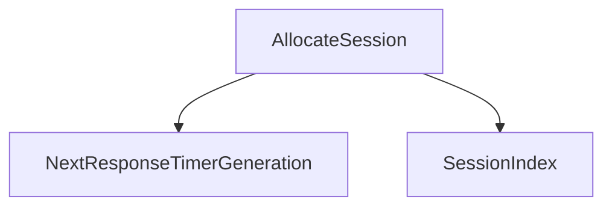

<!-- generated documentation — edit the source, not this file -->
# `modules/woz_aliro_stack/src/session.cpp`

**depends on** [`modules/woz_aliro_stack/src/protocol/access_document.h`](../modules.woz_aliro_stack.src.protocol/access_document.h.md), [`modules/woz_aliro_stack/src/protocol/ble_message.h`](../modules.woz_aliro_stack.src.protocol/ble_message.h.md), [`modules/woz_aliro_stack/src/protocol/ble_timeout.h`](../modules.woz_aliro_stack.src.protocol/ble_timeout.h.md), [`modules/woz_aliro_stack/src/protocol/nfc_auth.h`](../modules.woz_aliro_stack.src.protocol/nfc_auth.h.md), [`modules/woz_aliro_stack/src/protocol/nfc_select.h`](../modules.woz_aliro_stack.src.protocol/nfc_select.h.md), [`modules/woz_aliro_stack/src/protocol/nfc_step_up.h`](../modules.woz_aliro_stack.src.protocol/nfc_step_up.h.md)

Undocumented (54)

- `SessionContext`
- `ApplyNfcApduLimits`
- `ResponseTimerContext`
- `SessionDataEvent`
- `SessionDataEvent.SessionDataEvent`
- `ResponseTimeoutEvent`
- `ResponseTimeoutEvent.ResponseTimeoutEvent`
- `EventHeader`
- `StackLock`
- `StackLock.~StackLock`
- `StackLock.StackLock`
- `FindSession`
- `SessionIndex`
- `NextResponseTimerGeneration`
- `ResponseTimerExpired`
- `AllocateSession`
- `DestroyKey`
- `ResetSession`
- `ObserveResponseTimeoutMessage`
- `Append`
- `AppendCommonSalt`
- `DeriveVolatileKeys`
- `DerivePersistentKey`
- `IsValidCryptogramPlaintext`
- `TryFastKey`
- `SendApCommand`
- `SendAuth0`
- `HandleAuth0Response`
- `MakeNonce`
- `DeriveBleSessionKeys`
- `EncryptBleMessage`
- `DecryptBleMessage`
- `SendEncryptedExchange`
- `SendUrskExchange`
- `SendNfcCompletionExchange`
- `ProcessAccess`
- `CompleteBleAccess`
- `HandleExchangeResponse`
- `SendNextEnvelope`
- `SendGetResponse`
- `StartStepUpExchange`
- `EncodeBstrHead`
- `ValidateAndProcessAccessDocument`
- `FinishStepUpResponse`
- `CollectStepUpResponse`
- `HandleAuth1Response`
- `CreateSession`
- `DestroySession`
- `ProcessSessionData`
- `ProcessResponseTimeout`
- `HandleSessionData`
- `SendBleMessage`
- `SendReaderStatusChangedMessage`
- `ProcessEvent`

