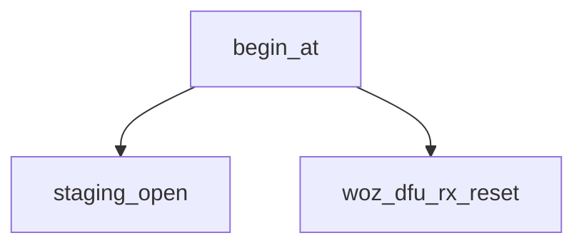

<!-- generated documentation — edit the source, not this file -->
# `modules/woz_dfu/src/dfu_receiver.c`

@file
@brief Application half of the delta update: receive, verify, stage, reboot.
Never applies anything. The patch is written into `patch_staging` and the
board is restarted; MCUboot does the work, because the application executes
from the slot the patch rewrites (see src/dfu_applier.c).
WHAT ARRIVES, in order, as one byte stream over whatever transport:
0   32   struct woz_dfu_hdr
32   64   ECDSA-P256 signature, raw r||s, over those 32 bytes
96   ..   the patch
The header is written to flash LAST, after the whole patch has arrived and
its CRC has been checked. So a transfer that is cut off leaves a staging
partition with no valid magic in it, and the next boot ignores it. There is
no half-staged state that the bootloader can act on.
THE SIGNATURE IS CHECKED HERE, NOT IN THE BOOTLOADER. This image already has
PSA ECDSA-P256 linked for Aliro; MCUboot is the flash-starved one. And the
floor sits under both: CONFIG_BOOT_VALIDATE_SLOT0 makes MCUboot re-verify
the P-256 signature of the RESULT before booting it, so even a forged header
cannot install code -- only destroy the installed image, which recovery
catches.

**depends on** [`modules/woz_dfu/include/woz_dfu.h`](../modules.woz_dfu.include/woz_dfu.h.md), [`modules/woz_dfu/include/woz_dfu_rx.h`](../modules.woz_dfu.include/woz_dfu_rx.h.md)

## API

### `static void reboot_fn(struct k_work *work)`
`modules/woz_dfu/src/dfu_receiver.c:75`

Replying before rebooting is the whole reason this is deferred: a reboot
inside the frame handler drops the acknowledgement the host is waiting for,
and the host cannot then tell success from a dead board.

### `static void window_notify(bool open)`
`modules/woz_dfu/src/dfu_receiver.c:97`

One place, so that every route in -- the button, Apple Home, the bench SWD
write -- reaches the indicator without knowing it exists.

**called by** `window_expire`, `woz_dfu_window_close`, `woz_dfu_window_open`

### `static enum woz_dfu_err commit_now(bool reboot)`
`modules/woz_dfu/src/dfu_receiver.c:303`

@p reboot is false only for SMP, where the host sends its own reset command
afterwards and a board that restarted on its own would look like a failure.

**called by** `do_commit`, `woz_dfu_rx_upload`  ·  **calls** `wbuf_flush`

Undocumented (20)

- `woz_dfu_set_window_cb`
- `window_expire`
- `woz_dfu_window_open`
- `woz_dfu_window_close`
- `woz_dfu_window_is_open`
- `staging_open`
- `wbuf_flush`
- `patch_write`
- `head_verifies`
- `woz_dfu_rx_reset`
- `reply_ok`
- `reply_err`
- `begin_at`
- `feed_bytes`
- `do_begin`
- `do_data`
- `do_commit`
- `woz_dfu_rx_frame`
- `woz_dfu_rx_upload`
- `woz_dfu_rx_staged`

