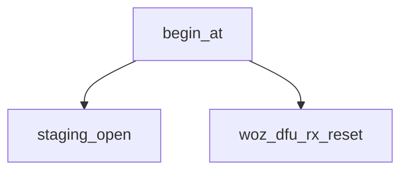

<!-- generated documentation — edit the source, not this file -->
# `modules/woz_dfu/src/dfu_receiver.c`

@file
@brief Application half of the delta update: receive, verify, stage, reboot.
Never applies anything. The patch is written into `patch_staging` and the
board is restarted; MCUboot does the work, because the application executes
from the slot the patch rewrites (see src/dfu_applier.c).
WHAT ARRIVES, in order, as one byte stream over whatever transport:
0   32   struct woz_dfu_hdr
32   64   ECDSA-P256 signature, raw r||s, over those 32 bytes
96   ..   the patch
The header is written to flash LAST, after the whole patch has arrived and
its CRC has been checked. So a transfer that is cut off leaves a staging
partition with no valid magic in it, and the next boot ignores it. There is
no half-staged state that the bootloader can act on.
THE SIGNATURE IS CHECKED HERE, NOT IN THE BOOTLOADER. This image already has
PSA ECDSA-P256 linked for Aliro; MCUboot is the flash-starved one. And the
floor sits under both: CONFIG_BOOT_VALIDATE_SLOT0 makes MCUboot re-verify
the P-256 signature of the RESULT before booting it, so even a forged header
cannot install code -- only destroy the installed image, which recovery
catches.

**depends on** [`modules/woz_dfu/include/woz_dfu.h`](../modules.woz_dfu.include/woz_dfu.h.md), [`modules/woz_dfu/include/woz_dfu_rx.h`](../modules.woz_dfu.include/woz_dfu_rx.h.md)

## API

### `static void reboot_fn(struct k_work *work)`
`modules/woz_dfu/src/dfu_receiver.c:75`

Replying before rebooting is the whole reason this is deferred: a reboot
inside the frame handler drops the acknowledgement the host is waiting for,
and the host cannot then tell success from a dead board.

### `void woz_dfu_set_window_cb(woz_dfu_window_cb cb)`
`modules/woz_dfu/src/dfu_receiver.c:93`

Register a callback to be invoked when the update window opens or closes.

### `static void window_notify(bool open)`
`modules/woz_dfu/src/dfu_receiver.c:100`

One place, so that every route in -- the button, Apple Home, the bench SWD
write -- reaches the indicator without knowing it exists.

**called by** `window_expire`, `woz_dfu_window_close`, `woz_dfu_window_open`

### `static void window_expire(struct k_work *work)`
`modules/woz_dfu/src/dfu_receiver.c:111`

Mark the update window closed, reset RX state, and notify all listeners (typically the UI) that
the window is no longer open.

**calls** `window_notify`, `woz_dfu_rx_reset`

### `void woz_dfu_window_open(uint32_t duration_ms)`
`modules/woz_dfu/src/dfu_receiver.c:124`

Open the update window for the given duration in milliseconds. Reschedule the close timer and
notify all window listeners.

**calls** `window_notify`

### `void woz_dfu_window_close(void)`
`modules/woz_dfu/src/dfu_receiver.c:136`

Cancel the update window timer, mark it closed, reset RX state, and notify all listeners that the
window is no longer open.

**calls** `window_notify`, `woz_dfu_rx_reset`

### `bool woz_dfu_window_is_open(void)`
`modules/woz_dfu/src/dfu_receiver.c:147`

Return true if the update window is currently open.

### `static int staging_open(void)`
`modules/woz_dfu/src/dfu_receiver.c:158`

Open the staging flash area if not already open. Return 0 on success or if already open; nonzero
on error.

**called by** `begin_at`, `woz_dfu_rx_staged`

### `static int wbuf_flush(bool final)`
`modules/woz_dfu/src/dfu_receiver.c:170`

Flush buffered patch data to the staging flash area, padding to 4-byte alignment if final. Return
0 on success, -1 on write error. Updates write position and shifts remaining bytes.

**called by** `commit_now`, `patch_write`

### `static int patch_write(const uint8_t *data, size_t len)`
`modules/woz_dfu/src/dfu_receiver.c:199`

Buffer patch data, updating the running CRC32, and flush to flash when the buffer is full. Return
0 on success or nonzero on flush failure.

**called by** `feed_bytes`  ·  **calls** `wbuf_flush`

### `static bool head_verifies(void)`
`modules/woz_dfu/src/dfu_receiver.c:224`

Verify the DFU header signature using ECDSA-SHA256 with the built-in public key. Return true if
the signature is valid.

**called by** `feed_bytes`

### `void woz_dfu_rx_reset(void)`
`modules/woz_dfu/src/dfu_receiver.c:253`

Reset the receiver state to empty: clear the RX struct.

**called by** `begin_at`, `reply_err`, `window_expire`, `woz_dfu_rx_frame`, `woz_dfu_rx_upload`, `woz_dfu_window_close`

### `static size_t reply_ok(uint8_t *rsp)`
`modules/woz_dfu/src/dfu_receiver.c:262`

Write a WOZ_DFU_RSP_OK response: set opcode to OK, append the byte count received as
little-endian 32-bit. Return 5 (response size).

**called by** `do_begin`, `do_commit`, `do_data`, `woz_dfu_rx_frame`

### `static size_t reply_err(uint8_t *rsp, enum woz_dfu_err code)`
`modules/woz_dfu/src/dfu_receiver.c:273`

Reset RX state and encode a two-byte error response with the given error code. Return the
response length (2 bytes).

**called by** `do_begin`, `do_commit`, `do_data`, `woz_dfu_rx_frame`  ·  **calls** `woz_dfu_rx_reset`

### `static enum woz_dfu_err begin_at(uint32_t total)`
`modules/woz_dfu/src/dfu_receiver.c:294`

Validate the patch size, erase the staging area including the step log, and prepare the receiver
to accept upload: initialize RX state with the write position at the patch offset and mark
reception active. Return an error code.

**called by** `do_begin`, `woz_dfu_rx_upload`  ·  **calls** `staging_open`, `woz_dfu_rx_reset`

### `static enum woz_dfu_err commit_now(bool reboot)`
`modules/woz_dfu/src/dfu_receiver.c:353`

@p reboot is false only for SMP, where the host sends its own reset command
afterwards and a board that restarted on its own would look like a failure.

**called by** `do_commit`, `woz_dfu_rx_upload`  ·  **calls** `wbuf_flush`

### `bool woz_dfu_rx_staged(void)`
`modules/woz_dfu/src/dfu_receiver.c:563`

Return true if a valid patch header is present in the staging flash area; otherwise return false.
The header's magic and ABI version must both match.

**calls** `staging_open`

Undocumented (6)

- `feed_bytes`
- `do_begin`
- `do_data`
- `do_commit`
- `woz_dfu_rx_frame`
- `woz_dfu_rx_upload` — tested: receiver upload

