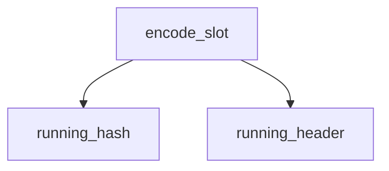

<!-- generated documentation — edit the source, not this file -->
# `modules/woz_dfu/src/dfu_smp_img.c`

@file
@brief SMP image-management group, so a stock mcumgr client can push a delta.
WHY THIS EXISTS INSTEAD OF ZEPHYR'S img_mgmt. Zephyr's implementation cannot
be built here, and not for a reason a partition rename fixes:
CONFIG_MCUMGR_GRP_IMG ... unsatisfied dependencies:
IMG_MANAGER (=n), (!MCUBOOT_BOOTLOADER_MODE_SINGLE_APP) (=n)
img_mgmt is gated OFF by single-slot mode itself. That mode is not incidental
on this board -- it is the only reason MCUboot fits, because two slots want
844 KB of a 512 KB part (firmware/pm_static.yml does the arithmetic). So the
choice was to leave single-slot mode, which the flash forbids, or to serve
group 1 ourselves. This is the second.
It is a thin adapter, not a reimplementation: every byte still goes through
woz_dfu_rx_upload(), so the signature check, the size limits, the CRC and the
window gate are the same ones the native transport uses, in the same order.
What is new here is only CBOR in and CBOR out.
WHAT A CLIENT SEES. One image, one slot, active and confirmed, versioned and
hashed from the running MCUboot header. Uploads are accepted and staged. It
does NOT pretend to have a second slot, because there is no honest hash to
report for one -- the staged bytes are a patch, and what they produce is not
known until the bootloader has applied it.
SO THE GUIDED "FIRMWARE UPGRADE" WIZARD IS NOT THE TARGET. That flow wants
upload -> test -> reset -> reconnect -> confirm, and two things break it: the
device never reports a pending second image to confirm, and the reboot after
reset spends 17-31 s applying the patch, which outlasts the client's
reconnect window. The supported path is the plain one, and it is three taps:
1. Images -> Upload, choose the .woz patch      (this file, group 1 cmd 1)
2. Device -> Reset                              (os_mgmt, group 0 cmd 5)
3. wait ~30 s while MCUboot applies it          (src/dfu_applier.c)

**depends on** [`modules/woz_dfu/include/woz_dfu.h`](../modules.woz_dfu.include/woz_dfu.h.md), [`modules/woz_dfu/include/woz_dfu_rx.h`](../modules.woz_dfu.include/woz_dfu_rx.h.md)

## API

### `struct image_version`
`modules/woz_dfu/src/dfu_smp_img.c:94`

MCUboot image version: major, minor, revision, and build number.

### `struct image_header`
`modules/woz_dfu/src/dfu_smp_img.c:105`

MCUboot image header: magic, load address, header size, protected TLV size, image size, flags,
version (major, minor, revision, build), and padding.

### `struct image_tlv_info`
`modules/woz_dfu/src/dfu_smp_img.c:119`

MCUboot image TLV info: magic marker (0x6907) and total TLV region size in bytes.

### `struct image_tlv`
`modules/woz_dfu/src/dfu_smp_img.c:127`

MCUboot image TLV entry: type, padding byte, and length in bytes.

### `static const struct image_header *running_header(void)`
`modules/woz_dfu/src/dfu_smp_img.c:136`

Read straight through a pointer rather than flash_area_read(): this is the
image that is currently executing, so it is already mapped at a known address
and a copy would only cost stack.

**called by** `encode_slot`

### `static const uint8_t *running_hash(const struct image_header *h)`
`modules/woz_dfu/src/dfu_smp_img.c:151`

Find the SHA-256 that MCUboot recorded for the running image.
This is the same hash the bootloader verifies against, so a client that
records it before an update can tell afterwards whether the update landed.
Returns NULL if the TLV block is not where the header says it is, which is
reported to the client as an all-zero hash rather than a refusal.

**called by** `encode_slot`

### `static bool encode_slot(zcbor_state_t *zse)`
`modules/woz_dfu/src/dfu_smp_img.c:194`

Encode the one slot this board has.
Deliberately shaped exactly like Zephyr's img_mgmt_state_encode_slot(), keys
and order included, so a client cannot distinguish the two.

**called by** `state_read`  ·  **calls** `running_hash`, `running_header`

### `static int state_read(struct smp_streamer *ctxt)`
`modules/woz_dfu/src/dfu_smp_img.c:233`

Encode and send the image state reply containing one slot (image 0) with splitStatus 0. Returns
MGMT_ERR_EOK on success or MGMT_ERR_EMSGSIZE if the response overflows.

**called by** `state_write`  ·  **calls** `encode_slot`

### `static int state_write(struct smp_streamer *ctxt)`
`modules/woz_dfu/src/dfu_smp_img.c:253`

Accept "set state" and change nothing.
A client sends this to mark an uploaded image test-or-confirm. There is
nothing to mark: an update is either fully staged, in which case the next
boot applies it, or it is not. Answering with the current list is both
truthful and what the client expects to parse.

**calls** `state_read`

### `static int upload_write(struct smp_streamer *ctxt)`
`modules/woz_dfu/src/dfu_smp_img.c:279`

Accept an uploaded image chunk. Decodes offset, total size, data, SHA256 hash, image index, and
upgrade flag from the request. Only image 0 is valid. Returns MGMT_ERR_EACCESSDENIED if no update
window is open, MGMT_ERR_EINVAL for missing or invalid offset or wrong image index,
MGMT_ERR_EBADSTATE for other failures, or MGMT_ERR_EOK on success. Echoes back the next expected
offset.

### `static int erase_write(struct smp_streamer *ctxt)`
`modules/woz_dfu/src/dfu_smp_img.c:345`

Throw away whatever is staged.
Gated on the window like upload is, and for the same reason: this erases
flash, and an unauthenticated peer that can erase in a loop is an
availability attack on a door lock.

### `static enum mgmt_cb_return reset_gate(uint32_t event, enum mgmt_cb_return prev_status, int32_t *rc, uint16_t *group, bool *abort_more, void *data, size_t data_size)`
`modules/woz_dfu/src/dfu_smp_img.c:383`

Refuse os_mgmt reset unless an update is actually in flight.
THIS IS NOT OPTIONAL ON THIS BOARD. MCUMGR_TRANSPORT_BT_PERM_RW leaves the
SMP endpoint writable by any unpaired peer in radio range, and group 0
command 5 reboots the device. Without this hook, anyone within a few metres
of the door could hold the lock in a reboot loop -- an availability attack
that needs no credential, no pairing and no knowledge of the firmware, and
the single strongest argument against putting mcumgr on a lock at all.
The gate is the same one the upload uses: the owner has opened an update
window, or a verified patch is already staged and waiting to be applied.
Outside those two states the reader has no reason to accept a remote reboot.

### `static void woz_smp_img_init(void)`
`modules/woz_dfu/src/dfu_smp_img.c:446`

SYS_INIT callback that registers the woz_smp_img group with mcumgr and optionally registers the
reset callback if CONFIG_MCUMGR_GRP_OS_RESET_HOOK is enabled.
