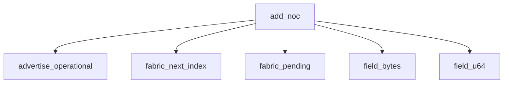

<!-- generated documentation — edit the source, not this file -->
# `modules/woz_matter/src/matter_clusters.c`

*No module docstring. First commit: "woz_matter: the Interaction Model, as far as a commissioner needs it".*

**depends on** [`modules/woz_matter/include/matter_clusters.h`](../modules.woz_matter.include/matter_clusters.h.md)

## API

### `static struct matter_fabric *fabric_pending(struct matter_device_info *info)`
`modules/woz_matter/src/matter_clusters.c:88`

The slot currently being provisioned, allocating one if needed.
A commissioner builds a fabric across several commands -- the root arrives
before the NOC -- so the half-built slot must survive between them. A slot
with a root but no index yet is that one. NULL when every slot is taken,
which is what AddNOC reports as TABLE_FULL.

**called by** `add_noc`, `add_trusted_root`

### `static uint8_t fabric_count(const struct matter_device_info *info)`
`modules/woz_matter/src/matter_clusters.c:106`

How many fabrics hold a complete identity.

**called by** `attr_value`

### `static uint8_t fabric_next_index(const struct matter_device_info *info)`
`modules/woz_matter/src/matter_clusters.c:125`

The lowest index not already taken. Indices are 1-based on the wire.
Kept in one place because an off-by-one here reports one fabric's
certificate under another's index, which no peer can detect.

**called by** `add_noc`

### `static void put_protocol_version_list(struct matter_tlv_writer *w, matter_tlv_tag_t tag)`
`modules/woz_matter/src/matter_clusters.c:340`

One Aliro protocol version, as the two big-endian bytes the spec asks for.
Both version lists carry the same single entry, so they share this. The
ESP32 lock encodes it the same way (aliro_reader_delegate.cpp:106-115) and
that is the port Apple Home has actually provisioned.

**called by** `lock_attr_value`

### `static void lock_attr_value(const struct matter_device_info *info, uint32_t cluster, uint32_t attribute, struct matter_tlv_writer *w, matter_tlv_tag_t tag)`
`modules/woz_matter/src/matter_clusters.c:359`

Endpoint 1: the Door Lock and its own Descriptor.
Split out rather than folded into attr_value() because the two endpoints
share cluster IDs -- Descriptor is on both -- and a single flat switch on
cluster would answer the root's Descriptor for the lock.

**called by** `attr_value`  ·  **calls** `put_protocol_version_list`

### `static size_t list_clusters(void *ctx, uint16_t endpoint, const uint32_t **out)`
`modules/woz_matter/src/matter_clusters.c:948`

Every cluster on @p endpoint, which is the same list has_cluster() answers
from and the same one Descriptor's ServerList reports. One array, so the
three cannot drift into disagreeing about what this endpoint carries.

### `static bool field_u64(const struct matter_im_invoke *inv, uint8_t tag, uint64_t *out)`
`modules/woz_matter/src/matter_clusters.c:1009`

Read one unsigned field out of a command's TLV arguments.

**called by** `add_noc`, `command`, `opcred_command`, `set_credential`

### `static bool field_struct_u64(const struct matter_im_invoke *inv, uint8_t outer, uint8_t inner, uint64_t *out)`
`modules/woz_matter/src/matter_clusters.c:1073`

Read an unsigned field from INSIDE a nested structure field.
SetCredential carries the credential type one level down, in a
CredentialStruct under field 1. Reading tag 0 at the top level instead finds
OperationType, which is also a small unsigned and decodes perfectly -- so
getting this wrong installs an Aliro key as whatever operation type happened
to be sent, with nothing to report.

**called by** `set_credential`

### `static bool dataset_xpanid(const uint8_t *ds, size_t len, uint8_t out[MATTER_THREAD_XPANID_LEN])`
`modules/woz_matter/src/matter_clusters.c:1160`

Find the Extended PAN ID in a Thread operational dataset.
Walked rather than indexed: the dataset's TLVs may arrive in any order, and a
length that runs past the end is a malformed dataset rather than a reason to
read past the buffer.

**called by** `network_command`

### `static uint8_t network_command(struct matter_device_info *info, const struct matter_im_invoke *inv, uint32_t *response_command)`
`modules/woz_matter/src/matter_clusters.c:1224`

Run one NetworkCommissioning command.
@return the IM status. The networking verdict goes in last_network_status and
travels in the response payload, the same split AddNOC uses.

**called by** `command`  ·  **calls** `advertise_operational`, `dataset_xpanid`, `field_bytes`

### `static void network_fields(const struct matter_device_info *info, uint32_t response_command, struct matter_tlv_writer *w, matter_tlv_tag_t tag)`
`modules/woz_matter/src/matter_clusters.c:1303`

Serialise what network_command() decided.

**called by** `command_fields`

### `static uint8_t add_trusted_root(struct matter_device_info *info, const struct matter_im_invoke *inv)`
`modules/woz_matter/src/matter_clusters.c:1332`

Install the root the commissioner wants this node to trust.
Only the public key is kept -- see matter_fabric.h. Nothing is verified: this
node has no prior opinion about which roots are legitimate, which is exactly
what makes it commissionable.

**called by** `opcred_command`  ·  **calls** `fabric_pending`, `field_bytes`

### `static uint8_t add_noc(struct matter_device_info *info, const struct matter_im_invoke *inv)`
`modules/woz_matter/src/matter_clusters.c:1367`

Accept the operational identity the commissioner minted for this node.
@return the NodeOperationalCertStatusEnum for the reply. Every refusal is one
of these rather than an IM status, because each names WHICH input was
wrong and a commissioner can act on that.

**called by** `opcred_command`  ·  **calls** `advertise_operational`, `fabric_next_index`, `fabric_pending`, `field_bytes`, `field_u64`

### `static uint8_t opcred_command(struct matter_device_info *info, const struct matter_im_invoke *inv, uint32_t *response_command)`
`modules/woz_matter/src/matter_clusters.c:1467`

Run one OperationalCredentials command.
Everything expensive happens here -- the signature, and for a CSR a fresh
P-256 key pair -- because this runs exactly once per request while
opcred_fields() may not.

**called by** `command`  ·  **calls** `add_noc`, `add_trusted_root`, `field_bytes`, `field_u64`

### `static void opcred_fields(const struct matter_device_info *info, uint32_t response_command, struct matter_tlv_writer *w, matter_tlv_tag_t tag)`
`modules/woz_matter/src/matter_clusters.c:1590`

Serialise what opcred_command() already computed.

**called by** `command_fields`

### `static uint8_t set_credential(struct matter_device_info *info, const struct matter_im_invoke *inv, uint32_t *response_command)`
`modules/woz_matter/src/matter_clusters.c:1662`

SetCredential: the Aliro trust anchor.
The reader identity says who this device IS; this says whose key it will
open for. Without it a provisioned reader still holds 0 trust anchors and
no phone can unlock it, which is the last functional gap before a walk-up.
The key is handed to the port unchanged and NOT stored here: the reader's
own trust store owns it, decides whether it is a valid P-256 point, and
persists it. Duplicating it in this struct would be a second copy of a
secret with no reader to use it.
The response is REQUIRED even for a refusal -- SetCredential is answered
with SetCredentialResponse carrying a status, not with a bare command
status, and a controller that gets the wrong shape treats it as no answer.

**called by** `command`  ·  **calls** `field_bytes`, `field_struct_u64`, `field_u64`

### `static uint8_t attr_write(void *ctx, const struct matter_im_path *path, const uint8_t *data, size_t data_len)`
`modules/woz_matter/src/matter_clusters.c:2150`

Apply an attribute write.
One attribute is writable on this node: the ACL. A commissioner's last act is
writing itself an entry granting Administer over CASE, and refusing it leaves
a home app that finished commissioning and then cannot record that it owns
the node -- which is what "Adding to home" is waiting on.
The value is stored as the TLV that arrived. Nothing decodes it and nothing
consults it; see the note on matter_device_info.acl.

**calls** `has_cluster`

Undocumented (14)

- `has_cluster` — tested: matter network
- `list_endpoints`
- `attr_status`
- `attr_value`
- `list_attrs`
- `field_bytes`
- `advertise_operational`
- `advertise_one`
- `set_aliro_reader_config`
- `command` — tested: matter addnoc; matter network
- `command_fields`
- `matter_clusters_resume` — tested: matter clusters
- `matter_clusters_failsafe_expire` — tested: matter addnoc
- `matter_clusters_init` — tested: matter addnoc; matter clusters; matter im; matter im invoke; matter im write; matter network

