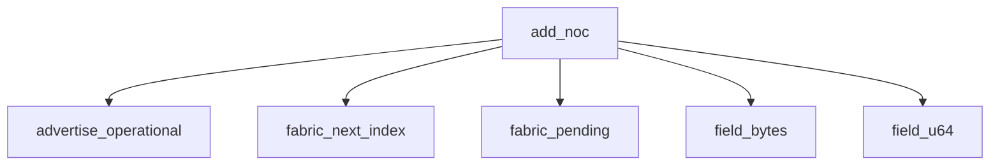

<!-- generated documentation — edit the source, not this file -->
# `modules/woz_matter/src/matter_clusters.c`

*No module docstring. First commit: "woz_matter: the Interaction Model, as far as a commissioner needs it".*

**depends on** [`modules/woz_matter/include/matter_clusters.h`](../modules.woz_matter.include/matter_clusters.h.md)

## API

### `static struct matter_fabric *fabric_pending(struct matter_device_info *info)`
`modules/woz_matter/src/matter_clusters.c:97`

The slot currently being provisioned, allocating one if needed.
A commissioner builds a fabric across several commands -- the root arrives
before the NOC -- so the half-built slot must survive between them. A slot
with a root but no index yet is that one. NULL when every slot is taken,
which is what AddNOC reports as TABLE_FULL.

**called by** `add_noc`, `add_trusted_root`

### `static uint8_t fabric_count(const struct matter_device_info *info)`
`modules/woz_matter/src/matter_clusters.c:115`

How many fabrics hold a complete identity.

**called by** `attr_value`

### `static uint8_t fabric_next_index(const struct matter_device_info *info)`
`modules/woz_matter/src/matter_clusters.c:134`

The lowest index not already taken. Indices are 1-based on the wire.
Kept in one place because an off-by-one here reports one fabric's
certificate under another's index, which no peer can detect.

**called by** `add_noc`

### `static bool has_cluster(void *ctx, uint16_t endpoint, uint32_t cluster)`
`modules/woz_matter/src/matter_clusters.c:158`

Check whether a given cluster is present on a given endpoint. Returns true if the cluster is
supported on that endpoint, false otherwise.

**called by** `attr_write`

### `static size_t list_endpoints(void *ctx, const uint16_t **out)`
`modules/woz_matter/src/matter_clusters.c:194`

Return the list of endpoint IDs this device exposes.

### `static uint8_t attr_status(void *ctx, uint16_t endpoint, uint32_t cluster, uint32_t attribute)`
`modules/woz_matter/src/matter_clusters.c:208`

Query whether an attribute on a given endpoint and cluster is supported. Returns
MATTER_IM_STATUS_SUCCESS if supported, MATTER_IM_STATUS_UNSUPPORTED_ENDPOINT if the endpoint does
not exist, MATTER_IM_STATUS_UNSUPPORTED_CLUSTER if the cluster does not exist on that endpoint,
or MATTER_IM_STATUS_UNSUPPORTED_ATTRIBUTE if the attribute does not exist on that cluster.

### `static void put_protocol_version_list(struct matter_tlv_writer *w, matter_tlv_tag_t tag)`
`modules/woz_matter/src/matter_clusters.c:372`

One Aliro protocol version, as the two big-endian bytes the spec asks for.
Both version lists carry the same single entry, so they share this. The
ESP32 lock encodes it the same way (aliro_reader_delegate.cpp:106-115) and
that is the port Apple Home has actually provisioned.

**called by** `lock_attr_value`

### `static void lock_attr_value(const struct matter_device_info *info, uint32_t cluster, uint32_t attribute, struct matter_tlv_writer *w, matter_tlv_tag_t tag)`
`modules/woz_matter/src/matter_clusters.c:391`

Endpoint 1: the Door Lock and its own Descriptor.
Split out rather than folded into attr_value() because the two endpoints
share cluster IDs -- Descriptor is on both -- and a single flat switch on
cluster would answer the root's Descriptor for the lock.

**called by** `attr_value`  ·  **calls** `put_protocol_version_list`

### `static void attr_value(void *ctx, uint16_t endpoint, uint32_t cluster, uint32_t attribute, struct matter_tlv_writer *w, matter_tlv_tag_t tag)`
`modules/woz_matter/src/matter_clusters.c:537`

Retrieve the value of an attribute on a given endpoint and cluster. Encodes the value into the
TLV writer using the supplied tag. Handles root and lock endpoints, multiple cluster types
including Door Lock, Descriptor, Basic Information, Network Commissioning, Access Control,
Operational Credentials, Admin Commissioning, and General Commissioning.

**calls** `fabric_count`, `lock_attr_value`

### `static size_t list_clusters(void *ctx, uint16_t endpoint, const uint32_t **out)`
`modules/woz_matter/src/matter_clusters.c:1044`

Every cluster on @p endpoint, which is the same list has_cluster() answers
from and the same one Descriptor's ServerList reports. One array, so the
three cannot drift into disagreeing about what this endpoint carries.

### `static size_t list_attrs(void *ctx, uint16_t endpoint, uint32_t cluster, const uint32_t **out)`
`modules/woz_matter/src/matter_clusters.c:1063`

Return the attribute IDs for a given endpoint and cluster, or 0 if the endpoint or cluster is not
supported.

### `static bool field_u64(const struct matter_im_invoke *inv, uint8_t tag, uint64_t *out)`
`modules/woz_matter/src/matter_clusters.c:1113`

Read one unsigned field out of a command's TLV arguments.

**called by** `add_noc`, `admin_command`, `clear_user`, `command`, `opcred_command`, `set_credential`

### `static bool field_struct_u64(const struct matter_im_invoke *inv, uint8_t outer, uint8_t inner, uint64_t *out)`
`modules/woz_matter/src/matter_clusters.c:1179`

Read an unsigned field from INSIDE a nested structure field.
SetCredential carries the credential type one level down, in a
CredentialStruct under field 1. Reading tag 0 at the top level instead finds
OperationType, which is also a small unsigned and decodes perfectly -- so
getting this wrong installs an Aliro key as whatever operation type happened
to be sent, with nothing to report.

**called by** `clear_credential`, `set_credential`

### `static bool field_bytes(const struct matter_im_invoke *inv, uint8_t tag, const uint8_t **out, size_t *len)`
`modules/woz_matter/src/matter_clusters.c:1220`

Extract a bytes field from the TLV-encoded command fields by tag. Searches the structure for the
first matching tag and decodes it. Returns true and fills out and len on success, false if the
fields are missing, malformed, or the tag is not found.

**called by** `add_noc`, `add_trusted_root`, `admin_command`, `network_command`, `opcred_command`, `set_aliro_reader_config`, `set_credential`

### `static bool dataset_xpanid(const uint8_t *ds, size_t len, uint8_t out[MATTER_THREAD_XPANID_LEN])`
`modules/woz_matter/src/matter_clusters.c:1271`

Find the Extended PAN ID in a Thread operational dataset.
Walked rather than indexed: the dataset's TLVs may arrive in any order, and a
length that runs past the end is a malformed dataset rather than a reason to
read past the buffer.

**called by** `network_command`

### `static void advertise_operational(const struct matter_device_info *info)`
`modules/woz_matter/src/matter_clusters.c:1305`

Advertise one Thread mDNS instance per provisioned fabric, deriving each instance name from the
compressed fabric ID and node ID. Do nothing if no fabrics are provisioned.

**called by** `add_noc`, `matter_clusters_resume`, `network_command`  ·  **calls** `advertise_one`

### `static void advertise_one(const struct matter_fabric *fabric)`
`modules/woz_matter/src/matter_clusters.c:1326`

Advertise this fabric's instance name over Thread on the operational port if the name can be
derived.

**called by** `advertise_operational`

### `void matter_clusters_set_admin_hooks(const struct matter_admin_hooks *hooks)`
`modules/woz_matter/src/matter_clusters.c:1355`

The cluster behind Apple Home's "Turn On Pairing Mode", and behind
multi-admin sharing generally. Without it a node is commissioned once, by
whoever got there first, and can never be handed to a second ecosystem --
which is what this board did until now: the button existed in the app and
the node answered UNSUPPORTED_CLUSTER.
Everything with a side effect is behind hooks the port installs. This file
decodes and validates; opening a window means swapping the SPAKE2+ verifier
the PASE responder uses and putting the commissionable payload back on the
air, and neither belongs in a module that tests/host compiles without Zephyr.

### `static uint8_t admin_status(uint8_t cluster_status)`
`modules/woz_matter/src/matter_clusters.c:1369`

Map a hook's cluster-specific status onto an IM status.
Lossy, and knowingly so: Matter can carry a ClusterStatus alongside FAILURE
so a controller can tell "already open" from "that verifier is malformed",
and this IM does not encode one yet. A controller therefore sees a generic
failure. Worth fixing when something depends on the distinction; nothing
here does, because the only caller that matters retries either way.

**called by** `admin_command`

### `static uint8_t admin_command(const struct matter_im_invoke *inv, uint32_t *response_command)`
`modules/woz_matter/src/matter_clusters.c:1379`

Decode and dispatch an admin cluster command: open-enhanced-window, open-basic-window, or revoke.
Extract TLV-encoded parameters by tag, validate lengths exactly, delegate to the registered
hooks, and return a status code. None of the three commands carry a response payload.

**called by** `command`  ·  **calls** `admin_status`, `field_bytes`, `field_u64`

### `static void network_fields(const struct matter_device_info *info, uint32_t response_command, struct matter_tlv_writer *w, matter_tlv_tag_t tag)`
`modules/woz_matter/src/matter_clusters.c:1536`

Serialise what network_command() decided.

**called by** `command_fields`

### `static uint8_t add_trusted_root(struct matter_device_info *info, const struct matter_im_invoke *inv)`
`modules/woz_matter/src/matter_clusters.c:1565`

Install the root the commissioner wants this node to trust.
Only the public key is kept -- see matter_fabric.h. Nothing is verified: this
node has no prior opinion about which roots are legitimate, which is exactly
what makes it commissionable.

**called by** `opcred_command`  ·  **calls** `fabric_pending`, `field_bytes`

### `static uint8_t add_noc(struct matter_device_info *info, const struct matter_im_invoke *inv)`
`modules/woz_matter/src/matter_clusters.c:1600`

Accept the operational identity the commissioner minted for this node.
@return the NodeOperationalCertStatusEnum for the reply. Every refusal is one
of these rather than an IM status, because each names WHICH input was
wrong and a commissioner can act on that.

**called by** `opcred_command`  ·  **calls** `advertise_operational`, `fabric_next_index`, `fabric_pending`, `field_bytes`, `field_u64`

### `static uint8_t opcred_command(struct matter_device_info *info, const struct matter_im_invoke *inv, uint32_t *response_command)`
`modules/woz_matter/src/matter_clusters.c:1700`

Run one OperationalCredentials command.
Everything expensive happens here -- the signature, and for a CSR a fresh
P-256 key pair -- because this runs exactly once per request while
opcred_fields() may not.

**called by** `command`  ·  **calls** `add_noc`, `add_trusted_root`, `field_bytes`, `field_u64`

### `static void opcred_fields(const struct matter_device_info *info, uint32_t response_command, struct matter_tlv_writer *w, matter_tlv_tag_t tag)`
`modules/woz_matter/src/matter_clusters.c:1889`

Serialise what opcred_command() already computed.

**called by** `command_fields`

### `static uint8_t set_credential(struct matter_device_info *info, const struct matter_im_invoke *inv, uint32_t *response_command)`
`modules/woz_matter/src/matter_clusters.c:1961`

SetCredential: the Aliro trust anchor.
The reader identity says who this device IS; this says whose key it will
open for. Without it a provisioned reader still holds 0 trust anchors and
no phone can unlock it, which is the last functional gap before a walk-up.
The key is handed to the port unchanged and NOT stored here: the reader's
own trust store owns it, decides whether it is a valid P-256 point, and
persists it. Duplicating it in this struct would be a second copy of a
secret with no reader to use it.
The response is REQUIRED even for a refusal -- SetCredential is answered
with SetCredentialResponse carrying a status, not with a bare command
status, and a controller that gets the wrong shape treats it as no answer.

**called by** `command`  ·  **calls** `field_bytes`, `field_struct_u64`, `field_u64`

### `static uint8_t set_aliro_reader_config(struct matter_device_info *info, const struct matter_im_invoke *inv)`
`modules/woz_matter/src/matter_clusters.c:2030`

Decode and store Aliro reader configuration: signing key, verification key (P-256 public), group
ID, and group-resolving key. Validate all field lengths exactly, call the registered config hook
to persist them, and store copies in the device info structure. Return a status code.

**called by** `command`  ·  **calls** `field_bytes`

### `static uint8_t clear_credential(struct matter_device_info *info, const struct matter_im_invoke *inv)`
`modules/woz_matter/src/matter_clusters.c:2094`

ClearCredential (0x0026): stop honouring one Aliro credential, every credential of one type, or
every credential there is.
The command names its target by (type, index) and never by key, so this is only answerable
because SetCredential recorded the index the key was installed under. An absent or null
Credential field means all types (door-lock-server.cpp:1021-1025); index 0xFFFE means all of the
named type (:1040-1044).
FAILURE rather than SUCCESS whenever the port could not make the removal stick. An admin who is
told a key was removed stops looking, so a removal that would come back on the next boot must not
be reported as done. "Nothing carried that index" is NOT such a case: the named credential is not
trusted either way, and the reference server answers a clear of an unoccupied slot with success
too (:3025-3029).

**called by** `command`  ·  **calls** `field_struct_u64`

### `static uint8_t clear_user(struct matter_device_info *info, const struct matter_im_invoke *inv)`
`modules/woz_matter/src/matter_clusters.c:2143`

ClearUser (0x001D): forget a user slot and every credential bound to it.
Answered because a controller may remove a person without ever naming their credentials -- the
reference server clears a user's credentials as part of clearing the user
(door-lock-server.cpp:2109-2135). A node that dropped the user row and kept the credential would
report an empty slot while still opening for the phone in it.
The row is cleared before the port is called and stays cleared even when the port reports a
failure, because the failure means "not persisted", not "still trusted": the credential is
already untrusted in RAM by then, and a user row that outlived it would be the lie.
A port that registered no hook is the other way round, which is why the check comes first: no
removal was attempted, the credential is still trusted, and emptying the row would leave the
controller reading an empty slot whose key still opens the door. ClearCredential refuses the
same way.

**called by** `command`  ·  **calls** `field_u64`

### `static void command_fields(void *ctx, uint16_t endpoint, uint32_t cluster, uint32_t response_command, struct matter_tlv_writer *w, matter_tlv_tag_t tag)`
`modules/woz_matter/src/matter_clusters.c:2370`

Encode the fields of a command response based on endpoint, cluster, and response command type.
Handles Door Lock SetCredentialResponse and GetCredentialStatusResponse on the lock endpoint, and
OperationalCredentials, NetworkCommissioning, and GeneralCommissioning responses on the root
endpoint.

**calls** `network_fields`, `opcred_fields`

### `void matter_clusters_failsafe_expire(struct matter_device_info *info)`
`modules/woz_matter/src/matter_clusters.c:2540`

Clear all fabric state and credentials when the fail-safe window expires before commissioning
completes, wiping each fabric's private key and intermediate certificate.

### `static uint8_t attr_write(void *ctx, const struct matter_im_path *path, const uint8_t *data, size_t data_len)`
`modules/woz_matter/src/matter_clusters.c:2578`

Apply an attribute write.
One attribute is writable on this node: the ACL. A commissioner's last act is
writing itself an entry granting Administer over CASE, and refusing it leaves
a home app that finished commissioning and then cannot record that it owns
the node -- which is what "Adding to home" is waiting on.
The value is stored as the TLV that arrived. Nothing decodes it and nothing
consults it; see the note on matter_device_info.acl.

**calls** `has_cluster`

### `void matter_clusters_init(struct matter_im_server *srv, struct matter_device_info *info)`
`modules/woz_matter/src/matter_clusters.c:2616`

Register this device's attribute, cluster, and command handlers with a Matter IM server.

Undocumented (3)

- `network_command`
- `command` — tested: matter addnoc; matter network
- `matter_clusters_resume` — tested: matter clusters

