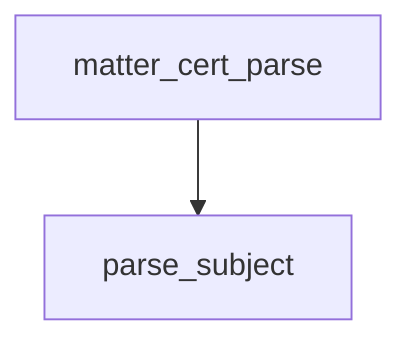

<!-- generated documentation — edit the source, not this file -->
# `modules/woz_matter/src/matter_fabric.c`

*No module docstring. First commit: "woz_matter: AddNOC, accepted by a real iPhone".*

**depends on** [`modules/woz_aliro/src/aliro_hash.h`](../modules.woz_aliro.src/aliro_hash.h.md), [`modules/woz_matter/include/matter_fabric.h`](../modules.woz_matter.include/matter_fabric.h.md), [`modules/woz_matter/include/matter_tlv.h`](../modules.woz_matter.include/matter_tlv.h.md)

## API

### `static int parse_subject(struct matter_tlv_reader *r, struct matter_cert_info *out)`
`modules/woz_matter/src/matter_fabric.c:32`

Pull the node and fabric ids out of a subject DN the reader is sitting on.

**called by** `matter_cert_parse`

Undocumented (3)

- `matter_cert_parse` — tested: matter fabric
- `matter_fabric_compressed_id` — tested: matter fabric
- `matter_fabric_instance_name` — tested: matter fabric

