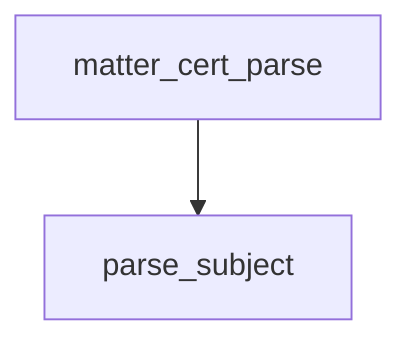

<!-- generated documentation — edit the source, not this file -->
# `modules/woz_matter/src/matter_fabric.c`

*No module docstring. First commit: "woz_matter: AddNOC, accepted by a real iPhone".*

**depends on** [`modules/woz_aliro/src/aliro_hash.h`](../modules.woz_aliro.src/aliro_hash.h.md), [`modules/woz_matter/include/matter_fabric.h`](../modules.woz_matter.include/matter_fabric.h.md), [`modules/woz_matter/include/matter_tlv.h`](../modules.woz_matter.include/matter_tlv.h.md)

## API

### `static int parse_subject(struct matter_tlv_reader *r, struct matter_cert_info *out)`
`modules/woz_matter/src/matter_fabric.c:32`

Pull the node and fabric ids out of a subject DN the reader is sitting on.

**called by** `matter_cert_parse`

### `int matter_cert_parse(const uint8_t *cert, size_t len, struct matter_cert_info *out)`
`modules/woz_matter/src/matter_fabric.c:78`

Parse a Matter certificate TLV structure to extract public key and subject DN fields.
Reads certificate from TLV container format, validates P-256 public key length (64 bytes),
extracts node and fabric IDs from subject.
Returns MATTER_E_INVAL if cert or out is NULL; returns MATTER_E_TYPE if root element is not a
container or key length is wrong; returns MATTER_E_INVAL if certificate format is invalid.

**calls** `parse_subject`

### `int matter_fabric_compressed_id(const uint8_t root_pub[MATTER_FABRIC_PUBKEY_LEN], uint64_t fabric_id, uint8_t out[MATTER_COMPRESSED_FABRIC_LEN])`
`modules/woz_matter/src/matter_fabric.c:141`

Compute the compressed fabric identifier from the root CA public key and fabric ID using HKDF.
Derives a 8-byte compressed ID used to identify the fabric in Matter fabric tables and
certificates.
Returns MATTER_E_INVAL if root_pub or out is NULL, if root_pub is not an uncompressed point
(first byte != 0x04), or if HKDF derivation fails.

**called by** `matter_fabric_instance_name`

### `int matter_fabric_instance_name(const struct matter_fabric *fabric, char *out, size_t cap)`
`modules/woz_matter/src/matter_fabric.c:176`

Format the fabric's ID and this node's ID into a hyphenated 16-digit hex instance name suitable
for Home Assistant.

**calls** `matter_fabric_compressed_id`
