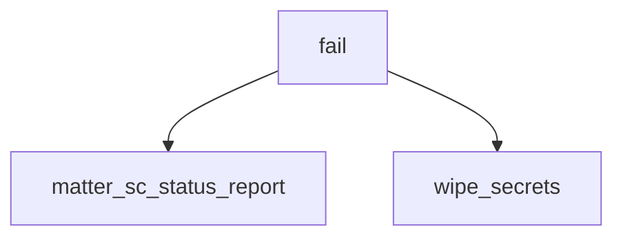

<!-- generated documentation — edit the source, not this file -->
# `modules/woz_matter/src/matter_pase_sm.c`

@file matter_pase_sm.c — PASE responder state machine. See matter_pase_sm.h.

**depends on** [`modules/woz_matter/include/matter_pase_sm.h`](../modules.woz_matter.include/matter_pase_sm.h.md)

## API

### `static void wipe_secrets(struct matter_pase_responder *r)`
`modules/woz_matter/src/matter_pase_sm.c:18`

Forget everything an unfinished exchange derived.
A failed PAKE is the case where key material is most worth clearing: the
responder struct outlives the attempt, and the next commissioner to connect
gets the same memory.

**called by** `fail`

### `static int fail(struct matter_pase_responder *r, int rc, uint8_t *out, size_t cap, size_t *out_len, uint8_t *out_opcode)`
`modules/woz_matter/src/matter_pase_sm.c:31`

Enter the terminal state and answer with the one failure code PASE uses.
@return @p rc, so callers can `return fail(r, rc, ...)`.

**called by** `matter_pase_responder_recv`, `on_pake1`, `on_pake3`, `on_pbkdf_req`  ·  **calls** `matter_sc_status_report`, `wipe_secrets`

### `static int on_pbkdf_req(struct matter_pase_responder *r, const uint8_t *payload, size_t len, uint8_t *out, size_t cap, size_t *out_len, uint8_t *out_opcode)`
`modules/woz_matter/src/matter_pase_sm.c:109`

PBKDFParamRequest -> PBKDFParamResponse, and fix the context hash.
The hash covers the request as received and the response as encoded, so it is
taken here where both are in hand: @p payload is still the peer's bytes and
@p out has just become ours. Re-encoding either one later to recompute this
would be the classic way to end up hashing something the peer never saw.

**called by** `matter_pase_responder_recv`  ·  **calls** `fail`

### `static int on_pake1(struct matter_pase_responder *r, const uint8_t *payload, size_t len, uint8_t *out, size_t cap, size_t *out_len, uint8_t *out_opcode)`
`modules/woz_matter/src/matter_pase_sm.c:157`

Pake1 (pA) -> Pake2 (pB, cB).
This is the only place the elliptic curve is touched. w1 is NULL and L is
supplied, which is what selects the verifier side of get_ZV
(ocrypto_spake2p_p256.h:83,87); passing both, or neither, would silently
compute the wrong side.

**called by** `matter_pase_responder_recv`  ·  **calls** `fail`

### `static int on_pake3(struct matter_pase_responder *r, const uint8_t *payload, size_t len, uint8_t *out, size_t cap, size_t *out_len, uint8_t *out_opcode)`
`modules/woz_matter/src/matter_pase_sm.c:212`

Pake3 (cA) -> StatusReport, and the session keys if cA is right.

**called by** `matter_pase_responder_recv`  ·  **calls** `fail`, `matter_sc_status_report`

Undocumented (3)

- `matter_sc_status_report` — tested: matter pase sm
- `matter_pase_responder_init` — tested: matter pase sm
- `matter_pase_responder_recv` — tested: matter pase sm

