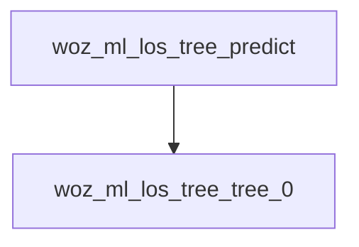

<!-- generated documentation — edit the source, not this file -->
# `modules/woz_ml/src/woz_ml_los_tree.h`

GENERATED by ai/tinyml/gen_model.py -- do not hand-edit.
Regenerate with:
ai/tinyml/.venv/bin/python ai/tinyml/gen_model.py

**used by** [`modules/woz_ml/src/woz_ml_los.c`](woz_ml_los.c.md)

Undocumented (3)

- `woz_ml_los_tree_tree_0`
- `woz_ml_los_tree_predict`
- `woz_ml_los_tree_predict_proba`

