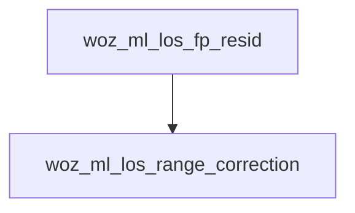

<!-- generated documentation — edit the source, not this file -->
# `modules/woz_ml/src/woz_ml_range.c`

@file woz_ml_range.c — free-space spreading at a measured range, without libm.
The classifier's strongest feature is first-path power with distance taken out
of it: an obstructed 1 m and a clear 3 m produce similar absolute power, and
that ambiguity is the whole reason the model exists. Removing 20*log10(d)
normalises every reception to what it would have measured at one metre, and
what is left is attenuation the range does not explain.
The obvious implementation calls log10f, which would cost woz_ml the property
its README claims and `arm-none-eabi-nm -u` can check: not one undefined
symbol, so the measured size is the whole size on every target modules/ builds
for. woz_ml_log2.c supplies the logarithm instead, and this file is only the
change of base and the clamp.
ACCURACY IS NOT THE BINDING CONSTRAINT HERE, and the term that binds is not the
logarithm. Measured on all 544 captured receptions, rounding the residual to
steps as coarse as 2 dB moves balanced accuracy by +0.0005; the tree's
thresholds are simply nowhere near most samples. What error there is comes
mostly from the reader reporting range as a whole number of centimetres, worth
~0.4 dB at the short end where the curve is steepest, against 0.017 dB from
the table. That is why gate 3 reports the same 0.183 dB maximum whether the
table has 8 entries or 64.

**depends on** [`modules/woz_ml/include/woz_ml.h`](../modules.woz_ml.include/woz_ml.h.md), [`modules/woz_ml/src/woz_ml_log2.h`](woz_ml_log2.h.md)  ·  **discussed in** [`ai/tinyml/RESULTS.md`](../../../ai/tinyml/RESULTS.md)

Undocumented (3)

- `woz_ml_los_range_correction` — tested: woz ml
- `woz_ml_los_fp_resid` — tested: woz ml
- `woz_ml_los_range_true_cm` — tested: woz ml

