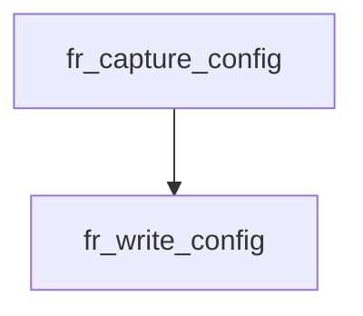

<!-- generated documentation — edit the source, not this file -->
# `modules/woz_uwb/src/facade/flight_recorder.c`

*No module docstring. First commit: "flight-recorder: record/replay real UWB walk-ups".*

**depends on** [`modules/woz_port/include/woz_log.h`](../modules.woz_port.include/woz_log.h.md), [`modules/woz_uwb/src/facade/flight_recorder.h`](flight_recorder.h.md), [`modules/woz_uwb/src/facade/woz_uwb_facade.h`](woz_uwb_facade.h.md)

## API

### `static int fr_emit(fr_writer_t *w, uint8_t type, const uint8_t *payload, size_t plen)`
`modules/woz_uwb/src/facade/flight_recorder.c:77`

Emit one framed record: [u8 type][u16 payload_len][payload]. Latches overflow
(and leaves the buffer at its last complete record) if it would not fit.

**called by** `fr_write_config`, `fr_write_end`, `fr_write_ev`, `fr_write_meta`  ·  **calls** `p16`, `p8`, `pbytes`

### `void fr_capture_ev(uint8_t ep, uint32_t status, uint16_t datalength)`
`modules/woz_uwb/src/facade/flight_recorder.c:417`

Snapshot the DW3000 registers this entry point will read, then append the
event. Reads are side-effect-free, but they do cost SPI while armed — capture
is opt-in and perturbs walk-up timing exactly like the `lab`/`uwbdiag` traces
do, so arm it only for a capture run.

**calls** `fr_ts5`, `fr_write_ev`

### `size_t fr_finalize(const uint8_t **buf)`
`modules/woz_uwb/src/facade/flight_recorder.c:457`

Append the END record once, then hand back the finalised buffer.

**called by** `fr_dump`  ·  **calls** `fr_write_end`

Undocumented (24)

- `p8`
- `p16`
- `p32`
- `p64`
- `pbytes`
- `g8`
- `g16`
- `g32`
- `g64`
- `fr_writer_init` — tested: format rejections; format roundtrip; writer overflow
- `fr_write_meta` — tested: format rejections; format roundtrip; writer overflow
- `fr_write_config` — tested: format roundtrip
- `fr_write_ev` — tested: format roundtrip
- `fr_write_end` — tested: format roundtrip
- `fr_reader_init` — tested: dump transport; format rejections; format roundtrip
- `fr_read_next` — tested: dump transport; format rejections; format roundtrip
- `fr_ts5`
- `fr_set_enabled`
- `fr_enabled`
- `fr_set_dump_sink` — tested: dump transport
- `fr_capture_config`
- `fr_emit_line`
- `fr_dump`
- `fr_clear`

