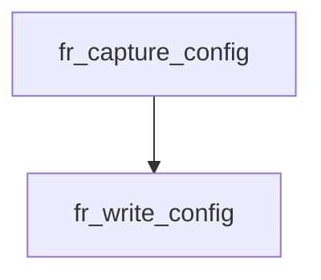

<!-- generated documentation — edit the source, not this file -->
# `modules/woz_uwb/src/facade/flight_recorder.c`

@file flight_recorder.c
Binary flight-recorder format: framed records (magic, metadata, configuration, events, end) with
little-endian integers and truncation handling; read/write operations with overflow detection.

**depends on** [`modules/woz_port/include/woz_log.h`](../modules.woz_port.include/woz_log.h.md), [`modules/woz_uwb/src/facade/flight_recorder.h`](flight_recorder.h.md), [`modules/woz_uwb/src/facade/woz_uwb_facade.h`](woz_uwb_facade.h.md)

## API

### `static void p8(uint8_t *b, size_t *o, uint8_t v)`
`modules/woz_uwb/src/facade/flight_recorder.c:25`

Write a 1-byte unsigned integer to buffer at offset o and advance o.

**called by** `fr_emit`, `fr_write_config`, `fr_write_end`, `fr_write_ev`, `fr_write_meta`

### `static void p16(uint8_t *b, size_t *o, uint16_t v)`
`modules/woz_uwb/src/facade/flight_recorder.c:32`

Write a 2-byte little-endian unsigned integer to buffer at offset o and advance o.

**called by** `fr_emit`, `fr_write_config`, `fr_write_ev`, `fr_write_meta`

### `static void p32(uint8_t *b, size_t *o, uint32_t v)`
`modules/woz_uwb/src/facade/flight_recorder.c:40`

Write a 4-byte little-endian unsigned integer to buffer at offset o and advance o.

**called by** `fr_write_config`, `fr_write_end`, `fr_write_ev`, `fr_writer_init`

### `static void p64(uint8_t *b, size_t *o, uint64_t v)`
`modules/woz_uwb/src/facade/flight_recorder.c:49`

Write an 8-byte little-endian unsigned integer to buffer at offset o and advance o.

**called by** `fr_write_config`, `fr_write_ev`

### `static void pbytes(uint8_t *b, size_t *o, const uint8_t *s, size_t n)`
`modules/woz_uwb/src/facade/flight_recorder.c:58`

Copy n bytes from s to buffer at offset o and advance o.

**called by** `fr_emit`, `fr_write_config`, `fr_write_ev`, `fr_write_meta`

### `static uint8_t g8(const uint8_t *b, size_t *o)`
`modules/woz_uwb/src/facade/flight_recorder.c:67`

Read and advance a 1-byte unsigned integer from buffer at offset o.

**called by** `fr_read_next`

### `static uint16_t g16(const uint8_t *b, size_t *o)`
`modules/woz_uwb/src/facade/flight_recorder.c:74`

Read and advance a 2-byte little-endian unsigned integer from buffer at offset o.

**called by** `fr_read_next`

### `static uint32_t g32(const uint8_t *b, size_t *o)`
`modules/woz_uwb/src/facade/flight_recorder.c:83`

Read and advance a 4-byte little-endian unsigned integer from buffer at offset o.

**called by** `fr_read_next`

### `static uint64_t g64(const uint8_t *b, size_t *o)`
`modules/woz_uwb/src/facade/flight_recorder.c:95`

Read and advance an 8-byte little-endian unsigned integer from buffer at offset o.

**called by** `fr_read_next`

### `static int fr_emit(fr_writer_t *w, uint8_t type, const uint8_t *payload, size_t plen)`
`modules/woz_uwb/src/facade/flight_recorder.c:109`

Emit one framed record: [u8 type][u16 payload_len][payload]. Latches overflow
(and leaves the buffer at its last complete record) if it would not fit.

**called by** `fr_write_config`, `fr_write_end`, `fr_write_ev`, `fr_write_meta`  ·  **calls** `p16`, `p8`, `pbytes`

### `void fr_writer_init(fr_writer_t *w, uint8_t *buf, size_t cap)`
`modules/woz_uwb/src/facade/flight_recorder.c:132`

Initialize a flight-recorder writer with an output buffer; write the magic prefix if capacity
permits, otherwise latch overflow flag.

**called by** `fr_clear`, `fr_set_enabled`  ·  **calls** `p32`

### `int fr_write_meta(fr_writer_t *w, uint16_t port, const char *sha)`
`modules/woz_uwb/src/facade/flight_recorder.c:152`

Emit a META record containing flight-recorder version, host port, and optional commit SHA; return
0 on success or -1 on buffer overflow.

**called by** `fr_set_enabled`  ·  **calls** `fr_emit`, `p16`, `p8`, `pbytes`

### `int fr_write_config(fr_writer_t *w, const struct fr_config *c)`
`modules/woz_uwb/src/facade/flight_recorder.c:173`

Emit a CONFIG record containing Aliro session parameters and UWB radio configuration; truncate
URSK and radio controller data to maximum lengths if needed; return 0 on success or -1 on buffer
overflow.

**called by** `fr_capture_config`  ·  **calls** `fr_emit`, `p16`, `p32`, `p64`, `p8`, `pbytes`

### `int fr_write_ev(fr_writer_t *w, const struct fr_ev *e)`
`modules/woz_uwb/src/facade/flight_recorder.c:197`

Emit an EV record containing DW3000 register snapshot and received frame data; truncate frame to
maximum length if needed; return 0 on success or -1 on buffer overflow.

**called by** `fr_capture_ev`  ·  **calls** `fr_emit`, `p16`, `p32`, `p64`, `p8`, `pbytes`

### `int fr_write_end(fr_writer_t *w, uint32_t n_events, bool truncated)`
`modules/woz_uwb/src/facade/flight_recorder.c:221`

Emit an END record with event count and truncation flag; return 0 on success or -1 on buffer
overflow.

**called by** `fr_finalize`  ·  **calls** `fr_emit`, `p32`, `p8`

### `void fr_reader_init(fr_reader_t *r, const uint8_t *buf, size_t len)`
`modules/woz_uwb/src/facade/flight_recorder.c:237`

Initialize a flight-recorder reader to parse a binary buffer; do not validate the magic prefix
until the first read.

### `int fr_read_next(fr_reader_t *r, struct fr_record *out)`
`modules/woz_uwb/src/facade/flight_recorder.c:250`

Parse one flight-recorder record from the reader buffer; check magic prefix on first call,
validate frame format and type; return the record type on success, 0 for clean end-of-buffer, or
-1 on malformed input.

**calls** `g16`, `g32`, `g64`, `g8`

### `static uint64_t fr_ts5(const uint8_t t[5])`
`modules/woz_uwb/src/facade/flight_recorder.c:411`

Decode a 5-byte little-endian unsigned integer.

**called by** `fr_capture_ev`

### `void fr_set_enabled(bool on)`
`modules/woz_uwb/src/facade/flight_recorder.c:421`

Stub callback that enables or disables flight recording.
No-op when the flight recorder is disabled.

**calls** `fr_write_meta`, `fr_writer_init`

### `bool fr_enabled(void)`
`modules/woz_uwb/src/facade/flight_recorder.c:438`

Returns true if the flight recorder is enabled and capturing events; false otherwise.
Stub when disabled.

### `void fr_set_dump_sink(void (*sink)(const char *line))`
`modules/woz_uwb/src/facade/flight_recorder.c:447`

Set an optional callback function to receive each line of flight-recorder dump output; if NULL,
output goes to stdout.

### `void fr_capture_config(const struct woz_uwb_aliro_cfg *c)`
`modules/woz_uwb/src/facade/flight_recorder.c:452`

Stub callback invoked when the flight recorder captures the Aliro session configuration.
No-op when the flight recorder is disabled.

**calls** `fr_write_config`

### `void fr_capture_ev(uint8_t ep, uint32_t status, uint16_t datalength)`
`modules/woz_uwb/src/facade/flight_recorder.c:486`

Snapshot the DW3000 registers this entry point will read, then append the
event. Reads are side-effect-free, but they do cost SPI while armed — capture
is opt-in and perturbs walk-up timing exactly like the `lab`/`uwbdiag` traces
do, so arm it only for a capture run.

**calls** `fr_ts5`, `fr_write_ev`

### `size_t fr_finalize(const uint8_t **buf)`
`modules/woz_uwb/src/facade/flight_recorder.c:526`

Append the END record once, then hand back the finalised buffer.

**called by** `fr_dump`  ·  **calls** `fr_write_end`

### `static void fr_emit_line(const char *line)`
`modules/woz_uwb/src/facade/flight_recorder.c:541`

Emit a line to the registered dump sink if set, otherwise print to stdout.

**called by** `fr_dump`

### `void fr_dump(void)`
`modules/woz_uwb/src/facade/flight_recorder.c:550`

Stub callback that dumps the flight recorder ring buffer to the host interface.
No-op when the flight recorder is disabled.

**calls** `fr_emit_line`, `fr_finalize`

### `void fr_clear(void)`
`modules/woz_uwb/src/facade/flight_recorder.c:575`

Stub callback that clears the flight recorder ring buffer.
No-op when the flight recorder is disabled.

**calls** `fr_writer_init`
