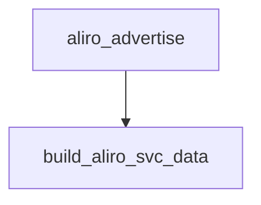

<!-- generated documentation — edit the source, not this file -->
# `ports/dwm3001cdk/app/src/aliro_ble_zephyr.c`

*No module docstring. First commit: "dwm3001cdk: standalone Aliro reader, stage 0 (it fits)".*

**depends on** [`ports/dwm3001cdk/app/src/matter_ble_zephyr.h`](matter_ble_zephyr.h.md), [`ports/dwm3001cdk/app/src/matter_commission.h`](matter_commission.h.md)

## API

### `static struct aliro_coc`
`ports/dwm3001cdk/app/src/aliro_ble_zephyr.c:85`

One peer at a time. CONFIG_BT_MAX_CONN=1 makes that a build-time fact, not a
hope, so a single channel record is the whole table.

### `static uint16_t conn_to_handle(struct bt_conn *conn)`
`ports/dwm3001cdk/app/src/aliro_ble_zephyr.c:101`

The reader engine's transport handle. Zephyr identifies a link by pointer,
the seam by uint16_t, so hand out the connection index (0..MAX_CONN-1).

**called by** `coc_connected`, `coc_disconnected`, `coc_recv`

### `static ssize_t device_ver_write(struct bt_conn *conn, const struct bt_gatt_attr *attr, const void *buf, uint16_t len, uint16_t offset, uint8_t flags)`
`ports/dwm3001cdk/app/src/aliro_ble_zephyr.c:217`

The peer writes the BLE-UWB protocol version it selected. Both shipped
readers require at least 3 bytes here (see 588df2e); we only need to accept
it, the reader engine reads the selection off the transaction itself.

### `static bool build_aliro_svc_data(uint8_t out[24])`
`ports/dwm3001cdk/app/src/aliro_ble_zephyr.c:256`

Aliro 1.0 section 11.3 (Table 11-2). 24 payload bytes after the 16-bit UUID:
[0]      flags: bit7 = BLE+UWB supported, bits2:0 = version (0)
[1]      tx power (int8)
[2..9]   truncated reader group id      = reader_id[0..7]
[10..11] truncated reader group sub id  = reader_id[16..17]
[12..15] dynamic-tag expiry, big-endian (0xFFFFFFFF = no clock)
[16]     reserved
[17..23] dynamic tag
The derivation wants the identity address MSB-first; bt_id_get hands it out
LSB-first, same as NimBLE.

**called by** `aliro_advertise`

### `const struct ble_gatt_svc_def *aliro_ble_service_def(void)`
`ports/dwm3001cdk/app/src/aliro_ble_zephyr.c:640`

Attach mode exists only so the ESP32 reader can share a NimBLE host with
esp-matter. Nothing shares this host.

Undocumented (25)

- `coc_alloc_buf`
- `coc_recv`
- `coc_connected`
- `coc_disconnected`
- `coc_accept`
- `encode_features`
- `build_read_payload`
- `reader_spsm_read`
- `aliro_advertise`
- `readvertise_work_fn`
- `on_connected`
- `on_disconnected`
- `aliro_ble_prepare`
- `aliro_ble_start`
- `aliro_ble_spsm`
- `aliro_ble_send`
- `aliro_ble_disconnect`
- `aliro_ble_set_adv_params`
- `aliro_ble_readvertise`
- `aliro_ble_time_updated`
- `status_work_fn`
- `presence_work_fn`
- `aliro_ble_post_reader_status`
- `aliro_ble_post_presence_reset`
- `aliro_ble_start_attached`

