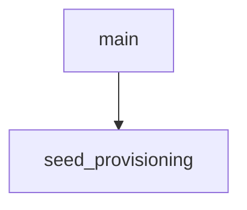

<!-- generated documentation — edit the source, not this file -->
# `ports/dwm3001cdk/app/src/main.c`

*No module docstring. First commit: "dwm3001cdk: standalone Aliro reader, stage 0 (it fits)".*

## API

### `static int seed_provisioning(void)`
`ports/dwm3001cdk/app/src/main.c:39`

Adopts the reader identity baked into the image by CONFIG_ALIRO_PROV_SEED_HEX.
This board cannot be commissioned into Apple Home on its own, so the only way
it holds an Apple-issued Aliro credential is to adopt one exported from a board
that was. Import persists to the settings store and commits in memory, so it
has to run before aliro_reader_start reads the identity to build the
advertisement. Returns 0 when nothing was seeded or the seed took.

**called by** `main`

Undocumented (1)

- `main`

