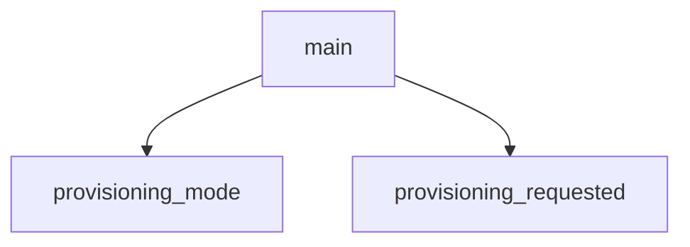

<!-- generated documentation — edit the source, not this file -->
# `ports/dwm3001cdk/app/src/main.c`

*No module docstring. First commit: "dwm3001cdk: standalone Aliro reader, stage 0 (it fits)".*

## API

### `static bool provisioning_requested(void)`
`ports/dwm3001cdk/app/src/main.c:54`

Provisioning mode: hold SW2 (the board's sw0 alias, P0.02) through reset.
The reader identity is per-device data in the settings store, never a string
in the image, so it has to arrive at runtime. This board's only input path is
the USB device port wired straight to the nRF52833 -- RTT is output-only --
so provisioning mode brings up CDC-ACM and the `aliro` console on it.
The radios stay down in this mode on purpose. It keeps USB's millisecond SOF
interrupts away from the DW3110's delayed-TX reply window (the timing that
commit 5b8d06b had to fight for on this single-core part), and it means the
console can never be reached while a walk-up is in flight.

**called by** `main`

### `static void provisioning_mode(void)`
`ports/dwm3001cdk/app/src/main.c:70`

Runs the console and nothing else. Never returns: leaving this function would
start the radios in a mode the user did not ask for.

**called by** `main`

Undocumented (1)

- `main`

