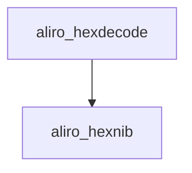

<!-- generated documentation — edit the source, not this file -->
# `ports/esp32/apps/matter-lock/main/app_shell.cpp`

ESP32-IDF console shell for the Aliro Matter door lock app: registers status, range, aliro, lock/unlock, codes, factoryreset, and clear commands and runs the REPL.

**depends on** [`ports/esp32/apps/matter-lock/main/app_priv.h`](app_priv.h.md), [`ports/esp32/apps/matter-lock/main/app_shell.h`](app_shell.h.md), [`ports/esp32/apps/matter-lock/main/ha_mqtt.h`](ha_mqtt.h.md), [`ports/esp32/apps/matter-lock/main/lock/door_lock_manager.h`](../ports.esp32.apps.matter-lock.main.lock/door_lock_manager.h.md), [`ports/esp32/components/aliro_reader/presence_link.h`](../ports.esp32.components.aliro_reader/presence_link.h.md)

## API

### `static const char *col(const char *c)`
`ports/esp32/apps/matter-lock/main/app_shell.cpp:66`

Return the ANSI color escape code c, or an empty string if linenoise is in dumb-terminal mode.

**called by** `cmd_commission`, `cmd_status`, `print_banner`

### `static void print_banner(void)`
`ports/esp32/apps/matter-lock/main/app_shell.cpp:72`

Prints the shell's startup banner: app name, version, IDF version, and a one-line usage hint.

**called by** `app_shell_start`  ·  **calls** `col`

### `static int cmd_status(int argc, char **argv)`
`ports/esp32/apps/matter-lock/main/app_shell.cpp:89`

Shell command handler: prints the current Matter door lock state, fabric count, and (when Aliro BLE/UWB is enabled) the last measured and last trusted UWB ranges in cm, or "none" if unavailable. Always returns 0.

**calls** `col`

### `static int cmd_range(int argc, char **argv)`
`ports/esp32/apps/matter-lock/main/app_shell.cpp:146`

Shell handler for the "range" command; prints the last measured UWB range in cm, or "no range yet"
if none has been recorded. Always returns 0.

### `static int aliro_hexnib(char c)`
`ports/esp32/apps/matter-lock/main/app_shell.cpp:164`

Maps one hex digit to its 0-15 value, or -1 if not [0-9a-fA-F]. Twin of the
helper in the standalone reader app_shell.c (kept local to avoid a shared dep).

**called by** `aliro_hexdecode`

### `static int aliro_hexdecode(const char *s, uint8_t *out, size_t out_cap)`
`ports/esp32/apps/matter-lock/main/app_shell.cpp:180`

Decodes an even-length hex string into out (capacity out_cap). Returns the byte
count on success, or -1 on an odd length, a bad character, or overflow.

**called by** `cmd_aliro`  ·  **calls** `aliro_hexnib`

### `static int cmd_aliro(int argc, char **argv)`
`ports/esp32/apps/matter-lock/main/app_shell.cpp:203`

Shell handler for the "aliro" command. Subcommands: "prov" prints reader provisioning info;
"trust" adds the last-presented credential to the trust store and persists it to NVS, reporting
whether a credential was actually available to trust or whether the store/NVS write failed.
With CONFIG_WOZ_ALIRO_CLONE, "export"/"import <hex>" clone the identity to a second board.
Any other or missing argument prints usage. Always returns 0.

**calls** `aliro_hexdecode`

### `static int cmd_uwbdiag(int argc, char **argv)`
`ports/esp32/apps/matter-lock/main/app_shell.cpp:278`

Shell handler for "uwbdiag": toggles the raw per-frame UWB trace (cia#/PREPOLL/
POLL/RESPTX/FINALDATA/DIST/GATE). Boot default off: the trace prints
synchronously from the UWB task and costs ranging-slot deadlines, so turn it
on only to debug the radio path. With no argument, prints the current state.

### `static int cmd_lock(int argc, char **argv)`
`ports/esp32/apps/matter-lock/main/app_shell.cpp:295`

Both bolt commands hop to the Matter task: BoltLockMgr drives cluster
attributes + emits events, which is only safe there.

### `static int cmd_unlock(int argc, char **argv)`
`ports/esp32/apps/matter-lock/main/app_shell.cpp:308`

Shell handler for the "unlock" command; schedules a manual bolt unlock on the Matter work queue
and confirms the request was submitted. Always returns 0.

### `static int cmd_codes(int argc, char **argv)`
`ports/esp32/apps/matter-lock/main/app_shell.cpp:323`

The boot log scrolls away long before you need to pair; this puts the QR URL
and manual code back on demand. Not PrintOnboardingCodes(): it logs at CHIP
Progress level, which the default WARN build compiles out of the CHIP library
entirely, so this command used to print nothing at all.

### `static int cmd_commission(int argc, char **argv)`
`ports/esp32/apps/matter-lock/main/app_shell.cpp:336`

Recovery for the one corner this firmware had no exit from: commissioned, so
it does not advertise commissionable, but with no working network, so no
controller can reach it to open a window. Opening one here lets a controller
re-push Wi-Fi credentials over BLE with every fabric and the Aliro trust store
intact, which is exactly what `factoryreset` costs.

**calls** `col`

### `static int cmd_factoryreset(int argc, char **argv)`
`ports/esp32/apps/matter-lock/main/app_shell.cpp:387`

Shell handler for the "factoryreset" command; erases persisted config and reboots the device via
esp_matter::factory_reset(). Always returns 0 (the reboot happens before returning is meaningful).

### `static int cmd_log(int argc, char **argv)`
`ports/esp32/apps/matter-lock/main/app_shell.cpp:408`

Runtime log knob: the boot default is WARN (blocking UART writes in the
protocol callbacks cost walk-up latency), so bench diagnostics need a way
back up without a reflash. The compile-time ceiling is DEBUG
(CONFIG_LOG_MAXIMUM_LEVEL); note the shared woz_aliro/woz_uwb sources log
under their module tags (aliro_reader, aliro_ranging, ...).

### `static int cmd_lab(int argc, char **argv)`
`ports/esp32/apps/matter-lock/main/app_shell.cpp:442`

Aliro Lab transaction trace: OFF at boot (the [ALAB] lines are blocking UART
writes on the protocol path, so they cost walk-up latency while on). `lab on`
before a walk-up, `lab off` after; tools/aliro_lab.py scores the captured log.
`lab cir on|off` additionally arms the windowed-CIR tap dump (channel-impulse
Stage 1): the taps buffer to RAM while armed and print in a burst on `lab cir
off`, off the ranging path, so the walk-up still unlocks while capturing.

### `static int cmd_frec(int argc, char **argv)`
`ports/esp32/apps/matter-lock/main/app_shell.cpp:485`

Flight recorder: record a live walk-up into a RAM ring for host replay. OFF at
boot (it reads extra DW3000 registers while armed, costing walk-up latency).
`fr on` before a walk-up, `fr off` after, `fr dump` to emit the `[FREC]` hex
that tools/flight_recorder.py turns into a .frc trace + fuzz corpus.

### `static int cmd_clear(int argc, char **argv)`
`ports/esp32/apps/matter-lock/main/app_shell.cpp:506`

Shell handler for the "clear" command; clears the terminal screen. Always returns 0.

### `void app_shell_start(void)`
`ports/esp32/apps/matter-lock/main/app_shell.cpp:514`

Register commands and start the console REPL (own task, pinned to core 0).

**calls** `print_banner`
