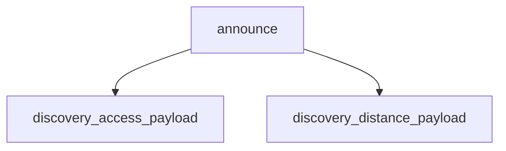

<!-- generated documentation — edit the source, not this file -->
# `ports/esp32/apps/matter-lock/main/ha_mqtt.c`

Native Home Assistant MQTT publisher for the ESP32 Matter lock — see ha_mqtt.h
for the wire contract this holds with integration/homeassistant.

**depends on** [`ports/esp32/apps/matter-lock/main/ha_mqtt.h`](ha_mqtt.h.md)  ·  **discussed in** [`docs/home-assistant-internals.md`](../../home-assistant-internals.md)

## API

### `struct ha_msg`
`ports/esp32/apps/matter-lock/main/ha_mqtt.c:75`

One queued observation: the smallest thing that can carry either topic's payload.

### `static bool node_name_ok(const char *node)`
`ports/esp32/apps/matter-lock/main/ha_mqtt.c:111`

True for a node name that is safe both as an MQTT topic level and as a bare JSON
string, so the discovery payloads below never need escaping.

**called by** `cfg_load`, `ha_mqtt_shell_cmd`

### `static esp_err_t cfg_set_str(const char *key, const char *value)`
`ports/esp32/apps/matter-lock/main/ha_mqtt.c:131`

Store one string under key in the ha_mqtt namespace, or erase it when value is
NULL. Returns ESP_OK on success.

**called by** `ha_mqtt_shell_cmd`

### `static bool cfg_get_str(nvs_handle_t h, const char *key, char *out, size_t len)`
`ports/esp32/apps/matter-lock/main/ha_mqtt.c:149`

Read one string from the ha_mqtt namespace into out. Returns false when the key
is absent or does not fit.

**called by** `cfg_load`, `cmd_show`

### `static bool cfg_load(void)`
`ports/esp32/apps/matter-lock/main/ha_mqtt.c:164`

Load every configured value into s_cfg. Returns false (naming the first missing
item) unless the broker is fully provisioned: host, login, node and pinned CA.
Authentication is required rather than optional, matching the agent's refusal to
connect anonymously without an explicit opt-in.

**called by** `ha_mqtt_task`  ·  **calls** `cfg_get_str`, `node_name_ok`

### `static void build_topics(void)`
`ports/esp32/apps/matter-lock/main/ha_mqtt.c:216`

Build every topic once, from the node name the agent also keys its topics on.

**called by** `ha_mqtt_task`

### `static void announce(void)`
`ports/esp32/apps/matter-lock/main/ha_mqtt.c:262`

Publish retained discovery and online availability, once per connection. Runs on
the publisher task, never in the mqtt event callback, because
esp_mqtt_client_publish() sends in the caller's context and would deadlock there.

**called by** `ha_mqtt_task`  ·  **calls** `discovery_access_payload`, `discovery_distance_payload`

### `static void mqtt_event_handler(void *arg, esp_event_base_t base, int32_t event_id, void *data)`
`ports/esp32/apps/matter-lock/main/ha_mqtt.c:279`

esp-mqtt event callback. Runs on the mqtt task and only flips flags; every publish
happens on the publisher task, which reads them.

### `static esp_err_t client_start(void)`
`ports/esp32/apps/matter-lock/main/ha_mqtt.c:312`

Bring up the TLS client against the pinned CA. Returns ESP_OK once esp-mqtt owns
the connection; it reconnects on its own from then on.

**called by** `ha_mqtt_task`

### `static void ha_mqtt_task(void *arg)`
`ports/esp32/apps/matter-lock/main/ha_mqtt.c:350`

Publisher task: the only place that touches the broker. Everything upstream of it
hands over a queue entry and returns immediately.

**calls** `announce`, `build_topics`, `cfg_load`, `client_start`

### `static void ha_mqtt_enqueue(uint8_t kind, int32_t value)`
`ports/esp32/apps/matter-lock/main/ha_mqtt.c:409`

Hand one observation to the publisher task. Drops rather than blocks: the callers
are the Aliro reader task and the NimBLE host task running the credential
transaction, where the UWB responder holds a ~1.8 ms slot deadline and a stalled
broker must never become walk-up latency. A dropped distance sample is replaced
by the next block 192 ms later; a dropped access event is only possible behind
eight unsent messages, which already means the broker is gone.

**called by** `ha_mqtt_publish_access`, `ha_mqtt_publish_distance_cm`

### `void ha_mqtt_publish_distance_cm(int32_t cm)`
`ports/esp32/apps/matter-lock/main/ha_mqtt.c:419`

Queue one conditioned approach distance, in centimetres (the estimate the
unlock thresholds act on, not a raw block). Never blocks: a full queue drops
the sample. Rate-limited to the agent's own interval before it is queued.

**calls** `ha_mqtt_enqueue`

### `void ha_mqtt_publish_access(bool granted)`
`ports/esp32/apps/matter-lock/main/ha_mqtt.c:441`

Queue one credential-independent access verdict. Never blocks: a full queue
drops the event. Matches aliro_reader's access-listener signature, so it can
be registered directly.

**calls** `ha_mqtt_enqueue`

### `void ha_mqtt_start_once(void)`
`ports/esp32/apps/matter-lock/main/ha_mqtt.c:446`

Bring the publisher up once the station has an address. Idempotent and
cheap: it only spawns the publisher task, which then does the NVS read, the
TLS connect and every publish. Safe to call from the Matter event callback.
No-op when the broker has not been provisioned.

**called by** `ha_mqtt_shell_cmd`

### `static char *read_console_block(size_t max, bool multiline)`
`ports/esp32/apps/matter-lock/main/ha_mqtt.c:469`

Read from the console without going through linenoise, so a secret typed here
never enters the shell's in-RAM history where an up-arrow would recall it. In
multiline mode, collect until a line containing only ".". Returns a heap string
the caller frees, or NULL on overflow or end of input. Nothing is echoed.

**called by** `ha_mqtt_shell_cmd`

### `static void cmd_show(void)`
`ports/esp32/apps/matter-lock/main/ha_mqtt.c:508`

Print what is provisioned and what the publisher is doing. The password is
reported as set or unset and never rendered.

**called by** `ha_mqtt_shell_cmd`  ·  **calls** `cfg_get_str`

### `int ha_mqtt_shell_cmd(int argc, char **argv)`
`ports/esp32/apps/matter-lock/main/ha_mqtt.c:549`

`hamqtt` console command: provision the broker, show state, start. Registered
from app_shell.cpp alongside the other commands.

**calls** `cfg_set_str`, `cmd_show`, `ha_mqtt_start_once`, `node_name_ok`, `read_console_block`

Undocumented (2)

- `discovery_distance_payload`
- `discovery_access_payload`

