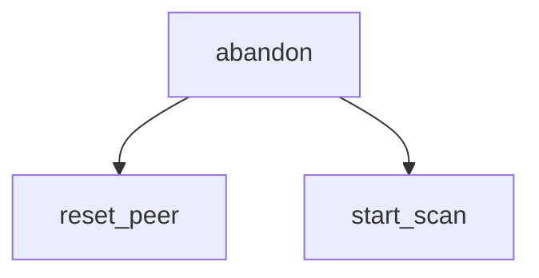

<!-- generated documentation — edit the source, not this file -->
# `ports/esp32/components/aliro_ble_central/aliro_ble_central_nimble.c`

NimBLE central/client backend for the Aliro initiator: the mirror of
components/aliro_ble/aliro_ble.c. That file advertises 0xFFF2, serves the
characteristics and runs a CoC server; this one scans for 0xFFF2, connects,
discovers, reads the reader's SPSM/versions, writes the selected version and
opens a CoC client to that SPSM.

## API

### `static void abandon(const char *why, int rc)`
`ports/esp32/components/aliro_ble_central/aliro_ble_central_nimble.c:93`

Abandon this peer and go back to scanning. Called from every failure path so
a half-finished chain can never leave the app wedged.

**called by** `coc_connect`, `gap_event`, `l2cap_event_cb`, `on_chr_disc`, `on_devver_write`, `on_spsm_read`, `on_svc_disc`  ·  **calls** `reset_peer`, `start_scan`

### `static void coc_connect(void)`
`ports/esp32/components/aliro_ble_central/aliro_ble_central_nimble.c:163`

Final step of the chain: open the CoC to the SPSM the READ gave us.

**called by** `on_devver_write`  ·  **calls** `abandon`

### `static bool advert_is_our_reader(const struct ble_hs_adv_fields *fields)`
`ports/esp32/components/aliro_ble_central/aliro_ble_central_nimble.c:319`

True when this advert carries Aliro service data from the reader we want. The
reader falls back to a bare UUID + name when unprovisioned or GRK-less
(aliro_ble.c:589); that form has no group id to match, so it is skipped
quietly rather than treated as an error.

**called by** `gap_event`

Undocumented (15)

- `reset_peer`
- `coc_arm_rx`
- `l2cap_event_cb`
- `on_devver_write`
- `on_spsm_read`
- `on_chr_disc`
- `on_svc_disc`
- `gap_event`
- `start_scan`
- `on_sync`
- `on_reset`
- `host_task`
- `coc_pools_init`
- `aliro_ble_central_start`
- `aliro_ble_central_send`

