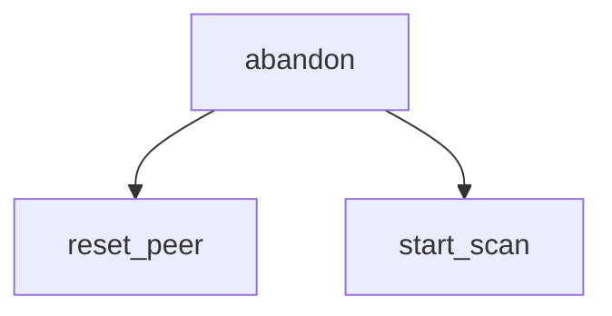

<!-- generated documentation — edit the source, not this file -->
# `ports/esp32/components/aliro_ble_central/aliro_ble_central_nimble.c`

NimBLE central/client backend for the Aliro initiator: the mirror of
components/aliro_ble/aliro_ble.c. That file advertises 0xFFF2, serves the
characteristics and runs a CoC server; this one scans for 0xFFF2, connects,
discovers, reads the reader's SPSM/versions, writes the selected version and
opens a CoC client to that SPSM.

## API

### `static void reset_peer(void)`
`ports/esp32/components/aliro_ble_central/aliro_ble_central_nimble.c:88`

Clear the peer state structure and reset the connection handle to BLE_HS_CONN_HANDLE_NONE.

**called by** `abandon`, `aliro_ble_central_start`, `gap_event`

### `static void abandon(const char *why, int rc)`
`ports/esp32/components/aliro_ble_central/aliro_ble_central_nimble.c:96`

Abandon this peer and go back to scanning. Called from every failure path so
a half-finished chain can never leave the app wedged.

**called by** `coc_connect`, `gap_event`, `l2cap_event_cb`, `on_chr_disc`, `on_devver_write`, `on_spsm_read`, `on_svc_disc`  ·  **calls** `reset_peer`, `start_scan`

### `static int coc_arm_rx(struct ble_l2cap_chan *chan)`
`ports/esp32/components/aliro_ble_central/aliro_ble_central_nimble.c:112`

Allocate and arm an RX buffer on the L2CAP CoC channel. Return BLE_HS_ENOMEM if no buffers are
available, otherwise return the ble_l2cap_recv_ready result.

**called by** `l2cap_event_cb`

### `static void coc_connect(void)`
`ports/esp32/components/aliro_ble_central/aliro_ble_central_nimble.c:170`

Final step of the chain: open the CoC to the SPSM the READ gave us.

**called by** `on_devver_write`  ·  **calls** `abandon`

### `static int on_devver_write(uint16_t conn_handle, const struct ble_gatt_error *error, struct ble_gatt_attr *attr, void *arg)`
`ports/esp32/components/aliro_ble_central/aliro_ble_central_nimble.c:194`

Callback when the device-version characteristic write completes. On success, open the L2CAP CoC
channel to the SPSM previously read. On error, abandon this peer.

**calls** `abandon`, `coc_connect`

### `static int on_spsm_read(uint16_t conn_handle, const struct ble_gatt_error *error, struct ble_gatt_attr *attr, void *arg)`
`ports/esp32/components/aliro_ble_central/aliro_ble_central_nimble.c:214`

GATT read callback for the reader SPSM characteristic: parse the flat payload to extract SPSM,
supported versions, and features. Verify that the peer publishes the selected version. Write the
selected version and a features byte to the device-version characteristic. On any error, abandon
this peer.

**calls** `abandon`

### `static int on_chr_disc(uint16_t conn_handle, const struct ble_gatt_error *error, const struct ble_gatt_chr *chr, void *arg)`
`ports/esp32/components/aliro_ble_central/aliro_ble_central_nimble.c:278`

GATT characteristic discovery callback: record the val_handle of the SPSM and device-version
characteristics. On discovery completion, read the SPSM characteristic. On error, abandon this
peer and return to scanning.

**calls** `abandon`

### `static int on_svc_disc(uint16_t conn_handle, const struct ble_gatt_error *error, const struct ble_gatt_svc *service, void *arg)`
`ports/esp32/components/aliro_ble_central/aliro_ble_central_nimble.c:313`

GATT service discovery callback: record the service handle range for the 0xFFF2 Aliro service. On
discovery completion, discover all characteristics within that range. On error, abandon this
peer.

**calls** `abandon`

### `static bool advert_is_our_reader(const struct ble_hs_adv_fields *fields)`
`ports/esp32/components/aliro_ble_central/aliro_ble_central_nimble.c:346`

True when this advert carries Aliro service data from the reader we want. The
reader falls back to a bare UUID + name when unprovisioned or GRK-less
(aliro_ble.c:589); that form has no group id to match, so it is skipped
quietly rather than treated as an error.

**called by** `gap_event`

### `static void start_scan(void)`
`ports/esp32/components/aliro_ble_central/aliro_ble_central_nimble.c:445`

Configure and start BLE GAP active scanning with duplicate filtering disabled (the dynamic tag
changes). Return to scanning after connection or on error.

**called by** `abandon`, `gap_event`, `on_sync`

### `static void on_reset(int reason)`
`ports/esp32/components/aliro_ble_central/aliro_ble_central_nimble.c:486`

Log that the NimBLE stack has reset and include the reset reason code.

### `static void host_task(void *param)`
`ports/esp32/components/aliro_ble_central/aliro_ble_central_nimble.c:495`

Run the NimBLE host event loop in the current thread until shutdown, then deinitialize the
FreeRTOS integration.

### `static int coc_pools_init(void)`
`ports/esp32/components/aliro_ble_central/aliro_ble_central_nimble.c:506`

Initialize the mbuf pool for CoC data: create a memory pool and mbuf pool with the configured
buffer count and MTU. Return 0 on success or -1 if either pool initialization fails.

**called by** `aliro_ble_central_start`

### `int aliro_ble_central_send(uint16_t conn_handle, const uint8_t *data, size_t len)`
`ports/esp32/components/aliro_ble_central/aliro_ble_central_nimble.c:568`

Send data to the peer over the L2CAP CoC: allocate an mbuf, append the data, and submit it via
ble_l2cap_send. Return 0 on success (stack owns the buffer or it is queued); return -1 on failure
(buffer freed on error).

Undocumented (4)

- `l2cap_event_cb`
- `gap_event`
- `on_sync`
- `aliro_ble_central_start`

