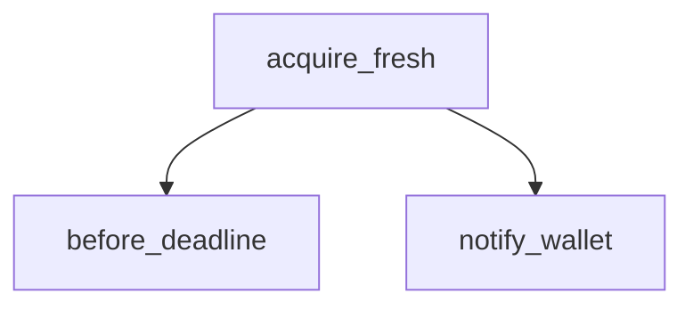

<!-- generated documentation — edit the source, not this file -->
# `ports/esp32/components/aliro_reader/presence_link.c`

Presence dongle commands (see presence_link.h). `prove` ends every old Aliro
link, waits for a new trusted credential authentication and a later trusted
UWB range, then signs that post-challenge result under a persistent P-256 key.
These live on the ordinary console rather than a private binary channel, so one
board can be provisioned (aliro-import) and queried for presence without
reflashing between modes, and so a stray log line is just another line instead of
a corrupted frame.

**depends on** [`ports/esp32/components/aliro_reader/presence_link.h`](presence_link.h.md)

## API

### `static void load_or_make_dev_key(void)`
`ports/esp32/components/aliro_reader/presence_link.c:51`

Load the device signing key from NVS, generating and persisting one on first
boot. This key IS the dongle's identity to every third-party verifier, so it has
to outlive reboots: a key regenerated each boot would silently invalidate every
public key anyone had already enrolled.

**called by** `presence_link_init`

### `void presence_link_init(bool drive_wallet_grant)`
`ports/esp32/components/aliro_reader/presence_link.c:94`

Generate or load the device signing key. Call once after the reader is up.
drive_wallet_grant: send the phone the Reader-Status-Changed grant/relock as the
presence verdict changes. Pass false from any app that already drives that from
its own lock state, or the two owners will contradict each other.

**calls** `load_or_make_dev_key`

### `static void notify_wallet(bool present)`
`ports/esp32/components/aliro_reader/presence_link.c:125`

Send the phone the grant/relock notification when the presence verdict changes.
Runs in the console task, never on the UWB RX path, because the send seals on the
BLE channel. A no-op with no established session (the reader logs and drops).
Off unless the host app asked for it. An app with its own lock state already owns
this notification (the Matter lock grants on its approach loop), and two owners
would fight over what the phone is being told.

**called by** `acquire_fresh`, `prove`

### `static void fill_assert(struct aliro_assert *a, const uint8_t nonce[ALIRO_ASSERT_NONCE_LEN], const uint8_t cred_id[ALIRO_ASSERT_CREDID_LEN], int32_t cm, const struct woz_uwb_range_integrity *ig)`
`ports/esp32/components/aliro_reader/presence_link.c:137`

Fill one successful assertion. Acquisition already proved that both the
credential and range are post-challenge, so this function accepts no latch
state and has no ABSENT path it could accidentally sign.

**called by** `answer_p256`

### `static void emit_hex(const char *tag, const uint8_t *b, size_t n)`
`ports/esp32/components/aliro_reader/presence_link.c:165`

Emit one tagged hex line in a single printf. Assembling the line first matters:
another task's output can land between two printf calls but not inside one, and
the host frames on whole lines.

**called by** `answer_p256`, `presence_link_cmd`

### `static int hexval(char c)`
`ports/esp32/components/aliro_reader/presence_link.c:179`

Return the numeric value 0-15 of a hex digit, or -1 if the character is not a valid hex digit.

**called by** `parse_hex`

### `static int parse_hex(const char *s, uint8_t *out, size_t n)`
`ports/esp32/components/aliro_reader/presence_link.c:195`

Parse exactly n bytes of hex. Rejects a short or long string rather than taking a
prefix: a truncated nonce that still parsed would silently weaken the challenge.

**called by** `presence_link_cmd`  ·  **calls** `hexval`

### `static int answer_p256(const uint8_t nonce[ALIRO_ASSERT_NONCE_LEN], const uint8_t cred_id[ALIRO_ASSERT_CREDID_LEN], int32_t cm, const struct woz_uwb_range_integrity *ig)`
`ports/esp32/components/aliro_reader/presence_link.c:216`

Assemble + sign the assertion for a challenge nonce under the device key, so any
holder of the public point can verify it without sharing a secret. That is what
makes a presence proof portable to a third party (a CI job, a second reviewer)
rather than only to one paired host.

**called by** `prove`  ·  **calls** `emit_hex`, `fill_assert`

### `static bool before_deadline(int64_t deadline_ms)`
`ports/esp32/components/aliro_reader/presence_link.c:236`

Return true if the current uptime is before the deadline in milliseconds.

**called by** `acquire_fresh`

### `int presence_link_require_fresh(void)`
`ports/esp32/components/aliro_reader/presence_link.c:356`

Require a new credential authentication and a later trusted UWB range.
Returns 0 only when the single provisioned credential ranges within policy.
Concurrent requests are serialized; no previous authentication or range can
authorize the caller.

**calls** `acquire_fresh`

### `int presence_link_cmd(int argc, char **argv)`
`ports/esp32/components/aliro_reader/presence_link.c:372`

Console handler for the `presence` command; registered by the app shell.

**calls** `emit_hex`, `parse_hex`, `prove`

Undocumented (2)

- `acquire_fresh`
- `prove`

