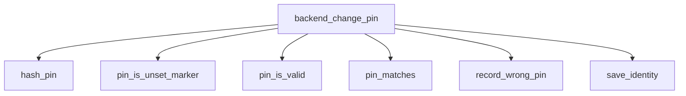

<!-- generated documentation — edit the source, not this file -->
# `ports/esp32/components/piv_ccid/piv_identity.c`

*No module docstring. First commit: "piv: gate macOS unlock on fresh presence".*

**depends on** [`ports/esp32/components/aliro_reader/presence_link.h`](../ports.esp32.components.aliro_reader/presence_link.h.md), [`ports/esp32/components/piv_ccid/include/piv_identity.h`](../ports.esp32.components.piv_ccid.include/piv_identity.h.md)

## API

### `struct piv_identity_blob`
`ports/esp32/components/piv_ccid/piv_identity.c:33`

Serialized identity blob holding a private key, public key, certificate, provisioned PIN state,
retries, salt, and hash. Magic and version fields used to detect format changes. GUID identifies
the identity. Reserved bytes for future use.

### `struct piv_key_management_blob`
`ports/esp32/components/piv_ccid/piv_identity.c:53`

Serialized key management blob holding a private key, public key, and certificate. Magic and
version fields used to detect format changes. Serial field distinguishes multiple key management
keys. Certificate is DER-encoded.

### `static int certificate_rng(void *ctx, unsigned char *out, size_t len)`
`ports/esp32/components/piv_ccid/piv_identity.c:73`

Fill a buffer with random bytes from the Aliro CSPRNG. Return 0 on success or nonzero on error.

### `static int make_pk_context(const uint8_t private_key[ALIRO_P256_SCALAR], const uint8_t public_key[ALIRO_P256_POINT], mbedtls_pk_context *key)`
`ports/esp32/components/piv_ccid/piv_identity.c:84`

Encode an RFC 5915 ECPrivateKey around the key material generated by PSA.
Parsing this standard DER object lets the X.509 writer use the same key
without reaching into private mbedTLS structures.

**called by** `make_certificate`

### `static int make_certificate(const uint8_t private_key[ALIRO_P256_SCALAR], const uint8_t public_key[ALIRO_P256_POINT], const uint8_t serial_source[16], const char *name, unsigned int key_usage, uint8_t *certificate, size_t certificate_cap, uint16_t *certificate_len)`
`ports/esp32/components/piv_ccid/piv_identity.c:127`

Encode a self-signed X.509v3 certificate around the given P-256 key pair. Sets the subject and
issuer name to the same string, validity from 2026-01-01 to 2046-01-01, and key usage to the
provided flags. Serial is derived from serial_source, with a fallback of 1 if all bytes are zero.
Returns 0 on success, -1 on failure (null pointer, buffer too small, or mbedTLS operation
failure). Output certificate is DER-encoded at certificate and its length is written to
certificate_len.

**called by** `piv_identity_init`  ·  **calls** `make_pk_context`

### `static int save_identity(void)`
`ports/esp32/components/piv_ccid/piv_identity.c:196`

Persist the in-memory identity blob to NVS under the key PIV_IDENTITY_KEY. Returns 0 on success,
-1 on NVS failure (open, set, or commit).

**called by** `backend_change_pin`, `backend_verify_pin`, `piv_identity_init`, `record_wrong_pin`

### `static int save_key_management(void)`
`ports/esp32/components/piv_ccid/piv_identity.c:217`

Persist the in-memory key management blob to NVS under the key PIV_KEY_MANAGEMENT_KEY. Returns 0
on success, -1 on NVS failure (open, set, or commit).

**called by** `piv_identity_init`

### `static int load_identity(void)`
`ports/esp32/components/piv_ccid/piv_identity.c:235`

Return 0 for a valid blob, 1 when no identity exists, and -1 on corruption.

**called by** `piv_identity_init`

### `static int load_key_management(void)`
`ports/esp32/components/piv_ccid/piv_identity.c:269`

Return 0 for a valid slot-9D blob, 1 when absent, and -1 on corruption.

**called by** `piv_identity_init`

### `static bool pin_is_valid(const uint8_t pin[PIV_PIN_BYTES])`
`ports/esp32/components/piv_ccid/piv_identity.c:309`

Return true if the PIN is valid: at least 6 ASCII decimal digits followed by padding bytes of
0xff, false otherwise.

**called by** `backend_change_pin`

### `static bool pin_is_unset_marker(const uint8_t pin[PIV_PIN_BYTES])`
`ports/esp32/components/piv_ccid/piv_identity.c:331`

Return true if the PIN buffer is the unset marker (all bytes 0xff), false otherwise.

**called by** `backend_change_pin`

### `static int hash_pin(const uint8_t salt[PIV_PIN_SALT_BYTES], const uint8_t pin[PIV_PIN_BYTES], uint8_t hash[32])`
`ports/esp32/components/piv_ccid/piv_identity.c:346`

Hash a PIN with its salt using SHA-256: concatenate salt and PIN, compute the hash, and clear
intermediate buffers. Return 0 on success or -1 if the PSA operation fails or returns a wrong
length.

**called by** `backend_change_pin`, `pin_matches`

### `static int backend_get_certificate(void *ctx, uint8_t key_ref, const uint8_t **certificate, size_t *certificate_len)`
`ports/esp32/components/piv_ccid/piv_identity.c:398`

Retrieve the certificate for a given key reference (AUTH or KEY_MANAGEMENT) and return its
pointer and length. Return 0 on success or -1 on error or invalid key reference.

### `static int backend_get_guid(void *ctx, uint8_t guid[16])`
`ports/esp32/components/piv_ccid/piv_identity.c:422`

Copy the 16-byte GUID from the PIV identity to the caller's buffer. Return 0 on success or -1 on
error or if the backend is not ready.

### `static int backend_pin_status(void *ctx, uint8_t *retries)`
`ports/esp32/components/piv_ccid/piv_identity.c:436`

Return the PIN retry counter and status: 0 if the PIN is provisioned and retries remain, -2 if
the PIN is not provisioned or retries are exhausted, -1 on error or if the backend is not ready.

### `static int backend_sign_hash(void *ctx, const uint8_t hash[PIV_P256_HASH_BYTES], uint8_t signature[PIV_P256_RAW_SIGNATURE_BYTES])`
`ports/esp32/components/piv_ccid/piv_identity.c:522`

Sign a 32-byte P-256 hash using the identity private key, after verifying that presence is fresh.
Return 0 on success or -1 on error, if the backend is not ready, or if presence validation fails.

### `static int backend_derive_shared(void *ctx, const uint8_t peer_public_key[PIV_P256_POINT_BYTES], uint8_t shared_secret[PIV_P256_SHARED_SECRET_BYTES])`
`ports/esp32/components/piv_ccid/piv_identity.c:539`

ECDH callback: compute the shared secret using the local P-256 private key and the peer's P-256
public key. Return 0 on success or -1 on error or if the backend is not ready.

### `const struct piv_apdu_backend *piv_identity_backend(void)`
`ports/esp32/components/piv_ccid/piv_identity.c:631`

Return a pointer to the APDU backend implementation struct for PIV identity operations.

Undocumented (5)

- `pin_matches`
- `record_wrong_pin`
- `backend_verify_pin`
- `backend_change_pin`
- `piv_identity_init`

