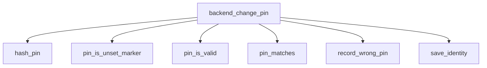

<!-- generated documentation — edit the source, not this file -->
# `ports/esp32/components/piv_ccid/piv_identity.c`

*No module docstring. First commit: "piv: gate macOS unlock on fresh presence".*

**depends on** [`ports/esp32/components/aliro_reader/presence_link.h`](../ports.esp32.components.aliro_reader/presence_link.h.md), [`ports/esp32/components/piv_ccid/include/piv_identity.h`](../ports.esp32.components.piv_ccid.include/piv_identity.h.md)

## API

### `static int make_pk_context(const uint8_t private_key[ALIRO_P256_SCALAR], const uint8_t public_key[ALIRO_P256_POINT], mbedtls_pk_context *key)`
`ports/esp32/components/piv_ccid/piv_identity.c:71`

Encode an RFC 5915 ECPrivateKey around the key material generated by PSA.
Parsing this standard DER object lets the X.509 writer use the same key
without reaching into private mbedTLS structures.

**called by** `make_certificate`

### `static int load_identity(void)`
`ports/esp32/components/piv_ccid/piv_identity.c:206`

Return 0 for a valid blob, 1 when no identity exists, and -1 on corruption.

**called by** `piv_identity_init`

### `static int load_key_management(void)`
`ports/esp32/components/piv_ccid/piv_identity.c:240`

Return 0 for a valid slot-9D blob, 1 when absent, and -1 on corruption.

**called by** `piv_identity_init`

Undocumented (20)

- `piv_identity_blob`
- `piv_key_management_blob`
- `certificate_rng`
- `make_certificate`
- `save_identity`
- `save_key_management`
- `pin_is_valid`
- `pin_is_unset_marker`
- `hash_pin`
- `pin_matches`
- `record_wrong_pin`
- `backend_get_certificate`
- `backend_get_guid`
- `backend_pin_status`
- `backend_verify_pin`
- `backend_change_pin`
- `backend_sign_hash`
- `backend_derive_shared`
- `piv_identity_init`
- `piv_identity_backend`

