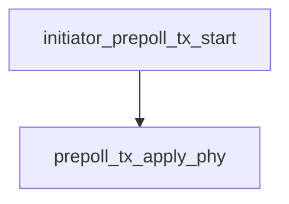

<!-- generated documentation — edit the source, not this file -->
# `ports/nrf5340dk/initiator/src/prepoll_tx.c`

Device-side CCC Pre-POLL transmitter. See prepoll_tx.h for scope.

**depends on** [`ports/nrf5340dk/initiator/src/prepoll_tx.h`](prepoll_tx.h.md)

## API

### `static int prepoll_tx_apply_phy(uint8_t channel, uint8_t preamble_code)`
`ports/nrf5340dk/initiator/src/prepoll_tx.c:73`

Apply the SP0 PHY the reader listens on.
Every field here is the reader's own prepoll_apply_phy() in
modules/woz_uwb/src/ccc/ccc_shim_rx.c, and it has to stay that way: a Pre-POLL
sent on a different preamble length, SFD type or data rate is not a frame the
reader can hear at all, and the failure looks exactly like a bad key.
The two that were learned on hardware rather than read off a spec, per that
file's comments: SFD is the ternary 8-symbol IEEE 4a pattern, not 4z (4z
SFD-timed-out on every real phone frame), and preamble length is 64 because
CCC config 0 pins it there.

**called by** `initiator_prepoll_tx_start`

### `static int prepoll_tx_build(uint8_t out[PREPOLL_FRAME_LEN], uint32_t *poll_sts_index_out)`
`ports/nrf5340dk/initiator/src/prepoll_tx.c:109`

Build one block's 44-byte Pre-POLL into @out.

**called by** `prepoll_tx_one`

### `static int prepoll_tx_one(void)`
`ports/nrf5340dk/initiator/src/prepoll_tx.c:159`

Put one Pre-POLL on the air and wait for TXFRS.

**called by** `prepoll_tx_work`  ·  **calls** `prepoll_tx_build`

### `int initiator_prepoll_tx_start(const struct prepoll_tx_params *p)`
`ports/nrf5340dk/initiator/src/prepoll_tx.c:230`

Derive the SP0 key material, configure the radio for SP0 and start sending one
Pre-POLL per ranging block. Idempotent: a second call restarts the schedule.
Returns 0 once the first frame is scheduled, negative on a bad parameter set
or a radio that will not configure. It does NOT wait for the reader.

**calls** `prepoll_tx_apply_phy`

### `void initiator_prepoll_tx_stop(void)`
`ports/nrf5340dk/initiator/src/prepoll_tx.c:303`

Stop transmitting and force the radio off. Safe if never started.

Undocumented (1)

- `prepoll_tx_work`

