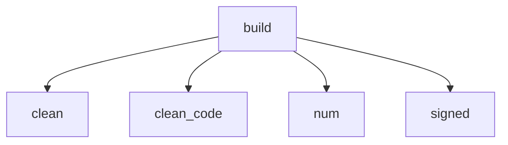

<!-- generated documentation — edit the source, not this file -->
# `scripts/cdk-size-notify.py`

cdk-size-notify.py — say what a change cost the CDK image, in Discord.

    DISCORD_WEBHOOK=https://discord.com/api/webhooks/...       scripts/cdk-size-notify.py --current size-report.json --run-url https://...

Formats a size report against the recorded baseline and posts it. Exit 0 when
it posted AND when it deliberately said nothing; exit 1 only when a post was
attempted and failed. Nothing here decides whether code merges: cdk-size-check
is the gate, this only reports what it decided.

SILENT ON A NO-OP, and that is the whole design. A bot that posts "+0 bytes" on
every push to every labelled pull request gets muted within a week, and a muted
bot is worse than none -- it is a channel everyone believes is being watched.
So a run that passed with both regions unchanged says nothing at all. Anything
that moved, was blocked, or could not be compared is worth an interruption.
Raise the bar with CDK_SIZE_NOTIFY_MIN if even that is too chatty.

THE REPORT IS UNTRUSTED INPUT. On a pull request from a fork, every byte of it
was produced by that fork's code -- including the symbol names, which end up in
a message this bot posts into your server. So nothing from it is interpolated
into a shell command, strings are stripped of markdown and length-capped, and
the payload disables mentions outright: a symbol named `@everyone` is a real
thing someone can write. The numbers themselves cannot be trusted either, and
are not meant to be; a fork can lie about its own size. What blocks a merge is
the gate's exit status, not this message.

## API

### `clean(text, limit=MAX_NAME)`
`scripts/cdk-size-notify.py:62`

Make untrusted PROSE safe to put in a Discord message.

A blacklist, because prose legitimately contains punctuation and only the
markdown-active characters have to go. Used for the gate's own messages,
which are generated here but interpolate numbers out of the report -- a
crafted report can put a string where an integer belongs.

**called by** `build`

### `clean_code(text, limit=MAX_NAME)`
`scripts/cdk-size-notify.py:90`

Make an untrusted identifier safe INSIDE a code span, keeping it readable.

**called by** `build`

### `build(cur, doc, run_url, min_delta)`
`scripts/cdk-size-notify.py:106`

Decide whether to say anything, and what. Returns (payload, why-silent).

**called by** `main`  ·  **calls** `clean`, `clean_code`, `num`, `signed`

Undocumented (5)

- `num`
- `signed`
- `normalise_webhook`
- `post`
- `main`

