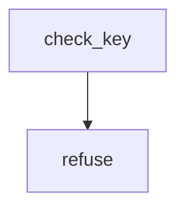

<!-- generated documentation — edit the source, not this file -->
# `scripts/check-signing-key.sh`

check-signing-key.sh — refuse to build a bootloader that anybody can sign for.
WHAT IS BEING PREVENTED. MCUboot boots slot 0 only if the image verifies
against a public key compiled into the bootloader, so the private half is the
whole answer to "what firmware will this lock run". Configure nothing and
MCUboot signs with root-ec-p256.pem out of its OWN repository, where that key
is published. Every stock MCUboot in the world accepts images signed with it.
On a lock that is not a signing key, it is a formality.
MCUboot does notice, at bootloader/mcuboot/boot/zephyr/CMakeLists.txt:449-452,
and calls message(WARNING). That is precisely why it survived on this port for
as long as it did: a warning in a ten-thousand-line build log is
indistinguishable from no warning. Here it is fatal.
scripts/check-signing-key.sh <path>      # validate one configured key
scripts/check-signing-key.sh --self-test # prove the refusals actually fire
Exit 0 clean, 1 on a finding, 2 if the gate could not do its job.
Both Zephyr ports call this, which is why it is a file rather than a paragraph
repeated in each: firmware/sysbuild.cmake for the DWM3001CDK, and
scripts/build-nrf5340dk.sh for the nRF5340 DK. One list, one set of refusals,
one place to edit when upstream adds an eighth demo key. The DK additionally
reads the key back out of the built mcuboot .config, because a flag we passed
is not the same fact as a flag the build honoured.

**discussed in** [`CHANGELOG.md`](../../../CHANGELOG.md), [`firmware/README.md`](../../../firmware/README.md), [`firmware/keys/README.md`](../../../firmware/keys/README.md), [`ports/nrf5340dk/README.md`](../../../ports/nrf5340dk/README.md)

## API

### `refuse()`
`scripts/check-signing-key.sh:53`

Print a refusal: first line coloured, the rest indented, all to stderr so a
caller that captures this can hand it straight to its own fatal error.

**called by** `check_key`

### `check_key()`
`scripts/check-signing-key.sh:63`

Validate one configured signing-key path. Returns 1, with the reason on
stderr, when the path would leave the bootloader trusting a published key.

**calls** `refuse`

### `cleanup()`
`scripts/check-signing-key.sh:120`

Clean up the self-test fixture directory. Always succeeds, so an EXIT trap
can never rewrite the exit status the gate meant to report.
