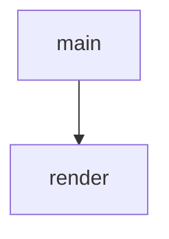

<!-- generated documentation — edit the source, not this file -->
# `scripts/flash_html.py`

Render a release FLASH.md into a self-contained FLASH.html.

The markdown file stays the single source of truth; this wraps its rendered
body in an embedded stylesheet (light + dark, no external assets) so the
bundle ships a guide that reads well in a browser. The output is committed
next to its source, so regenerate after editing a FLASH.md:

    pip install markdown==3.8
    python3 scripts/flash_html.py release/*/FLASH.md

Output is deterministic (no timestamps): it only changes when the source does.

## API

### `render(src: pathlib.Path) -> pathlib.Path`
`scripts/flash_html.py:112`

Convert a Markdown source file to an HTML page: extract the first H1 as the title (fallback to parent directory name), render Markdown with table and fenced code support, reformat section labels from "## N. TEXT" to "N · TEXT", wrap tables in a scrollable container for mobile, and write to a .html file in the same directory.
Returns the path to the rendered HTML file.

**called by** `main`

### `main() -> int`
`scripts/flash_html.py:135`

Convert a Markdown file to HTML: extract title from first H1 (or parent directory name), render Markdown with code fence and table support, rewrite section headers from "## N. TEXT" to "N · TEXT", wrap tables for mobile scrolling. Write output as .html alongside the source.

**calls** `render`
