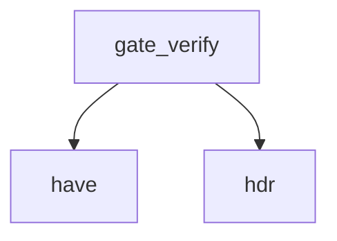

<!-- generated documentation — edit the source, not this file -->
# `scripts/security-attest.sh`

security-attest.sh — can somebody who downloaded a release prove where it came from?
Yes, since release.yml grew an attest-build-provenance step. It did not always: SHA256SUMS.txt
on its own answers "are these the bytes the release page listed" and not "did this repository's
CI build them". Those are different questions, and the second is the one that matters for a
project whose distribution path ends in a browser page calling navigator.serial. A SHA256SUMS.txt
served from the same release as the artifacts it describes is signed by nothing; whoever could
replace the .bin could replace the sums file in the same motion.
The fix was one action and two permissions in release.yml (see INTEGRATION.md), producing a
Sigstore-backed attestation that binds each artifact to the workflow, repository and commit that
built it. This script is the other half: the part that runs outside CI and checks the CI half is
real.
The subject list covers the unzipped bundle contents as well as the zips, which is what lets
each release/<target>/flash.sh verify the exact image it is about to write to a board. A
guarantee nobody can reach at the moment they need it is not much of a guarantee.
scripts/security-attest.sh workflow          # static: release.yml still emits attestations
scripts/security-attest.sh verify v0.4.0     # download a release and verify it end to end
make security-attest
Two modes, because they answer to different failure modes. `workflow` needs no network and no
release to exist, so it can sit in the fast lane and catch the attestation step being dropped in
an edit — the way a security control usually dies. `verify` is what a user would run, and is the
only thing that proves the control works rather than that it is configured.
Exit 0 clean, 1 on a finding, 2 if the mode could not run.
Env:
REPO=owner/name    default openaliro/openaliro
NO_COLOR=1         plain output

**discussed in** [`security/README.md`](../../../security/README.md)

## API

### `have()`
`scripts/security-attest.sh:53`

Return 0 if command exists in PATH, 1 otherwise.

**called by** `gate_verify`

### `hdr()`
`scripts/security-attest.sh:55`

Print a section header with bold formatting and a leading newline.

**called by** `gate_verify`, `gate_workflow`

### `gate_workflow()`
`scripts/security-attest.sh:62`

---- workflow --------------------------------------------------------------
A line scanner over the workflow rather than a yaml parse, for the reason security-diff.sh gives
about its own choices: the checks below are about the presence and shape of four specific
things, and a yaml dependency in a security gate that reads one file is a worse trade than a
regex that is honest about what it matches.

**calls** `hdr`

### `gate_verify()`
`scripts/security-attest.sh:128`

---- verify ----------------------------------------------------------------
What a user would actually do, run against a real release. This is the check that proves the
control works; `workflow` above only proves it is configured, and the two have failed
independently often enough elsewhere to be worth separating.

**calls** `have`, `hdr`
