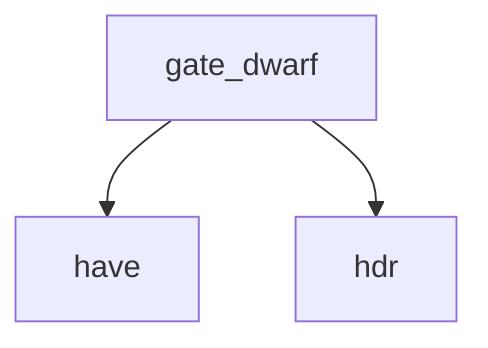

<!-- generated documentation — edit the source, not this file -->
# `scripts/security-fw.sh`

security-fw.sh — the shipped artifact, which every other gate in this repo reasons about only
indirectly.
semgrep, clang-tidy, CodeQL and CBMC all read source. The thing a user actually flashes is
build/nrf5340dk/merged.hex, and between the source and that file sit a linker, a Kconfig tree, a
generated device tree, a vendor blob and whatever `west build` decided to bake in. Nothing here
has ever looked at the result. That gap is where a build-host path leak, a test key that
survived a #ifdef, or a payload appended after the link would live, and none of those are
visible to a source scanner by construction.
scripts/security-fw.sh                       # every check, on the nRF5340DK image
scripts/security-fw.sh --image out/x.bin     # explicit artifact
scripts/security-fw.sh strings               # one: keys strings size dwarf
make security-fw
Exit 0 clean, 1 on a finding, 2 if there is no artifact to examine.
Intel HEX is parsed here rather than shelled out to objcopy. objcopy is not on a mac by default
and arm-none-eabi-objcopy lives inside the NCS toolchain, so requiring either turns "the gate
ran" into "the gate ran if you had bootstrapped", which is the soft-skip this repo's gates are
written to refuse. The parser below is thirty lines and has no dependencies.
Env:
FW_IMAGE=path                artifact (default: the nRF5340DK image under $ALIRO_BUILD_ROOT)
The size baseline is calibrated to THAT image, so pointing this
at another board's build compares against the wrong record.
FW_DENYLIST=path             byte patterns that must not ship (default: security/fw-denylist.txt)
FW_SIZE_BASELINE=path        recorded sizes (default: security/fw-size-baseline.txt)
FW_SIZE_WARN=2 FW_SIZE_FAIL=10   growth percentages
FW_UPDATE_BASELINE=1         rewrite the size record instead of comparing
NO_COLOR=1                   plain output

## API

### `gate_keys()`
`scripts/security-fw.sh:140`

---- keys ------------------------------------------------------------------
The denylist is byte patterns, not strings, because the thing being looked for is key material:
a 32-byte URSK that leaked out of a test fixture into a production image does not appear in
`strings` output and never will.

**called by** `run_one`  ·  **calls** `hdr`

### `gate_strings()`
`scripts/security-fw.sh:194`

---- strings ---------------------------------------------------------------
Build-host paths in an image are two problems wearing one coat: they name the machine and the
user that built it, and they mean the artifact is not reproducible, so nobody can independently
rebuild a release and compare. Zephyr fixes both with -ffile-prefix-map; this notices when that
is not in effect.

**called by** `run_one`  ·  **calls** `hdr`

### `gate_dwarf()`
`scripts/security-fw.sh:241`

---- dwarf -----------------------------------------------------------------
Advisory, not blocking. Debug information in a shipped image is a reverse-engineering
convenience rather than a vulnerability, and this project publishes its source anyway — so the
argument for stripping is size, not secrecy, and a hard failure would be theatre.

**called by** `run_one`  ·  **calls** `have`, `hdr`

### `gate_size()`
`scripts/security-fw.sh:280`

---- size ------------------------------------------------------------------
Same reasoning as the oversized-file rule in security-diff.sh, applied to the artifact: large
additions are where payloads hide, because nobody reads to the end of them. A 40 KB jump in an
image nobody looked at is exactly as invisible as a 40 KB blob nobody read.

**called by** `run_one`  ·  **calls** `hdr`

### `run_one()`
`scripts/security-fw.sh:316`

---- dispatch --------------------------------------------------------------

**calls** `gate_dwarf`, `gate_keys`, `gate_size`, `gate_strings`

Undocumented (2)

- `have`
- `hdr`

