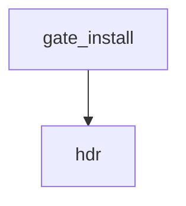

<!-- generated documentation — edit the source, not this file -->
# `scripts/security-web.sh`

security-web.sh — the browser half of the supply chain, which nothing else in this repo looks at.
scripts/security.sh's `deps` gate reads tools/tui/bun.lock and integration/homeassistant's
pyproject. Neither of those is what a user actually executes. web-flasher/index.html executes a
module fetched at page load from a CDN, and that page's whole purpose is to write firmware to a
board over WebSerial — so whoever controls that module controls what gets flashed onto every
device of everyone who used the hosted flasher. It is not in any lockfile, so `deps` has never
seen it; semgrep's p/javascript pack parses .js, not a <script> tag inside .html, so semgrep has
never seen it either; and security-diff.sh's URL check only fires on a URL being ADDED, so a
dependency that has been there since the page was written is invisible to all three.
This gate closes that. It reads every tracked HTML page and asks three questions of it:
1. Is every remote subresource pinned to an exact version AND carrying an integrity hash?
A range like `@10` resolves to whatever the registry serves at page load. That is not a
dependency, it is a promise from a stranger, and `integrity=` is the only thing that makes
the difference observable to the browser.
2. Does the page carry a Content-Security-Policy?
GitHub Pages sends no CSP header and cannot be made to, so a <meta http-equiv> is the only
place one can exist for this project. Without it, an injected script has the same authority
as the page: on the flasher, that is navigator.serial.
3. Is the vendored JavaScript free of known-vulnerable versions? (retire.js)
scripts/security-web.sh              # every check
scripts/security-web.sh pins         # one check: pins csp retire
make security-web
Exit 0 if everything selected passed, 1 otherwise, 2 on bad usage.
Baseline, not suppression: security/web-baseline.txt lists paths that are knowingly
non-compliant, one per line, each with a reason after a '#'. A baselined path still prints, it
just does not block — so the debt is visible on every run rather than deleted. An entry that no
longer matches anything is itself an error, because a stale baseline is how a check quietly
stops applying to the file it was written for.
Env:
WEB_BASELINE=path   override the baseline file
NO_COLOR=1          plain output

**discussed in** [`activity/README.md`](../../../activity/README.md), [`security/README.md`](../../../security/README.md)

## API

### `have()`
`scripts/security-web.sh:58`

Return true if the command exists in PATH, false otherwise.

**called by** `gate_retire`

### `hdr()`
`scripts/security-web.sh:60`

Print a bold section header to stdout preceded by a newline.

**called by** `gate_install`, `gate_pins_csp`, `gate_retire`

### `missing()`
`scripts/security-web.sh:62`

Print a missing-tool error to stdout, note that a missing gate is a failed gate, and return 1.

**called by** `gate_retire`

### `gate_pins_csp()`
`scripts/security-web.sh:73`

---- pins + csp ------------------------------------------------------------
Both live in one python pass because both need the same parse of the same files, and the whole
point of reading HTML with html.parser rather than with grep is that a regex over markup cannot
tell a <script src> from the string "<script src" inside a JS template literal — and this repo
has pages that contain both.

**called by** `run_one`  ·  **calls** `hdr`

### `gate_retire()`
`scripts/security-web.sh:260`

---- retire ----------------------------------------------------------------
Vendored JS only. retire.js is a version-fingerprint scanner, so it has nothing useful to say
about a file this repo wrote itself (web-twin/twin.js is emscripten output); it earns its place
the moment anything third-party gets vendored in, which is exactly what the `pins` check above
will push people towards doing.

**called by** `run_one`  ·  **calls** `have`, `hdr`, `missing`

### `gate_install()`
`scripts/security-web.sh:300`

---- install -----------------------------------------------------------------
Installing a package is an arbitrary-code-execution step. npm runs preinstall/postinstall from
every package in the resolved tree by default, so `npm i` on a runner executes code from
whoever published any transitive dependency. Bun blocks lifecycle scripts by default but keeps
a built-in allow-list, so it is not the same guarantee; --ignore-scripts is.
This is the gate `deps` cannot be: osv-scanner answers "is this package known bad today", which
a package that is bad and not yet reported passes cleanly. Refusing to execute it does not
depend on anyone having noticed.
Two rules, both mechanical:
1. every install command in a tracked file carries --ignore-scripts
2. a lockfile-backed install also carries --frozen-lockfile, so a resolution cannot drift
out from under the lockfile that was reviewed
and one more, on manifests: no floating version specifier, because "latest" resolves at install
time to whatever was published since the review.

**called by** `run_one`  ·  **calls** `hdr`

### `run_one()`
`scripts/security-web.sh:378`

---- dispatch --------------------------------------------------------------

**calls** `gate_install`, `gate_pins_csp`, `gate_retire`
