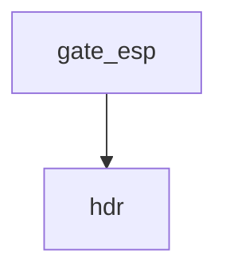

<!-- generated documentation — edit the source, not this file -->
# `scripts/security-workspace.sh`

*No module docstring. First commit: "security: add the eight-gate scanning lane".*

**discussed in** [`security/README.md`](../../../security/README.md)

## API

### `have()`
`scripts/security-workspace.sh:58`

Test whether a command is available in PATH.

**called by** `gate_pins`, `gate_sbom`, `gate_vulns`

### `hdr()`
`scripts/security-workspace.sh:60`

Print a section header with leading newline, bold text, and color reset.

**called by** `gate_esp`, `gate_pins`, `gate_sbom`, `gate_vulns`

### `missing()`
`scripts/security-workspace.sh:62`

Print a missing-tool error and return failure; a gate that cannot run does not pass.

**called by** `gate_pins`, `gate_sbom`, `gate_vulns`

### `need_workspace()`
`scripts/security-workspace.sh:71`

The workspace guard is per-check, not global: `esp` reads idf_component.yml out of the tracked
tree and has nothing to do with a bootstrap, so it belongs in the fast lane and must not be
blocked by a missing workspace/. The three that genuinely scan the fetched tree call this.

**called by** `gate_pins`, `gate_sbom`, `gate_vulns`

### `gate_pins()`
`scripts/security-workspace.sh:91`

---- pins ------------------------------------------------------------------
west.yml pins the Nordic add-on to a full SHA, which is correct and is where the reproducibility
claim in its header comes from. But the add-on's OWN manifest is what pins sdk-nrf, Zephyr and
every module under it, and none of that is reviewable from this tree — `import: true` means the
real dependency set is whatever that commit's manifest said. So it is read back from the
resolved workspace instead, where it is a fact rather than a promise.
A revision that resolves to a branch name is the finding that matters: it means `west update`
on a different day produces a different tree from the same repository state, and every other
gate in this repo is reasoning about the wrong bytes.

**called by** `run_one`  ·  **calls** `have`, `hdr`, `missing`, `need_workspace`

### `gate_esp()`
`scripts/security-workspace.sh:183`

---- esp -------------------------------------------------------------------
The ESP component registry is a second package manager nothing in this repo audits. `deps` reads
bun.lock and the Home Assistant pyproject; idf_component.yml is read by neither, and its default
spec form is a RANGE — `version: "~1.0"` resolves at build time, on the runner, from a registry.

**called by** `run_one`  ·  **calls** `hdr`

### `gate_sbom()`
`scripts/security-workspace.sh:254`

---- sbom ------------------------------------------------------------------
The one that TOOLING.md rejected, run in the only place it means anything. Both roots are
scanned in one syft invocation so the output is a single document: an SBOM split across two
files is one nobody consumes.

**called by** `run_one`  ·  **calls** `have`, `hdr`, `missing`, `need_workspace`

### `gate_vulns()`
`scripts/security-workspace.sh:304`

---- vulns -----------------------------------------------------------------

**called by** `run_one`  ·  **calls** `have`, `hdr`, `missing`, `need_workspace`

### `run_one()`
`scripts/security-workspace.sh:323`

---- dispatch --------------------------------------------------------------

**calls** `gate_esp`, `gate_pins`, `gate_sbom`, `gate_vulns`
