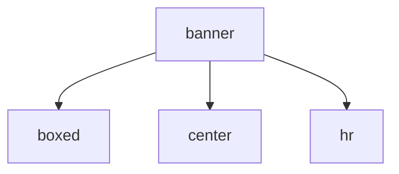

<!-- generated documentation — edit the source, not this file -->
# `scripts/test-runner.sh`

Pretty umbrella runner for every host-side suite: one banner, live per-check
rows, a per-suite summary table, and suite timings. The suites themselves are
unchanged — this only orchestrates and renders their existing output:
firmware (C host)      tests/host/run.sh        the KAT suite + the lab python suite
shared core (C host)   ports/esp32/test/run.sh  reader/stepup/crypto/... stages
web twin               scripts/twin-suite.sh    constant-drift gate + WASM selftest
Default: suites run in parallel, output replayed in order when done.
SERIAL=1 streams them live, one at a time. SUITES="firmware shared" scopes.
Exit is nonzero if any suite fails. Colour off when not a TTY or NO_COLOR.

## API

### `hr()`
`scripts/test-runner.sh:34`

Repeat a character N times.

**called by** `banner`

### `dlen()`
`scripts/test-runner.sh:41`

Display length of a string in characters (multibyte-aware), excluding ANSI codes.

**called by** `center`

### `center()`
`scripts/test-runner.sh:46`

Center text to display width with even padding on both sides.

**called by** `banner`  ·  **calls** `dlen`

### `boxed()`
`scripts/test-runner.sh:54`

Print one row: cyan borders, bold box-draw characters, and content centered/left-aligned to display width.

**called by** `banner`, `row`

### `banner()`
`scripts/test-runner.sh:59`

Print the test runner banner: title, subtitle, and colored box-draw frame across the display width.

**calls** `boxed`, `center`, `hr`

### `suite_cmd()`
`scripts/test-runner.sh:67`

---- suite definitions ----------------------------------------------------

**called by** `run_suite`

### `suite_label()`
`scripts/test-runner.sh:76`

Return the human-readable label for a suite name.

**called by** `run_suite`

### `suite_counts()`
`scripts/test-runner.sh:86`

passed/failed counts from a suite's captured output. Harnesses differ, so
count the universal per-check rows plus each harness's own totals line.

**called by** `run_suite`

### `render_line()`
`scripts/test-runner.sh:110`

live rendering of one suite output line (streaming + replay)

**called by** `run_suite`

### `run_suite()`
`scripts/test-runner.sh:123`

Run one test suite: spawn the suite command, optionally stream output line-by-line in serial mode, capture exit code and timing. Write test counts (passed/failed) and metadata to the metafile.

**calls** `render_line`, `suite_cmd`, `suite_counts`, `suite_label`

### `row()`
`scripts/test-runner.sh:187`

---- summary table --------------------------------------------------------
Row layout (plain widths sum to W_IN=66):
' ' mark(1) '  ' label(24) '  ' passed(6) '  ' failed(6) '  ' time(8) pad(12)

**calls** `boxed`
