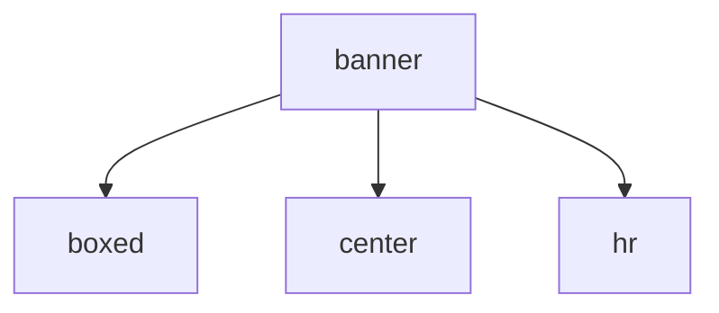

<!-- generated documentation — edit the source, not this file -->
# `scripts/test-runner.sh`

Pretty umbrella runner for every host-side suite: one banner, live per-check
rows, a per-suite summary table, and suite timings. The suites themselves are
unchanged — this only orchestrates and renders their existing output:
firmware (C host)      tests/host/run.sh        the KAT suite + the lab python suite
shared core (C host)   ports/esp32/test/run.sh  reader/stepup/crypto/... stages
web twin               scripts/twin-suite.sh    constant-drift gate + WASM selftest
Default: suites run in parallel, output replayed in order when done.
SERIAL=1 streams them live, one at a time. SUITES="firmware shared" scopes.
Exit is nonzero if any suite fails. Colour off when not a TTY or NO_COLOR.

## API

### `suite_cmd()`
`scripts/test-runner.sh:62`

---- suite definitions ----------------------------------------------------

**called by** `run_suite`

### `suite_counts()`
`scripts/test-runner.sh:80`

passed/failed counts from a suite's captured output. Harnesses differ, so
count the universal per-check rows plus each harness's own totals line.

**called by** `run_suite`

### `render_line()`
`scripts/test-runner.sh:104`

live rendering of one suite output line (streaming + replay)

**called by** `run_suite`

### `row()`
`scripts/test-runner.sh:180`

---- summary table --------------------------------------------------------
Row layout (plain widths sum to W_IN=66):
' ' mark(1) '  ' label(24) '  ' passed(6) '  ' failed(6) '  ' time(8) pad(12)

**calls** `boxed`

Undocumented (7)

- `hr`
- `dlen`
- `center`
- `boxed`
- `banner`
- `suite_label`
- `run_suite`

