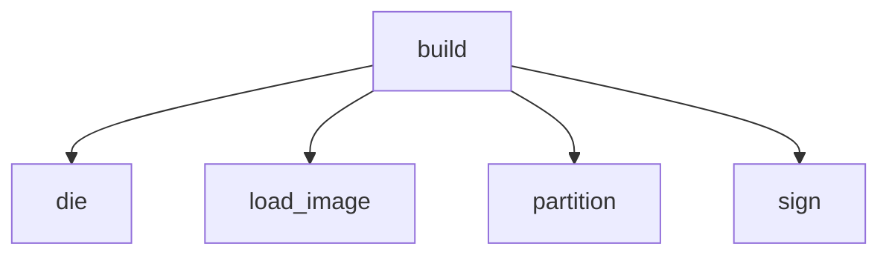

<!-- generated documentation — edit the source, not this file -->
# `scripts/woz_patch.py`

Build a signed delta patch for the DWM3001CDK's over-the-air update path.

Takes two SIGNED MCUboot images and emits one `.wdfu` file: a header the
bootloader reads, a signature the application checks, and a detools in-place
patch that turns the first image into the second.

    scripts/woz_patch.py build --from old/zephyr.signed.bin \
                               --to   new/zephyr.signed.bin \
                               --build-dir build/cdk-matter \
                               --out  update.wdfu

Why SIGNED images and not zephyr.bin: the patch has to reproduce the MCUboot
header and the ECDSA TLVs as well as the code. Patching only the payload would
leave the old signature in front of new code, and MCUboot would refuse to boot
the result -- correctly, and after the update had already overwritten the
working image.

AND IT MUST BE zephyr.signed.HEX, NOT zephyr.signed.BIN. The build signs the
image TWICE, in two separate imgtool runs, and ECDSA signatures are randomised,
so the two artifacts hold the same code under DIFFERENT signatures -- 64 bytes
apart at the very end of the image. Only the .hex goes into merged.hex and so
only the .hex is what a flashed board is actually running. MEASURED 2026-08-03:
device crc 0xd4177b20, zephyr.signed.hex 0xd4177b20, zephyr.signed.bin
0xbb9ec396.

This does not matter for `make dfu`, which uploads a whole image and overwrites
whatever was there. It matters completely here, because a delta is computed
AGAINST the bytes already on the device. Feed it the .bin and the bootloader
declines the patch with "not for this image" -- which is the good outcome, and
only because the from-image CRC catches it. This script refuses the .bin rather
than rely on that.

The `.wdfu` layout, which `modules/woz_dfu/include/woz_dfu.h` is the other half
of:

      0   32   struct woz_dfu_hdr, little-endian
     32   64   ECDSA-P256 signature over those 32 bytes, raw r||s
     96   ..   the detools patch

Needs `detools` and `cryptography`:

    python3 -m pip install detools cryptography

## API

### `image_sha(path)`
`scripts/woz_patch.py:104`

The SHA-256 MCUboot recorded in a signed image's TLVs.

The same value the board prints in its image list, which is what makes it
worth putting in a filename: comparing the two is then a glance rather than
a tool.

**called by** `wrap`  ·  **calls** `die`, `load_image`

### `partition(build_dir, name)`
`scripts/woz_patch.py:138`

Read one partition's size out of a build's generated partitions.yml.

Parsed rather than hardcoded because the whole update path is invalid if
the host and the board disagree about how big the slot is, and
firmware/pm_static.yml is allowed to change.

**called by** `build`  ·  **calls** `die`

### `read_ihex(text)`
`scripts/woz_patch.py:159`

Minimal Intel HEX reader. Returns the contiguous bytes it describes.

Written here rather than pulled in as a dependency because it is twenty
lines and this script already asks for detools and cryptography.

**called by** `load_image`  ·  **calls** `die`

### `load_image(path)`
`scripts/woz_patch.py:197`

Read a signed image, refusing the artifact that will not match a board.

**called by** `build`, `image_sha`  ·  **calls** `die`, `read_ihex`

### `wrap(args)`
`scripts/woz_patch.py:317`

Dress a .wdfu as an MCUboot image so a phone's file picker accepts it.

The result is a WELL-FORMED image, not a decoy: the header sizes describe
the real payload and the SHA-256 TLV really is the hash of what precedes it,
so an app that validates finds everything consistent. What it is NOT is
bootable -- the payload is a delta, not code, and nothing ever asks MCUboot
to run it. The board recognises the wrapper by its magic and skips it.

**calls** `die`, `image_sha`

### `stage(args)`
`scripts/woz_patch.py:444`

Lay a .wdfu out as a raw image of the patch_staging partition.

For bench work only: it lets a patch be written over SWD and the APPLIER
tested on its own, with no radio and no receiver in the picture. That
separation is the point -- when an over-the-air update fails, this says
which half failed.

    scripts/woz_patch.py stage update.wdfu --out staging.bin
    arm-zephyr-eabi-objcopy -I binary -O ihex \
        --change-addresses 0x76000 staging.bin staging.hex
    nrfjprog --program staging.hex --sectorerase --verify -r

**calls** `die`

Undocumented (5)

- `die`
- `sign`
- `build`
- `info`
- `main`

